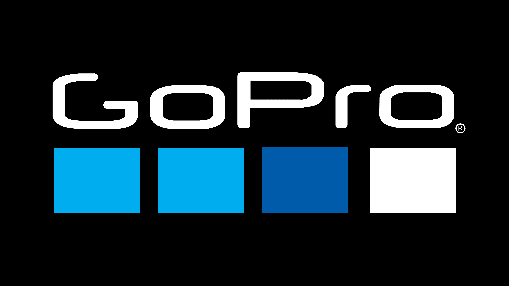

# Open GoPro Developer README

[comment]: <> (Do not touch the following line. It is used as the single source of versioning.)
Current Version: 2.0



TODO REMOVE ME

This README is for a developer who wants to modify or contribute to this repo. If you are a user (i.e.
you don't want to make changes to this repo), see the Open GoPro [Github Pages site](https://gopro.github.io/OpenGoPro/). If you
are just looking for demos, you can browse the `demos` folder here.

## Overview

This repo consists of two types of content:

-   demos
-   documentation

## Demos

Demos are runnable examples in various languages / frameworks and can be found in the `demos` folder. Demos exist,
from their own perspective, independent to the Jekyll-based documentation described below. To create a demo,
follow the "Contributing" section of the [README](demos/README.md) in the `demos` folder.

## Documentation

The documentation can be found in the `docs` directory in markdown files. It is built as a [Jekyll](https://jekyllrb.com/)
static site and hosted via [Github Pages](https://pages.github.com/). It consists of:

-   Interface specifications
-   Walk-through tutorials in various languages / frameworks
-   Demo documentation: This is automatically generated from the demo README's when the Jekyll site is built

The `docs` folder [README](docs/README.md) has more detailed information on its structure and contributing. Here is an overview of documentation development.

### Requirements

-   It is assumed that your environment has access to GNU or BSD tools (i.e. this will not run natively on Windows)
-   [Docker](https://www.docker.com) must be installed
-   To edit any files tracked by `.gitattributes`, git-lfs must be [installed](https://git-lfs.github.com/)

### Usage

First, build and serve the site locally via:

```
make serve
```

The site can then be viewed at `http://localhost:4998`

> Note! This is different than the address from the Jekyll CLI output

As you modify .md files in the `docs` repo, the changes will be mirrored to the local site when the page is
refreshed. The local site is served with an "incremental" build such that only the necessary files are re-built
after a change. This should work fine for modifications to .md files. However, if a sweeping change such
as site-wide configuration is made, it will likely be necessary to re-build the entire site via:

```
make clean serve
```

### Deployment

Github Pages serves the site from the `gh-pages` branch of this repo. Whenever the main branch is updated (such
as via a Pull Request being merged),
the "Jekyll Build and Deploy" [Github Actions](hhttps://github.com/gopro/OpenGoPro/actions/workflows/release.yml) workflow will automatically
be triggered to build the site from `main` and update the `gh-pages` branch.

> Note! This process should be invisible to the developer

## Copyright

All relevant source files shall contain a copyright. This is managed via the "Pre Merge Checks" Github Action.
When a pull request is opened (or updated), this action will search for any missing / incorrect copyrights,
add / fix them, and update the branch. If for some reason this needs to be done manually, it can be done via:

```
make copyright
```

A file can be excluded from this process by adding the following in a comment on the first line:

`No (C) Copyright`

## Versioning

The version listed at the top of this README is the single source of versioning. Versioning / releases should
be done using the "Release" workflow from the [Github Actions UI](https://github.com/gopro/OpenGoPro/actions)
