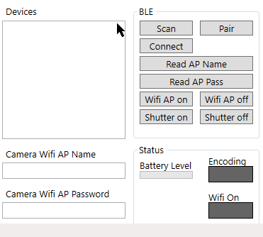

# GoProCSharpSample

This sample demonstrates how to discover, pair, and connect to a GoPro camera via Bluetooth LE (BLE). Once a connection is established, the code shows how to:

1. Enable Wi-Fi on the GoPro camera
2. Read the camera wifi name and password
3. Get status and notification of camera's battery level, encoding flag, and wifi ap on flag.
4. Start and stop camera shutter

# Requirements

Visual Studio is required to run the solution. Visit https://visualstudio.microsoft.com/downloads/ to download.

The target .NET framework is v4.7.2

GoPro camera must be paired before any other operations will succeed. Put the camera in pairing mode before attempting pairing with the app.

# Usage

1. Open and run the demo in Visual Studio to show the GUI
2. `Scan` for GoPro devices
3. `Pair` to the discovered device that is not `GoPro Cam`. In the .gif below, this is `GoPro 0456` (Only needs to be done once, or if camera is factory reset)
4. After pairing is successful, `connect` to the same GoPro device
5. Now use any of the GUI buttons to read WiFi info, enable WiFi AP, set shutter, etc.

