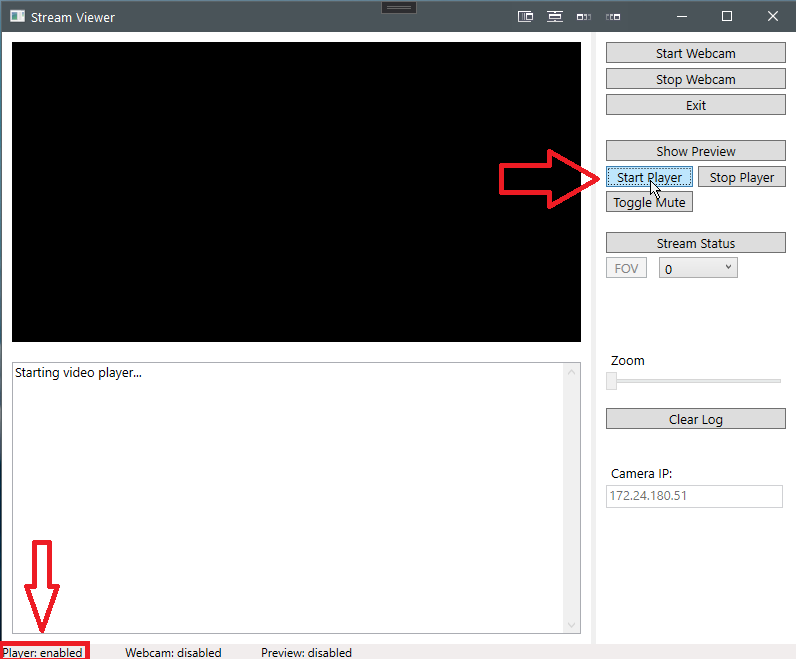

# CSharp Webcam Demo

This demo implements a simple GUI to interact with a GoPro camera that supports [Open GoPro 2.0](https://gopro.github.io/OpenGoPro/http).

# Requirements

This demo will only run on Windows.

Visual Studio is required to run the solution. Visit [VisualStudio](https://visualstudio.microsoft.com/downloads/) to download.

The target .NET framework is v4.7.2

GoPro camera must be paired before any other operations will succeed. Put the camera in
[pairing mode](https://gopro.github.io/OpenGoPro/tutorials/connect-ble#advertise) before attempting
pairing with the app.

# Prerequisites

The correct GoPro Webcam drivers must be installed. To verify this, ensure that you can first use your desired
GoPro as a webcam following the steps [here](https://community.gopro.com/s/article/GoPro-Webcam?language=en_US).

# Usage

1. Connect the GoPro to your computer using the USB cable
1. Open the solution (GoProWebCamViewer.sln) in Visual Studio, build and run io to show the Webcam GUI
1. Select `Start Player` to start the VLC backend. Note that the log and status bar have updated. This will be
   true for all functionality.

   
2. Select `Show Preview` to start a low quality preview stream
3. While in preview, feel free to update the FOV or change the zoom
4. Once you are ready, select `Start Webcam` to start full resolution streaming
