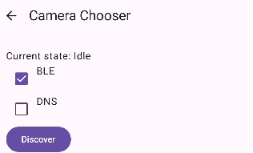
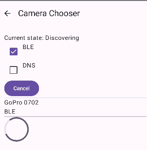
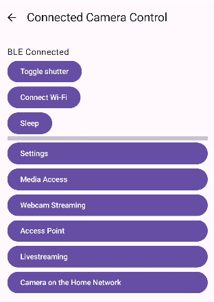
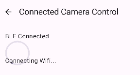
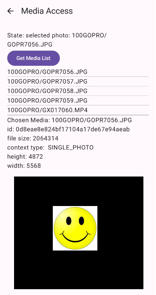

# Open GoPro Kotlin Multiplatform SDK


<br>


## Overview

- [Open GoPro Kotlin Multiplatform SDK](#open-gopro-kotlin-multiplatform-sdk)
  - [Overview](#overview)
  - [Documentation](#documentation)
  - [Features](#features)
  - [Setup](#setup)
    - [Permissions](#permissions)
      - [Android](#android)
  - [Quick Start (Demo App)](#quick-start-demo-app)
  - [SDK Usage](#sdk-usage)


The Open GoPro (OGP) Kotlin Multiplatform (KMP) SDK provides a simple Coroutines-powered API to
connect to GoPro cameras and exercise the Open GoPro [Bluetooth Low Energy](https://gopro.github.io/OpenGoPro/ble/)
and Wi-Fi / USB [HTTP](https://gopro.github.io/OpenGoPro/http) APIs.

> Currently only Android is fully supported. iOS is mostly untested but there are plans to fully support it
> soon.

## Documentation

> Note! This README is only an overview of the library.

Complete Documentation can be found at [Open GoPro](https://gopro.github.io/OpenGoPro/kotlin_sdk/)

## Features

- High-level GoPro class interface to use BLE and WiFi
- Supports all commands, settings, and statuses from the [Open GoPro](https://gopro.github.io/OpenGoPro/) API
- Coroutines based
- Automatically handles connection maintenance:
    - manage camera ready / encoding
    - periodically sends keep alive signals
- Includes detailed logging for each module
- Includes basic demo App to show all contained functionality:
    - Capture media
    - Inspect / configure settings and statuses
    - Basic streaming
    - Setting up Camera-on-the-home-network and Livestreaming
    - Media Access and display

## Setup

NOTE!! The library is not yet available on Maven so this project is currently only intended to be interacted with using
the demo app provided in the repo.

This should be resolved soon...

### Permissions

The SDK needs permissions relating to Bluetooth, WiFi, and disc writing.

#### Android

You can find an example in the demo app:
- Set the needed permissions in the [manifest](https://github.com/gopro/OpenGoPro/blob/main/demos/kotlin/kmp_sdk/composeApp/src/androidMain/AndroidManifest.xml)
- Request the needed permissions at [run-time](https://github.com/gopro/OpenGoPro/blob/main/demos/kotlin/kmp_sdk/composeApp/src/androidMain/kotlin/gopro/open_gopro/MainActivity.kt)

## Quick Start (Demo App)

To see a simple demo app that demonstrates most of the SDK, build and load the `composeApp` project from TODO.

General usage is:

1. Select an interface to scan for GoPro's (initially only BLE will be available) and select "Scan"
    <br>
2. Click on a discovered GoPro to connect to it.
    <br>
3. Select "Toggle Shutter" to verify communication
    <br>
4. Select "Connect Wifi" if desired
    <br>
5. Select a submenu to enter. Note that some require HTTP so you will have needed to Connect Wifi.
    <br>

## SDK Usage

> Note! This section contains only an overview.
> Complete API documentation for the OGP KMP SDK can be found on [Open GoPro](https://gopro.github.io/OpenGoPro/kotlin_sdk/).

The general procedure is:

1. Initialize the SDK
   ```kotlin
    // App context is platform-specific context passed from application
    val sdk = OgpSdk(Dispatchers.IO, appContext)
   ```
1. Discover and connect to a GoPro Device. A successful connection will store it in the SDK's (runtime) database.
   ```kotlin
    // Discover and take the first device we find
    val device = sdk.discover(NetworkType.BLE).first()

    // Connect (assume success)
    val goproId = sdk.connect(device).getOrThrow()
    ```

2. Now that the device is connected and stored in the SDK, retrieve the GoPro object from the SDK. This can be done any
   number of times after connection.
   ```kotlin
    // Now retrieve the gopro (assume success)
    val gopro = sdk.getGoPro(goproId).getOrThrow()
   ```
3. Manipulate the retrieved GoPro as desired
   ```kotlin
    // Set the shutter
    gopro.commands.setShutter(true)
   ```
