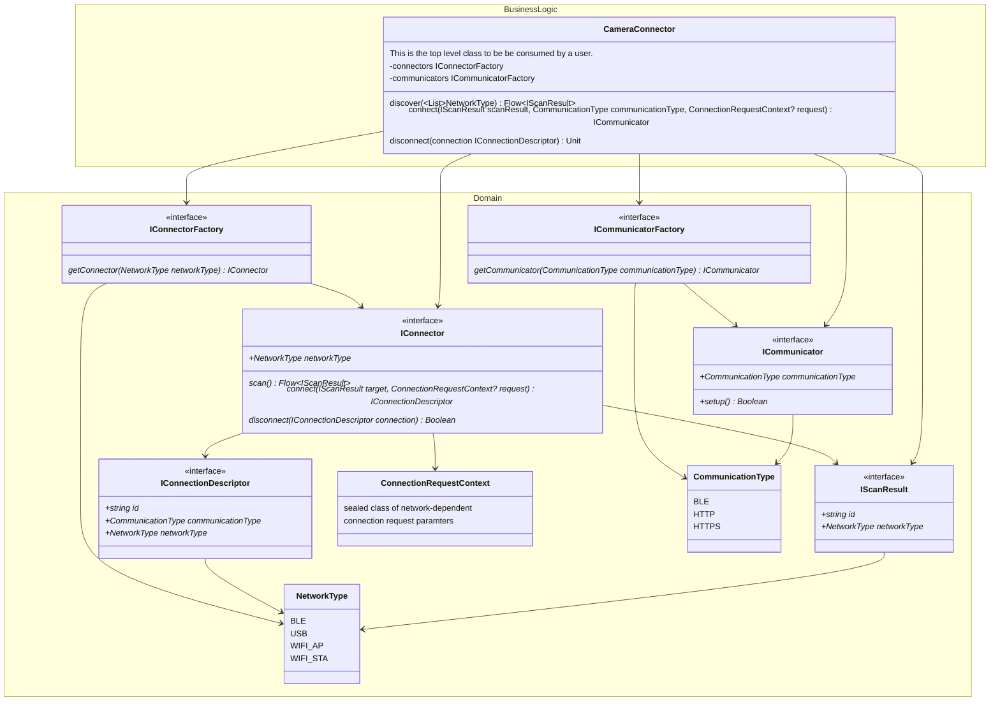
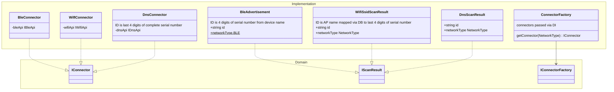
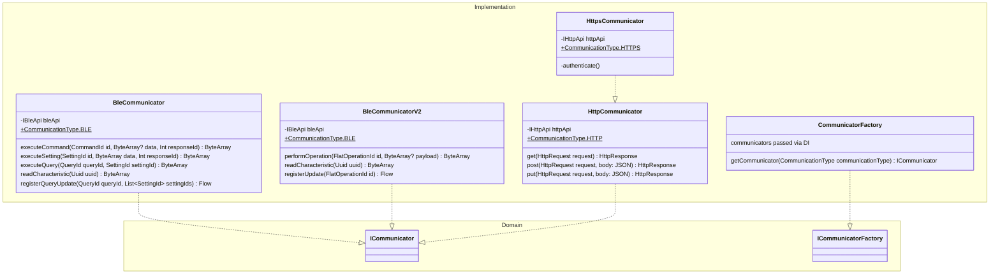

# Camera Connector and Communicator

This describes how a GoPro camera is discovered, connected, and established for communication via any of the
available network interfaces.

There are the following components:
- `connector`: strictly relating to the network layer of establishing communication
- `communicator`: in charge of GoPro-domain communication using the connector.

## Diagram

> Note! All method return values are wrapped in a Result monad. This is omitted in the following diagrams for brevity.



## Connector Implementation



## Communicator Implementation



## Usage

```C
// Get connector which really will be initialized via DI
connector = CameraConnector(connectorFactory, communicatorFactory)
// Get scan results
scanResults = connector.discover(NetworkType.BLE, NetworkType.MDNS)
// Establish a connection and get a communicator. Let's assume first scan result is BLE
// Communication type is chosen by the user here.
communicator = connector.connect(scanResult[0], CommunicationType.BLE)
```

Once we have a communicator it is bound to a `GoProFacade`
