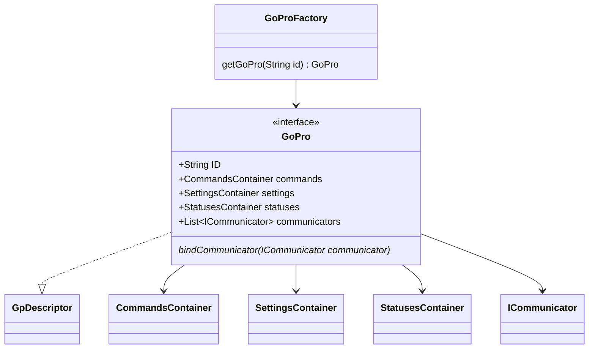

# GoPro

This is the top-level object that users will use to communicate with a GoPro camera.
It can be retrieved via the `GoProFactory`

## ID

Ideally there would be an identifier that is accessible via all network discovery interfaces (BLE, MDNS, and AP). This
is however not currently possible. We have the following:
- BLE: `GoPro XXXX` where XXXX is the last 4 digits of the serial number. This is not affected by camera name changes.
- MDNS: complete serial number
- AP: Device name. This defaults to the same as BLE (`GoPro XXXX`) but will be set to the camera name if it is changed
  from the default.

Therefore the best we can currently do is the last 4 digits of the serial number. We could potentially use an initial
BLE connector to connect and get the full serial number but this seems like an undesirable amount of overhead. For now
this is a limitation and we will wait until the camera advertises the complete serial number via BLE.

Regarding AP scan: we can not rely on the AP name to be sensible since it can be set by the user. In any case, a password
is required to connect so we need a database anyway. Therefore, we will store known AP names and passwords (accessed
via BLE) in this database.

## Diagram



## Usage

```C
// We already have a communicator. Bind it to a facade
communicator = "See connector_communicator.md"
// Factory is singleton initialized via DI
factory = GoProFactory()
// Get the facade whose ID matches the communicator
// If it doesn't exist, the factory will create it
facade = factory.getGoPro(communicator.id)
// Now configure the facade
facade.bindCommunicator(communicator)
```