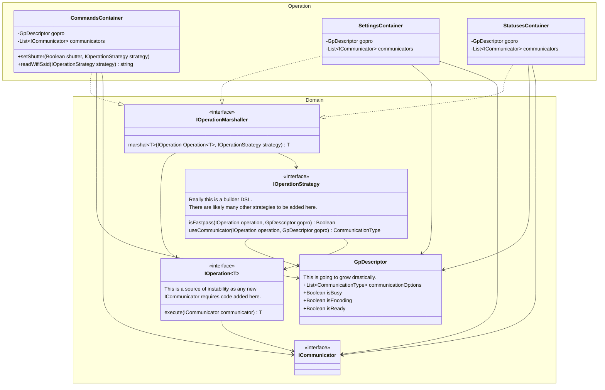

# Operations

This describes the components used to perform GoPro BLE and HTTP operations.
The operations are not exposed to the user and are instead abstracted through the various containers which are accessed
via a `GoPro`.

This consists of the following components:
- `Operation`: The base operation which accepts parameters and passes / receives data to / from a communicator.
- `Strategy`: How / when operations can be executed in the GoPro context
- `GpDescriptor`: Data class that describes the connected GoPro device's properties. Also stores communicators.
- `Marshaller`: Applies the strategies to the operations using the state of the GpDescriptor

> Note! All method return values are wrapped in a Result monad. This is omitted in the following diagrams for brevity.

## Diagram

