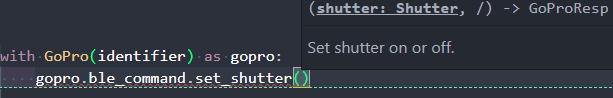

:github_url: https://github.com/gopro/OpenGoPro/tree/main/demos/python/sdk_wireless_camera_control

Usage
*****

This section will describe some high level information of how to use the Open GoPro module. For more detailed
information, see the :ref:`Interfaces<Interfaces>` section. For just running the demo, see the
:ref:`QuickStart Guide<QuickStart Guide>` section.

Overview
========

The top level interface is the :ref:`GoPro <GoPro>` class. One `GoPro` instance corresponds to a (potentially not
yet) connected GoPro camera resource.

Once a `GoPro` instance is :ref:`opened<Opening>`, it can be interacted with (via BLE and / or WiFi) by:

- Performing synchronous :ref:`data operations<Synchronous Data Operations>` to send a command and receive a GoPro Response
- Registering for :ref:`push notifications<Asynchronous Push Notifications>` and getting these after they are enqueued

.. note:: There is a lot of logging throughout the Open GoPro package. See :ref:`troubleshooting <troubleshooting>` for more info.

Opening
=======

Before communicating with a camera, the camera resource must be "opened". This can be done either with the
context manager...

.. code-block:: python

    from open_gopro import GoPro

    with GoPro() as gopro:
        print("Yay! I'm connected via BLE, Wifi, initialized, and ready to send / get data now!")
        # Send some commands now

\...or without the context manager:

.. code-block:: python

    from open_gopro import GoPro

    gopro = GoPro()
    gopro.open()
    print("Yay! I'm connected via BLE, Wifi, initialized, and ready to send / get data now!")
    # Send some commands now

In either case, the following will have occurred before the camera is ready to communicate:

#. scan for camera
#. connect to camera via BLE
#. enable notifications
#. pair (if needed)
#. discover characteristics
#. initialize (register for internal status notifications)
#. discover Open GoPro version
#. connect via WiFi

After the `GoPro` instance is successfully opened via either of the methods above, it's state can be checked via several
properties. All of the following will return True:

.. code-block:: python

    gopro.is_ble_connected
    gopro.is_wifi_connected
    gopro.is_ble_initialized

Arguments
---------

The `GoPro` class takes the following optional arguments:

- **target**: either the last 4 digits of the GoPro name. The name can be found from the
  camera via Preferences-->About-->Camera Info-->Camera Name. If no target is passed, the first discovered
  GoPro BLE device will be connected to.
- **enable_wifi**: a boolean to optionally disable WiFi. This defaults to True (i.e. WiFi is enabled). If set
  to False, the camera's WiFI AP will not be discovered / connected to and a command will be sent to the camera to
  disable its WiFi.
- **maintain_ble**: a boolean to optionally disable some BLE housekeeping. This defaults to True. If set to
  False, the keep-alive signal will not be automatically sent and the camera's encoding / ready state will not
  be tracked. This is most likely not desirable for the user and is mostly used for testing.

API Version
-----------

As mentioned above, one of the steps during the opening sequence is to query the camera's Open GoPro API version.
Once this is done, the relevant commands, settings, and statuses properties of the `GoPro` instance are
set to access a specific version. This means that the attributes of these properties can change depending on the
camera that you connect to if you are connecting to cameras supporting different Open GoPro versions. That is,
different versions can, for example, have different commands and / or parameters.

Here are the relevant properties which will all be expanded upon (with accompanying example code) below:

- :meth:`open_gopro.gopro.GoPro.params`
- :meth:`open_gopro.gopro.GoPro.ble_command`
- :meth:`open_gopro.gopro.GoPro.ble_setting`
- :meth:`open_gopro.gopro.GoPro.ble_status`
- :meth:`open_gopro.gopro.GoPro.wifi_command`
- :meth:`open_gopro.gopro.GoPro.wifi_setting`

Also, the version string can be accessed via the `version` property

- :meth:`open_gopro.gopro.GoPro.version`

For example,

.. code-block:: python

    with GoPro() as gopro:
        print(f"This camera supports Open GoPro version {gopro.version}")

.. note::
    Since the API is set (by version) dynamically after connection, it is not possible to perform static type checking
    on the top-level Open GoPro API calls. The benefit of this approach is that the user does not need to
    manually choose the API to use.

Camera Readiness
----------------

A command can not be sent to the camera if it is not ready where "ready" is defined as not encoding and not
busy. These two states are managed automatically by the `GoPro` instance such that a call to any command will
block until the camera is ready. It is possible to check these from the application via:

- :meth:`open_gopro.gopro.GoPro.is_encoding`
- :meth:`open_gopro.gopro.GoPro.is_busy`

For example,

.. code-block:: python

    with GoPro() as gopro:
        # A naive check for it to be ready
        while gopro.is_encoding or gopro.is_ready:
            pass

Just to reiterate...it is not needed or recommended to worry about this as all of this internal state is managed automatically
by the `GoPro` instance.

Sending Commands
================

Once the `GoPro` instance has been :ref:`opened<opening>`, it is now possible to send commands to the camera
(provided that the camera is :ref:`ready<camera readiness>`) using the Open GoPro API :ref:`version<API Version>`
that the camera supports. This is done either via:

- synchronous data operations
- registering for asynchronous push notifications

Both of these patterns will be expanded upon below. But first, a note on selecting parameters for use with commands...

Selecting Parameters
--------------------

Whenever a parameter is required for a command, it will be type-hinted in the method definition as either a basic Python type
or an Enum from the version-specific `params` class (i.e. :class:`open_gopro.api.v1_0.params.ParamsV1_0` for version
1.0). Since parameters can vary by open GoPro version, this params class should be accessed using the `GoPro` instance's
`params` property (:meth:`open_gopro.gopro.GoPro.params`). Doing so will ensure that the correct parameter set
is dynamically chosen.

For example, if we want to send the "set shutter" command, we can see that it takes one parameter (`shutter`) which
is of type `Shutter`:

The `Shutter` class can accessed via `gopro.params.Shutter` where a decent editor should show the available options:

Here is the full example for clarity:

.. code-block:: python

    with GoPro() as gopro:
        gopro.ble_command.set_shutter(gopro.params.Shutter.ON)

Synchronous Data Operations
---------------------------

This section refers to sending commands, getting settings / statuses, and setting settings. In all cases here,
the method will block until a :ref:`response<handling responses>` is received.

Commands
^^^^^^^^

Commands are instance methods of a version-specific Commands class instance
(i.e. :class:`open_gopro.api.v1_0.ble_commands.BleCommandsV1_0` or
:class:`open_gopro.api.v1_0.wifi_commands.WifiCommandsV1_0`), thus they can be called directly:

.. code-block:: python

    with GoPro() as gopro:
        gopro.wifi_command.set_preset(gopro.params.Preset.ACTIVITY)
        gopro.ble_command.set_shutter(gopro.params.Shutter.ON)
        gopro.wifi_command.set_shutter(gopro.params.Shutter.OFF)

Statuses
^^^^^^^^

Statuses are instances of a BleStatus(:class:`open_gopro.api.builders.BleStatus`). They can be read
synchronously using their `get_value` method as such:

.. code-block:: python

    with GoPro() as gopro:
        gopro.ble_status.encoding_active.get_value()
        gopro.ble_status.int_batt_per.get_value()

It is also possible to read all statuses at once via:

.. code-block:: python

    with GoPro() as gopro:
        gopro.ble_command.get_camera_statuses()

.. note::
    WiFi can not access individual statuses. Instead it can use the `get_camera_state`
    (:meth:`open_gopro.api.v1_0.wifi_commands.WifiCommandsV1_0.get_camera_state`)
    command to retrieve all of them (as well as all of the settings) at once

Settings
^^^^^^^^

Settings are instances of a BleSetting(:class:`open_gopro.api.builders.BleSetting`)
or WifiSetting(:class:`open_gopro.api.builders.WifiSetting`). They cam be interacted synchronously in several
ways:

Their values can be read (via BLE) using the `get_value` method as such:

.. code-block:: python

    with GoPro() as gopro:
        gopro.ble_setting.resolution.get_value()
        gopro.ble_setting.video_field_of_view.get_value()

It is also possible to read all settings at once via:

.. code-block:: python

    with GoPro() as gopro:
        gopro.ble_command.get_camera_settings()

.. note::
    WiFi can not access individual settings. Instead it can use the `get_camera_state`
    (:meth:`open_gopro.api.v1_0.wifi_commands.WifiCommandsV1_0.get_camera_state`)
    command to retrieve all of them (as well as all of the statuses) at once.

Depending on the camera's current state, settings will have differing capabilities. It is possible to query
the current capabilities for a given setting (via BLE) using the `get_capabilities_values` method as such:

.. code-block:: python

    with GoPro() as gopro:
        gopro.ble_setting.resolution.get_capabilities_values()

.. note::
    This functionality is only possible via BLE.

Settings' values can be set (via either BLE or WiFI) using the `set` method as such:

.. code-block:: python

    with GoPro() as gopro:
        gopro.ble_setting.resolution.set(gopro.params.Resolution.RES_4K)
        gopro.wifi_setting.fps.set(gopro.params.FPS.FPS_30)

Asynchronous Push Notifications
-------------------------------

This section describes how to register for and handle asynchronous push notifications. This is only relevant for BLE.

It is possible to enable push notifications for any of the following:

- setting values via :meth:`open_gopro.api.builders.BleSetting.register_value_update`
- setting capabilities via :meth:`open_gopro.api.builders.BleSetting.register_capability_update`
- status values via :meth:`open_gopro.api.builders.BleStatus.register_value_update`

Firstly, the desired settings / id must be registered for.

Once registered, the camera will send a push notification when the relevant setting / status changes. These
responses are added to an internal queue of the `GoPro` instance be retrieved from via
:meth:`open_gopro.gopro.get_update`.

It is possible to stop receiving notifications by issuing the relevant unregister command, i.e.:

- setting values via :meth:`open_gopro.api.builders.BleSetting.unregister_value_update`
- setting capabilities via :meth:`open_gopro.api.builders.BleSetting.unregister_capability_update`
- status values via :meth:`open_gopro.api.builders.BleStatus.unregister_value_update`

Here is an example of registering for and receiving FOV updates:

.. code-block:: python

    from open_gopro import GoPro
    from open_gopro.constants import SettingId

    with GoPro() as gopro:
        current_fov = gopro.ble_setting.video_field_of_view.register_value_update().flatten
        print(f"Current FOV is {current_fov}")
        # Get updates until we get a FOV update
        while True:
            update = gopro.get_update()
            if SettingId.VIDEO_FOV in update:
                print(f"New resolution is {update[SettingId.VIDEO_FOV]}")
                break
        # We don't care about FOV anymore so let's stop receiving notifications
        gopro.ble_setting.video_field_of_view.unregister_value_update()

.. note:: The `register_XXX_update` methods will return the current value / capabilities. That is why we are
    printing the current value in the example above.

.. note:: It is probably desirable to have a separate thread to retrieve these updates as the demo examples do.

It is also possible to register / unregister for all settings and / or statuses via one API call using the
following commands:

- register for all  setting notifications via :meth:`open_gopro.api.v1_0.ble_commands.BleCommandsV1_0.register_for_all_settings`
- register for all status notifications via :meth:`open_gopro.api.v1_0.ble_commands.BleCommandsV1_0.register_for_all_statuses`
- unregister for all  setting notifications via :meth:`open_gopro.api.v1_0.ble_commands.BleCommandsV1_0.unregister_for_all_settings`
- unregister for all status notifications via :meth:`open_gopro.api.v1_0.ble_commands.BleCommandsV1_0.unregister_for_all_statuses`

Handling Responses
==================

Unless otherwise stated, all commands, settings, and status operations return a `GoProResp`
(:class:`open_gopro.responses.GoProResp`) which is a JSON serializable dict with some helper functions.

Response Structure
------------------

A `GoProResp` has 3 relevant attributes for the end user:

- | **id** (:meth:`open_gopro.responses.GoProResp.id`): identifier of the completed operation.
  | This will vary based on what type the response is and will also contain the most specific identification information.

    - UUID if a direct BLE characteristic read
    - CmdId if an Open GoPro BLE Operation
    - endpoint string if a Wifi HTTP operation
- **status** (:meth:`open_gopro.responses.GoProResp.status`): the status returned from the camera
- **data** (:meth:`open_gopro.responses.GoProResp.data`): JSON serializable dict containing the responded data

Besides the `id` attribute which always contains the most specific identification information, there are properties
to attempt to access other identification information. If the property is not valid for the given response,
it will return `None`.

- **command**: :meth:`open_gopro.responses.GoProResp.cmd`. Relevant for any BLE operation.
- **uuid**: :meth:`open_gopro.responses.GoProResp.uuid`. Relevant for any BLE operation.
- **endpoint**: :meth:`open_gopro.responses.GoProResp.endpoint`. Relevant for any Wifi operation.

There is also a property to check that the `status` is Success:

- **is_ok**: :meth:`open_gopro.responses.GoProResp.is_ok`

The response object can be serialized to a JSON string with the default Python `str()` function. Note that
the `id` and `status` attributes are appended to the JSON.

For example, first let's connect, send a command, and then store the response:

.. code-block:: console

    >>> from open_gopro import GoPro
    >>> gopro = GoPro()
    >>> gopro.open()
    >>> response = gopro.ble_setting.resolution.get_value()

Now let's print the response (as JSON):

.. code-block:: console

    >>> print(response)
    {
        "status": "SUCCESS",
        "id": "UUID.CQ_QUERY_RESP::QueryCmdId.GET_SETTING_VAL",
        "SettingId.RESOLUTION": "RES_5_3_K"
    }

Now let's inspect the responses various attributes / properties:

.. code-block:: console

    >>> print(response.status)
    ErrorCode.SUCCESS
    >>> print(response.is_ok)
    True
    >>> print(response.id)
    QueryCmdId.GET_SETTING_VAL
    >>> print(response.cmd)
    QueryCmdId.GET_SETTING_VAL
    >>> print(response.uuid)
    UUID.CQ_QUERY_RESP

Data Access
-----------

The response data is stored in the `data` attribute (:meth:`open_gopro.responses.GoProResp.data`) but can also
be accessed via dict access on the instance since `__getitem__` has been overridden. For example, the must
succinct way to access the current resolution from the response is:

.. code-block:: console

    >>> print(response[SettingId.RESOLUTION])
    RES_5_3_K

However, it is also possible to this as:

.. code-block:: console

    >>> print(response.data[SettingId.RESOLUTION])
    RES_5_3_K

Similarly, `__contains__` and `__iter__` have also been overridden to operate on the `data` attribute:

.. code-block:: console

    >>> SettingId.RESOLUTION in response
    True
    >>> [str(x) for x in response]
    ['SettingId.RESOLUTION']

.. note:: The `Open GoPro Documentation <https://gopro.github.io/OpenGoPro/>`_ should be referenced in regards
    to how to access the JSON.

Value Flattening
----------------

For short responses, it is rather unwieldy to access the JSON dict as described above. Therefore, you can attempt to use the
`flatten` property (:meth:`open_gopro.responses.GoProResp.flatten`) to flatten the data:

Continuing with our example above, where previously we accessed the responded resolution as:

.. code-block:: console

    >>> print(response[SettingId.RESOLUTION])
    RES_5_3_K

We can also do it as:

.. code-block:: console

    >>> print(response.flatten)
    RES_5_3_K

For example, we can get and print all resolution capabilities on one line via:

    >>> print(", ".join(gopro.ble_setting.resolution.get_capabilities_values().flatten))
    RES_4K, RES_2_7K, RES_2_7K_4_3, RES_1080, RES_4K_4_3, RES_5_K_4_3, RES_5_3_K

If the response data is anything other than a single value or a list, it can't be flattened and so the entire
data structure will be returned.

Flattening works well when getting a single value (from a get status / value) or a list of values (from a get
capabilities). This won't work for many cases.

For complex JSON structures, you will need to read through the
`Open GoPro API Documentation  <https://github.com/gopro/OpenGoPro/tree/main/docs/wifi>`_ for
parsing it. There will be some future work to turn these (at least the media list) into nice Python classes. But
for now, it will look ugly like this:

.. code-block:: python

    # Get list of media
    gopro.media_list = wifi_command.get_media_list().data["media"][0]["fs"]

Closing
=======

It is important to close the camera resource when you are done with it. This can be in two ways. If the context
manager was used, it will automatically be closed when exiting, i.e.:

.. code-block:: python

    with GoPro() as gopro:
        # Do some things.
        pass
        # Then when finished...
    # The camera resource is closed now!!

Otherwise, you will need to manually call the `close` method, i.e.:

.. code-block:: python

    gopro = GoPro()
    gopro.open()
    print("Yay! I'm connected via BLE, Wifi, initialized, and ready to send / get data now!")
    # When we're done...
    gopro.close()
    # The camera resource is closed now!!

The `close` method will handle gracefully disconnecting BLE and Wifi.

.. warning::
    If the resource is not closed correctly, it is possible that your OS will maintain the BLE connection to it.
    This will cause reconnection problems as the device will not be advertising when you try to reconnect.