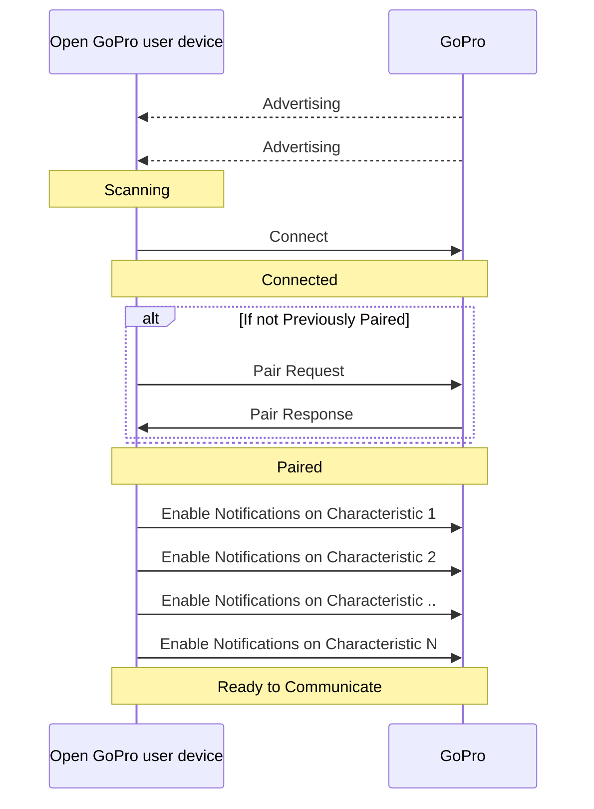

# Tutorial 1: Connect BLE

This tutorial will provide a walk-through to connect to the GoPro camera via Bluetooth Low Energy (BLE).

# Requirements

## Hardware

* A GoPro camera that is [supported by Open GoPro](/ble/index.html#supported-cameras)


* One of the following systems:

    - Windows 10, version 16299 (Fall Creators Update) or greater
    - Linux distribution with [BlueZ](http://www.bluez.org/) >= 5.43
    - OS X/macOS support via Core Bluetooth API, from at least OS X version 10.11


* An Android Device supporting SDK >= 33



## Software



-   Python >= 3.8.x must be installed. See this [Python installation guide](https://docs.python-guide.org/starting/installation/).


- [Android Studio](https://developer.android.com/studio) >= 2022.1.1 (Electric Eel)



# Overview / Assumptions



This tutorial will use [bleak](https://pypi.org/project/bleak/) to control the OS's Bluetooth Low Energy (BLE).


The Bleak BLE controller does not currently support autonomous pairing for the BlueZ backend. So if you are using
BlueZ (i.e. Ubuntu, RaspberryPi, etc.), you need to first pair the camera from the command line as shown in the
[BlueZ tutorial](https://gopro.github.io/OpenGoPro/tutorials/bash/bluez). There is work to add this feature
and progress can be tracked on the [Github Issue](https://github.com/hbldh/bleak/pull/1100).


The bleak module is based on asyncio which means that its awaitable functions need to
be called from an async coroutine. In order to do this, all of the code below should be
running in an async function. We accomplish this in the tutorial scripts
by making _main_ async as such:

```python
import asyncio

async def main() -> None:
    # Put our code here

if __name__ == "__main__":
    asyncio.run(main())
```


These are stripped down Python tutorials that are only meant to show the basics.
For a complete Python SDK that uses bleak as the backend as well as a
cross-platform WiFi backend to easily write Python apps that control the GoPro, see the
[Open GoPro Python SDK](https://gopro.github.io/OpenGoPro/python_sdk/)




This tutorial will provide a set of Kotlin tutorials to demonstrate Open GoPro Functionality. The tutorials
are provided as a single Android Studio project targeted to run on an Android device.

The tutorials are only concerned with application-level demonstrations of the Open GoPro API and therefore
do not prioritize the following:

-   UI: The tutorial project only contains a minimal UI to select, implement, and view logs for each tutorial
-   Android architecture / best practices: the project architecture is designed to encapsulate Kotlin functionality
    to easily display per-tutorial functionality
-   Android-specific requirements: permission handling, adapter enabling, etc are implemented in the project but not
    documented in the tutorials
-   BLE / Wifi (HTTP) functionality: A simple BLE API is included in the project and will be touched upon in the tutorials.
    However, the focus of the tutorials is not on how the BLE API is implemented as a real project would likely
    use a third-party library for this such as [Kable](https://github.com/JuulLabs/kable)
    -   See the [Punchthrough tutorials](https://punchthrough.com/android-ble-guide/) for Android BLE-Specific tutorials

These tutorials assume familiarity and a base level of competence with:

-   Android Studio
-   Bluetooth Low Energy
-   JSON
-   HTTP




# Setup



This set of tutorials is accompanied by a Python package consisting of scripts separated by tutorial module.
These can be found on [Github](https://github.com/gopro/OpenGoPro/tree/main/demos/python/tutorial/). Once the
Github repo has been cloned or downloaded to your
local machine, the package can be installed as follows:

1. Enter the python tutorials directory at `$INSTALL/demos/python/tutorial/` where $INSTALL is the top level of the Open GoPro repo
   where it exists on your local machine
2. Use pip to install the package (in editable mode in case you want to test out some changes):

```
pip install -e .
```


While it is out of the scope of this tutorial to describe, it is recommended to install the package in to a
[virtual environment](https://realpython.com/python-virtual-environments-a-primer/#why-do-you-need-virtual-environments)
in order to isolate system dependencies.


You can test that installation was successful by viewing the installed package's information:

```console
$ pip show open-gopro-python-tutorials
Name: open-gopro-python-tutorials
Version: 0.0.3
Summary: Open GoPro Python Tutorials
Home-page: https://github.com/gopro/OpenGoPro
Author: Tim Camise
Author-email: gopro.com
License: MIT
Location: c:\users\tim\gopro\opengopro\demos\python\tutorial
Requires: bleak, requests
Required-by:
```



This set of tutorials is accompanied by an Android Studio project consisting of, among other project infrastructure,
Kotlin files separated by tutorial module.
The project  can be found on [Github](https://github.com/gopro/OpenGoPro/tree/main/demos/kotlin/tutorial/). Once the
Github repo has been cloned or downloaded to your local machine, open the project in Android studio.

At this point you should be able to build and load the project to your Android device.


The project will not work on an emulated device since BLE can not be emulated.




## Just Show me the Demo!!



Each of the scripts for this tutorial can be found in the Tutorial 1
[directory](https://github.com/gopro/OpenGoPro/tree/main/demos/python/tutorial/tutorial_modules/tutorial_1_connect_ble)..


Python >= 3.8.x must be used as specified in the requirements


You can test connecting to your camera through BLE using the following script:

```console
python ble_connect.py
```

See the help for parameter definitions:

```console
$ python ble_connect.py --help
usage: ble_connect.py [-h] [-i IDENTIFIER]

Connect to a GoPro camera, pair, then enable notifications.

optional arguments:
  -h, --help            show this help message and exit
  -i IDENTIFIER, --identifier IDENTIFIER
                        Last 4 digits of GoPro serial number, which is the last 4 digits of the default camera
                        SSID. If not used, first discovered GoPro will be connected to
```



The Kotlin file for this tutorial can be found on
[Github](https://github.com/gopro/OpenGoPro/tree/main/demos/kotlin/tutorial/app/src/main/java/com/example/open_gopro_tutorial/tutorials/Tutorial1ConnectBle.kt).

To perform the tutorial, run the Android Studio project, select "Tutorial 1" from the dropdown and click on "Perform."

{% include figure image_path="/assets/images/tutorials/kotlin/tutorial_1.png" alt="kotlin_tutorial_1" size="40%" caption="Perform Tutorial 1" %}

This will start the tutorial and log to the screen as it executes. When the tutorial is complete, click
"Exit Tutorial" to return to the Tutorial selection screen.



# Basic BLE Tutorial

This tutorial will walk through the process of connecting to a GoPro via BLE. This same connect functionality
will be used as a foundation for all future BLE tutorials.

Here is a summary of the sequence that will be described in detail in the following
sections:



## Advertise

First, we need to ensure the camera is discoverable (i.e. it is advertising).
Follow the per-camera steps [here](https://community.gopro.com/s/article/GoPro-Quik-How-To-Pair-Your-Camera?language=en_US).

The screen should appear as such:

{% include figure image_path="/assets/images/tutorials/quik.png" alt="Quik" size="50%" caption="Camera is discoverable." %}

## Scan

Next, we must scan to discover the advertising GoPro Camera.


We will do this using bleak. Let's initialize an empty dict that will store discovered devices, indexed by name:

```python
# Map of devices indexed by name
devices: Dict[str, BleakDevice] = {}
```

We're then going to scan for all devices.
We are passing a scan callback to bleak in order to also find non-connectable scan responses.
We are keeping any devices that have a device name.

```python
# Scan callback to also catch nonconnectable scan responses
def _scan_callback(device: BleakDevice, _: Any) -> None:
    # Add to the dict if not unknown
    if device.name != "Unknown" and device.name is not None:
        devices[device.name] = device

# Now discover and add connectable advertisements
for device in await BleakScanner.discover(timeout=5, detection_callback=_scan_callback):
    if device.name != "Unknown" and device.name is not None:
        devices[device.name] = device
```

Now we can search through the discovered devices to see if we found a GoPro. Any GoPro
device name will be structured as `GoPro XXXX` where XXXX is the last four digits of
your camera's serial number.


If you have renamed your GoPro to something other than the default, you will need to update the below
steps accordingly.


First, we define a regex which is either "GoPro " followed by any four alphanumeric characters if no identifier was passed,
or "GoPro " concatenated with the identifier if it exists. In the demo `ble_connect.py`, the identifier is taken
from the command-line arguments.

```python
token = re.compile(r"GoPro [A-Z0-9]{4}" if identifier is None else f"GoPro {identifier}")
```

Now we build a list of matched devices by checking if each device's name includes the token regex.

```python
matched_devices: List[BleakDevice] = []
# Now look for our matching device(s)
matched_devices = [device for name, device in devices.items() if token.match(name)]
```

Due to potential RF interference and the asynchronous nature of BLE advertising / scanning, it is possible that
the advertising GoPro will not be discovered by the scanning PC in one scan. Therefore, you may need to redo
the scan (as `ble_connect.py` does) until a GoPro is found. That is, `matched_device` must contain at least one
device.

Similarly, connection establishment can fail for reasons out of our control. Therefore, the connection process
is also wrapped in retry logic.

Here is an example of the log from `ble_connect.py` of scanning for devices. Note that this
includes several rescans until the devices was found.

```console
$ python ble_connect.py
INFO:root:Scanning for bluetooth devices...
INFO:root:      Discovered:
INFO:root:      Discovered: TR8600 seri
INFO:root:Found 0 matching devices.
INFO:root:      Discovered:
INFO:root:      Discovered: TR8600 seri
INFO:root:      Discovered: GoPro Cam
INFO:root:      Discovered: GoPro 0456
INFO:root:Found 1 matching devices.
```

Among other devices, you should see `GoPro XXXX` where XXXX is the last four digits of
your camera's serial number.



First let's define a filter to find the GoPro. We do this by filtering on the GoPro Service UUID that is
included in all GoPro advertisements:

```kotlin
private val scanFilters = listOf<ScanFilter>(
    ScanFilter.Builder().setServiceUuid(ParcelUuid.fromString(GOPRO_UUID)).build()
)
```

We then send this to the BLE API and collect events from the SharedFlow that it returns. We take the first
event emitted from this SharedFlow and notify (via a Channel) that a GoPro advertiser has been found, store
the GoPro's BLE address, and stop the scan.

```kotlin
ble.startScan(scanFilters).onSuccess { scanResults ->
    val deviceChannel: Channel<BluetoothDevice> = Channel()
    // Collect scan results
    CoroutineScope(Dispatchers.IO).launch {
        scanResults.collect { scanResult ->
            // We will take the first discovered gopro
            deviceChannel.send(scanResult.device)
        }
    }
    // Wait to receive the scan result
    goproAddress = deviceChannel.receive().address
    ble.stopScan(scanResults)
}
```

At this point, the GoPro's BLE address is stored (as a String) in `goproAddress`.

Here is an example log output from this process:

```console
Scanning for GoPro's
Received scan result: GoPro 0992
Found GoPro: GoPro 0992
```



## Connect

Now that we have discovered at least one GoPro device to connect to, the next step is to
establish a BLE connection to the camera.



```python
# We're just taking the first device if there are multiple.
device = matched_devices[0]
client = BleakClient(device)
await client.connect(timeout=15)
```

An example output of this is shown here where we can see that the connection has successfully been established
as well as the GoPro's BLE MAC address.:

```console
INFO:root:Establishing BLE connection to EF:5A:F6:13:E6:5A: GoPro 0456...
INFO:bleak.backends.dotnet.client:Services resolved for BleakClientDotNet (EF:5A:F6:13:E6:5A)
INFO:root:BLE Connected!
```


```kotlin
ble.connect(goproAddress)
```




At this point, the BLE connection is established but there is more setup to be done before we are ready to
communicate.

## Pair

The GoPro has encryption-protected characteristics which require us to pair before
writing to them. Therefore now that we are connected, we need to attempt to pair.



```python
try:
    await client.pair()
except NotImplementedError:
    # This is expected on Mac
    pass
```

Not all OS's allow pairing (at this time) but some require it. Rather than checking for the OS, we are just
catching the exception when it fails.



Rather than explicitly request pairing, we rely on the fact that Android will automatically start the pairing
process if you try to read a characteristic that requires encryption. To do this, we read the
[Wifi AP Password characteristic](https://gopro.github.io/OpenGoPro/ble/protocol/ble_setup.html#ble-characteristics).

First we discover all characteristics (this will also be needed later when enabling notifications):

```kotlin
ble.discoverCharacteristics(goproAddress)
```

Then we read the relevant characteristic to trigger pairing:

```kotlin
ble.readCharacteristic(goproAddress, GoProUUID.WIFI_AP_PASSWORD.uuid)
```

At this point a pairing popup should occur on the Android Device. Select "Allow Pairing" to continue.

Here is an example log output from this process:

```console
Discovering characteristics
Discovered 9 services for F7:5B:5D:81:64:1B
Service 00001801-0000-1000-8000-00805f9b34fb
Characteristics:
|--
Service 00001800-0000-1000-8000-00805f9b34fb
Characteristics:
|--00002a00-0000-1000-8000-00805f9b34fb: READABLE
|--00002a01-0000-1000-8000-00805f9b34fb: READABLE
|--00002a04-0000-1000-8000-00805f9b34fb: READABLE
Service 0000180f-0000-1000-8000-00805f9b34fb
Characteristics:
|--00002a19-0000-1000-8000-00805f9b34fb: READABLE, NOTIFIABLE
|------00002902-0000-1000-8000-00805f9b34fb: EMPTY
Service 0000180a-0000-1000-8000-00805f9b34fb
Characteristics:
|--00002a29-0000-1000-8000-00805f9b34fb: READABLE
|--00002a24-0000-1000-8000-00805f9b34fb: READABLE
|--00002a25-0000-1000-8000-00805f9b34fb: READABLE
|--00002a27-0000-1000-8000-00805f9b34fb: READABLE
|--00002a26-0000-1000-8000-00805f9b34fb: READABLE
|--00002a28-0000-1000-8000-00805f9b34fb: READABLE
|--00002a23-0000-1000-8000-00805f9b34fb: READABLE
|--00002a50-0000-1000-8000-00805f9b34fb: READABLE
Service b5f90001-aa8d-11e3-9046-0002a5d5c51b
Characteristics:
|--b5f90002-aa8d-11e3-9046-0002a5d5c51b: READABLE, WRITABLE
|--b5f90003-aa8d-11e3-9046-0002a5d5c51b: READABLE, WRITABLE
|--b5f90004-aa8d-11e3-9046-0002a5d5c51b: WRITABLE
|--b5f90005-aa8d-11e3-9046-0002a5d5c51b: READABLE, INDICATABLE
|------00002902-0000-1000-8000-00805f9b34fb: EMPTY
|--b5f90006-aa8d-11e3-9046-0002a5d5c51b: READABLE
Service 0000fea6-0000-1000-8000-00805f9b34fb
Characteristics:
|--b5f90072-aa8d-11e3-9046-0002a5d5c51b: WRITABLE
|--b5f90073-aa8d-11e3-9046-0002a5d5c51b: NOTIFIABLE
|------00002902-0000-1000-8000-00805f9b34fb: EMPTY
|--b5f90074-aa8d-11e3-9046-0002a5d5c51b: WRITABLE
|--b5f90075-aa8d-11e3-9046-0002a5d5c51b: NOTIFIABLE
|------00002902-0000-1000-8000-00805f9b34fb: EMPTY
|--b5f90076-aa8d-11e3-9046-0002a5d5c51b: WRITABLE
|--b5f90077-aa8d-11e3-9046-0002a5d5c51b: NOTIFIABLE
|------00002902-0000-1000-8000-00805f9b34fb: EMPTY
|--b5f90078-aa8d-11e3-9046-0002a5d5c51b: WRITABLE
|--b5f90079-aa8d-11e3-9046-0002a5d5c51b: NOTIFIABLE
|------00002902-0000-1000-8000-00805f9b34fb: EMPTY
Service b5f90090-aa8d-11e3-9046-0002a5d5c51b
Characteristics:
|--b5f90091-aa8d-11e3-9046-0002a5d5c51b: WRITABLE
|--b5f90092-aa8d-11e3-9046-0002a5d5c51b: NOTIFIABLE
|------00002902-0000-1000-8000-00805f9b34fb: EMPTY
Service b5f90080-aa8d-11e3-9046-0002a5d5c51b
Characteristics:
|--b5f90081-aa8d-11e3-9046-0002a5d5c51b: NOTIFIABLE
|------00002902-0000-1000-8000-00805f9b34fb: EMPTY
|--b5f90082-aa8d-11e3-9046-0002a5d5c51b: WRITABLE
|--b5f90083-aa8d-11e3-9046-0002a5d5c51b: NOTIFIABLE
|------00002902-0000-1000-8000-00805f9b34fb: EMPTY
|--b5f90084-aa8d-11e3-9046-0002a5d5c51b: NOTIFIABLE
|------00002902-0000-1000-8000-00805f9b34fb: EMPTY
Service 00001804-0000-1000-8000-00805f9b34fb
Characteristics:
|--00002a07-0000-1000-8000-00805f9b34fb: READABLE
Pairing
Read characteristic b5f90003-aa8d-11e3-9046-0002a5d5c51b : value: 66:3F:54:2D:38:35:72:2D:4E:35:63
```



Once paired, the camera should beep and display "Connection Successful".


This pairing process only needs to be done once. On subsequent connections, the devices will automatically
re-establish encryption using stored keys. That is, they are "bonded."


## Enable Notifications

As specified in the [Open GoPro Bluetooth API](/ble/index.html#sending-and-receiving-messages),
we must enable notifications for a given characteristic to receive responses from it.

To enable notifications, we loop over each characteristic in each service and enable the characteristic
for notification if it has `notify` properties:




It is necessary to define a notification handler to pass to the bleak `start_notify` method. Since we
only care about connecting to the device in this tutorial (and not actually receiving data), we are just passing
an empty function. A future tutorial will demonstrate how to use this meaningfully.


```python
for service in client.services:
    for char in service.characteristics:
        if "notify" in char.properties:
            await client.start_notify(char, notification_handler)
```

In the following example output, we can see that notifications are enabled for each characteristic that is
notifiable.

```console
INFO:root:Enabling notifications...
INFO:root:Enabling notification on char 00002a19-0000-1000-8000-00805f9b34fb
INFO:root:Enabling notification on char b5f90073-aa8d-11e3-9046-0002a5d5c51b
INFO:root:Enabling notification on char b5f90075-aa8d-11e3-9046-0002a5d5c51b
INFO:root:Enabling notification on char b5f90077-aa8d-11e3-9046-0002a5d5c51b
INFO:root:Enabling notification on char b5f90079-aa8d-11e3-9046-0002a5d5c51b
INFO:root:Enabling notification on char b5f90092-aa8d-11e3-9046-0002a5d5c51b
INFO:root:Enabling notification on char b5f90081-aa8d-11e3-9046-0002a5d5c51b
INFO:root:Enabling notification on char b5f90083-aa8d-11e3-9046-0002a5d5c51b
INFO:root:Enabling notification on char b5f90084-aa8d-11e3-9046-0002a5d5c51b
INFO:root:Done enabling notifications
```


```kotlin
ble.servicesOf(goproAddress).onSuccess { services ->
    services.forEach { service ->
        service.characteristics.forEach { char ->
            if (char.isNotifiable()) {
                ble.enableNotification(goproAddress, char.uuid)
            }
        }
    }
}
```

Here is an example log output from this process:

```console
Enabling notifications
Enabling notifications for 00002a19-0000-1000-8000-00805f9b34fb
Wrote to descriptor 00002902-0000-1000-8000-00805f9b34fb
Enabling notifications for b5f90073-aa8d-11e3-9046-0002a5d5c51b
Wrote to descriptor 00002902-0000-1000-8000-00805f9b34fb
Enabling notifications for b5f90075-aa8d-11e3-9046-0002a5d5c51b
Wrote to descriptor 00002902-0000-1000-8000-00805f9b34fb
Enabling notifications for b5f90077-aa8d-11e3-9046-0002a5d5c51b
Wrote to descriptor 00002902-0000-1000-8000-00805f9b34fb
Enabling notifications for b5f90079-aa8d-11e3-9046-0002a5d5c51b
Wrote to descriptor 00002902-0000-1000-8000-00805f9b34fb
Enabling notifications for b5f90092-aa8d-11e3-9046-0002a5d5c51b
Wrote to descriptor 00002902-0000-1000-8000-00805f9b34fb
Enabling notifications for b5f90081-aa8d-11e3-9046-0002a5d5c51b
Wrote to descriptor 00002902-0000-1000-8000-00805f9b34fb
Enabling notifications for b5f90083-aa8d-11e3-9046-0002a5d5c51b
Wrote to descriptor 00002902-0000-1000-8000-00805f9b34fb
Enabling notifications for b5f90084-aa8d-11e3-9046-0002a5d5c51b
Wrote to descriptor 00002902-0000-1000-8000-00805f9b34fb
Bluetooth is ready for communication!
```



The characteristics that correspond to each UUID listed in the log can be found in the
[Open GoPro API](/ble/index.html#services-and-characteristics). These
will be used in a future tutorial to send data.

Once the notifications are enabled, the GoPro BLE initialization is complete and it is ready to communicate via
BLE.

**Quiz time! 📚 ✏️**

{% quiz
    question="How often is it necessary to pair?"
    option="A:::Pairing must occur every time to ensure safe BLE communication."
    option="B:::We never need to pair as the GoPro does not require it to communicate."
    option="C:::Pairing only needs to occur once as the keys will be automatically re-used for future connections."
    correct="C"
    info="Pairing is only needed once (assuming neither side deletes the keys). If the
    GoPro deletes the keys (via Connections->Reset Connections), the devices will need to re-pair."
%}

# Troubleshooting

## Device not connecting

If the connection is not starting, it is likely because the camera is not advertising. This can be due to either:

1. The camera is not in pairing mode. Ensure that this is achieved as done in
   [the advertise section](#advertise).
2. The devices never disconnected from the previous session so are thus already connected. If this is the case,
   perform the "Complete System Reset" shown below.

## Complete System Reset

BLE is a fickle beast. If at any point it is impossible to discover or connect to the camera,
perform the following.

1. Reset the camera by choosing Connections --> Reset Connections
1. Use your OS's bluetooth settings GUI to remove / unpair the Gopro
1. Restart the procedure detailed above

## Logs



The demo program has enabled bleak logs and is also using the default
[python logging module](https://docs.python.org/3/library/logging.html) to write its own logs.

To enable more bleak logs, follow bleak's
[troubleshooting section](https://bleak.readthedocs.io/en/latest/troubleshooting.html#enable-logging).



The demo program is using [Timber](https://github.com/JakeWharton/timber). It is piping all log messages
to the UI but they are also available in the [logcat](https://developer.android.com/studio/debug/logcat) window
and can be filtered using: `package:mine  tag:GP_`.




# Good Job!


Congratulations 🤙


You can now successfully connect to the GoPro via BLE and prepare it to receive / send data. To see how
to send commands, you should advance to the next tutorial.
