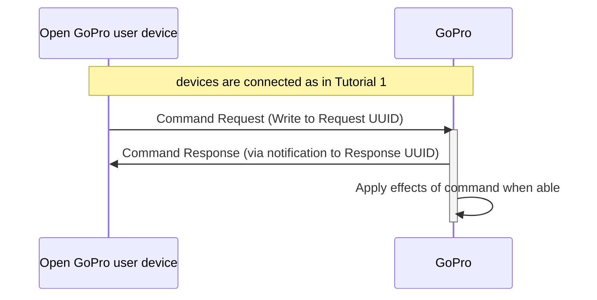

# Tutorial 2: Send BLE Commands

This document will provide a walk-through tutorial to use the
[Open GoPro BLE Interface](/ble/index.html) to send commands and receive responses.

"Commands" in this sense are specifically procedures that are initiated by either:

-   Writing to the Command Request UUID and receiving responses via the Command Response UUID. They are
    listed [here](/ble/index.html#commands).
-   Writing to the Setting UUID and receiving responses via the Setting Response UUID. They are listed
    [here](/ble/index.html#settings).


It is suggested that you have first completed the
[connect tutorial](#requirements) before going through
this tutorial.


This tutorial only considers sending these commands as one-off commands. That is, it does not consider state
management / synchronization when sending multiple commands. This will be discussed in a future lab.

# Requirements

It is assumed that the hardware and software requirements from the
[connect tutorial]() are present and configured correctly.

# Just Show me the Demo(s)!!



Each of the scripts for this tutorial can be found in the Tutorial 2
[directory](https://github.com/gopro/OpenGoPro/tree/main/demos/python/tutorial/tutorial_modules/tutorial_2_send_ble_commands/).


Python >= 3.8.x must be used as specified in the requirements




You can test sending the Set Shutter command to your camera through BLE using the following script:
```console
$ python ble_command_set_shutter.py
```

See the help for parameter definitions:

```console
$ python ble_command_set_shutter.py --help
usage: ble_command_set_shutter.py [-h] [-i IDENTIFIER]

Connect to a GoPro camera, set the shutter on, wait 2 seconds, then set the shutter off.

optional arguments:
  -h, --help            show this help message and exit
  -i IDENTIFIER, --identifier IDENTIFIER
                        Last 4 digits of GoPro serial number, which is the last 4 digits of the
                        default camera SSID. If not used, first discovered GoPro will be connected to
```




You can test sending the Load Preset Group command to your camera through BLE using the following script:
```console
$ python ble_command_load_group.py
```

See the help for parameter definitions:

```console
$ python ble_command_load_group.py --help
usage: ble_command_load_group.py [-h] [-i IDENTIFIER]

Connect to a GoPro camera, then change the Preset Group to Video.

optional arguments:
  -h, --help            show this help message and exit
  -i IDENTIFIER, --identifier IDENTIFIER
                        Last 4 digits of GoPro serial number, which is the last 4 digits of the
                        default camera SSID. If not used, first discovered GoPro will be connected to
```





You can test sending the Set Video Resolution command to your camera through BLE using the following script:
```console
$ python ble_command_set_resolution.py
```

See the help for parameter definitions:

```console
$ python ble_command_set_resolution.py --help
usage: ble_command_set_resolution.py [-h] [-i IDENTIFIER]

Connect to a GoPro camera, then change the resolution to 1080.

optional arguments:
  -h, --help            show this help message and exit
  -i IDENTIFIER, --identifier IDENTIFIER
                        Last 4 digits of GoPro serial number, which is the last 4 digits of the
                        default camera SSID. If not used, first discovered GoPro will be connected to
```





You can test sending the Set FPS command to your camera through BLE using the following script:
```console
$ python ble_command_set_fps.py
```

See the help for parameter definitions:

```console
$ python ble_command_set_fps.py --help
usage: ble_command_set_fps.py [-h] [-i IDENTIFIER]

Connect to a GoPro camera, then attempt to change the fps to 240.

optional arguments:
  -h, --help            show this help message and exit
  -i IDENTIFIER, --identifier IDENTIFIER
                        Last 4 digits of GoPro serial number, which is the last 4 digits of the
                        default camera SSID. If not used, first discovered GoPro will be connected to
```



The Kotlin file for this tutorial can be found on
[Github](https://github.com/gopro/OpenGoPro/tree/main/demos/kotlin/tutorial/app/src/main/java/com/example/open_gopro_tutorial/tutorials/Tutorial2SendBleCommands.kt).

To perform the tutorial, run the Android Studio project, select "Tutorial 2" from the dropdown and click on "Perform."
This requires that a GoPro is already connected via BLE, i.e. that Tutorial 1 was already run. You can
check the BLE status at the top of the app.

{% include figure image_path="/assets/images/tutorials/kotlin/tutorial_1.png" alt="kotlin_tutorial_2" size="40%" caption="Perform Tutorial 2" %}

This will start the tutorial and log to the screen as it executes. When the tutorial is complete, click
"Exit Tutorial" to return to the Tutorial selection screen.




# Setup

We must first connect as was discussed in the [connect tutorial](). In
this case, however, we are defining a meaningful (albeit naive) notification handler that will:

1. print byte data and handle that the notification was received on
1. check if the response is what we expected
1. set an event to notify the writer that the response was received

This is a very simple handler; response parsing will be expanded upon in the
[next tutorial]().



```python
def notification_handler(characteristic: BleakGATTCharacteristic, data: bytes) -> None:
    logger.info(f'Received response at handle {characteristic.handle}: {data.hex(":")}')

    # If this is the correct handle and the status is success, the command was a success
    if client.services.characteristics[characteristic.handle].uuid == response_uuid and data[2] == 0x00:
        logger.info("Command sent successfully")
    # Anything else is unexpected. This shouldn't happen
    else:
        logger.error("Unexpected response")

    # Notify the writer
    event.set()
```

The event used above is a simple synchronization event that is only alerting the writer that a notification was
received. For now, we're just checking that the handle matches what is expected and
that the status (third byte) is success (0x00).


```kotlin
private val receivedData: Channel<UByteArray> = Channel()

private fun naiveNotificationHandler(characteristic: UUID, data: UByteArray) {
    if ((characteristic == GoProUUID.CQ_COMMAND_RSP.uuid)) {
        CoroutineScope(Dispatchers.IO).launch { receivedData.send(data) }
    }
}
private val bleListeners by lazy {
    BleEventListener().apply {
        onNotification = ::naiveNotificationHandler
    }
}
```

The handler is simply verifying that the response was received on the correct UIUD and then notifying the
received data.

We are registering this notification handler with the BLE API before sending any data requests as such:

```kotlin
ble.registerListener(goproAddress, bleListeners)
```



There is much more to the synchronization and data parsing than this but this will be
discussed in future tutorials.

# Command Overview

Both Command Requests and Setting Requests follow the same procedure:

1. Write to relevant request UUID
1. Receive confirmation from GoPro (via notification from relevant response UUID) that request was received.
1. GoPro reacts to command


The notification response only indicates that the request was received and whether it was accepted or rejected.
The relevant behavior of the GoPro must be observed to verify when the command's effects have been applied.


Here is the procedure from power-on to finish:



# Sending Commands

Now that we are are connected, paired, and have enabled notifications (registered to our defined callback), we
can send some commands.

First, we need to define the attributes to write to / receive responses from, which are:

-   For commands
    -   "Command Request" characteristic (UUID `b5f90072-aa8d-11e3-9046-0002a5d5c51b`)
    -   "Command Response" characteristic (UUID `b5f90073-aa8d-11e3-9046-0002a5d5c51b`)
-   For settings
    -   "Settings" characteristic (UUID `b5f90074-aa8d-11e3-9046-0002a5d5c51b`)
    -   "Settings Response" (UUID `b5f90075-aa8d-11e3-9046-0002a5d5c51b`)



```python
COMMAND_REQ_UUID = GOPRO_BASE_UUID.format("0072")
COMMAND_RSP_UUID = GOPRO_BASE_UUID.format("0073")
```

```python
SETTINGS_REQ_UUID = GOPRO_BASE_UUID.format("0074")
SETTINGS_RSP_UUID = GOPRO_BASE_UUID.format("0075")
```


We're using the GOPRO_BASE_UUID string imported from the module's `__init__.py ` to build these.



These are defined in the `GoProUUID` class:

```kotlin
const val GOPRO_UUID = "0000FEA6-0000-1000-8000-00805f9b34fb"
const val GOPRO_BASE_UUID = "b5f9%s-aa8d-11e3-9046-0002a5d5c51b"

enum class GoProUUID(val uuid: UUID) {
    WIFI_AP_PASSWORD(UUID.fromString(GOPRO_BASE_UUID.format("0003"))),
    WIFI_AP_SSID(UUID.fromString(GOPRO_BASE_UUID.format("0002"))),
    CQ_COMMAND(UUID.fromString(GOPRO_BASE_UUID.format("0072"))),
    CQ_COMMAND_RSP(UUID.fromString(GOPRO_BASE_UUID.format("0073"))),
    CQ_SETTING(UUID.fromString(GOPRO_BASE_UUID.format("0074"))),
    CQ_SETTING_RSP(UUID.fromString(GOPRO_BASE_UUID.format("0075"))),
    CQ_QUERY(UUID.fromString(GOPRO_BASE_UUID.format("0076"))),
    CQ_QUERY_RSP(UUID.fromString(GOPRO_BASE_UUID.format("0077")));
}
```




## Set Shutter

The first command we will be sending is [Set Shutter](/ble/index.html#commands-quick-reference),
which at byte level is:

| Command         |        Bytes        |
| --------------- | :-----------------: |
| Set Shutter Off | 0x03 0x01 0x01 0x00 |
| Set Shutter On  | 0x03 0x01 0x01 0x01 |

Now, let's write the bytes to the "Command Request" UUID to turn the shutter on and start encoding!



```python
event.clear()
await client.write_gatt_char(COMMAND_REQ_UUID, bytearray([3, 1, 1, 1]))
await event.wait() # Wait to receive the notification response
```


We make sure to clear the synchronization event before writing, then pend on the event until it is set in
the notification callback.



```kotlin
val setShutterOnCmd = ubyteArrayOf(0x03U, 0x01U, 0x01U, 0x01U)
ble.writeCharacteristic(goproAddress, GoProUUID.CQ_COMMAND.uuid, setShutterOnCmd)
// Wait to receive the notification response, then check its status
checkStatus(receivedData.receive())
```



You should hear the camera beep and it will either take a picture or start recording
depending on what mode it is in.

Also note that we have received the "Command Status" notification response from the
Command Response characteristic since we enabled its notifications in
[Enable Notifications](#enable-notifications).
This can be seen in the demo log:



```console
INFO:root:Setting the shutter on
INFO:root:Received response at handle=52: b'02:01:00'
INFO:root:Shutter command sent successfully
```


```console
Writing characteristic b5f90072-aa8d-11e3-9046-0002a5d5c51b ==> 03:01:01:01
Wrote characteristic b5f90072-aa8d-11e3-9046-0002a5d5c51b
Characteristic b5f90073-aa8d-11e3-9046-0002a5d5c51b changed | value: 02:01:00
Received response on b5f90073-aa8d-11e3-9046-0002a5d5c51b: 02:01:00
Command sent successfully
```



As expected, the response was received on the correct handle and the status was "success".

If you are recording a video, continue reading to set the shutter off.

We can now set the shutter off:


We're waiting 2 seconds in case you are in video mode so that we can capture a 2 second video.




```python
time.sleep(2)
event.clear()
await client.write_gatt_char(COMMAND_REQ_UUID, bytearray([3, 1, 1, 0]))
await event.wait() # Wait to receive the notification response
```

This will log in the console as follows:

```python
INFO:root:Setting the shutter off
INFO:root:Received response at handle=52: b'02:01:00'
INFO:root:Shutter command sent successfully
```


```kotlin
delay(2000)
val setShutterOffCmd = ubyteArrayOf(0x03U, 0x01U, 0x01U, 0x00U)
// Wait to receive the notification response, then check its status
checkStatus(receivedData.receive())
```

This will log as such:

```console
Setting the shutter off
Writing characteristic b5f90072-aa8d-11e3-9046-0002a5d5c51b ==> 03:01:01:00
Wrote characteristic b5f90072-aa8d-11e3-9046-0002a5d5c51b
Characteristic b5f90073-aa8d-11e3-9046-0002a5d5c51b changed | value: 02:01:00
Received response on b5f90073-aa8d-11e3-9046-0002a5d5c51b: 02:01:00
Command sent successfully
```



## Load Preset Group

The next command we will be sending is
[Load Preset Group](/ble/index.html#commands-quick-reference), which is used
to toggle between the 3 groups of presets (video, photo, and timelapse). At byte level, the commands are:

| Command                     |          Bytes           |
| --------------------------- | :----------------------: |
| Load Video Preset Group     | 0x04 0x3E 0x02 0x03 0xE8 |
| Load Photo Preset Group     | 0x04 0x3E 0x02 0x03 0xE9 |
| Load Timelapse Preset Group | 0x04 0x3E 0x02 0x03 0xEA |


It is possible that the preset GroupID values will vary in future cameras. The only absolutely correct way to know
the preset ID is to read them from the "Get Preset Status" protobuf command. A future lab will discuss protobuf
commands.


Now, let's write the bytes to the "Command Request" UUID to change the preset group to Video!



```python
event.clear()
await client.write_gatt_char(COMMAND_REQ_UUID, bytearray([0x04, 0x3E, 0x02, 0x03, 0xE8]))
await event.wait()  # Wait to receive the notification response
```


We make sure to clear the synchronization event before writing, then pend on the event until it is set in
the notification callback.



```kotlin
val loadPreset = ubyteArrayOf(0x04U, 0x3EU, 0x02U, 0x03U, 0xE8U)
ble.writeCharacteristic(goproAddress, GoProUUID.CQ_COMMAND.uuid, loadPreset)
// Wait to receive the notification response, then check its status
checkStatus(receivedData.receive())
```



You should hear the camera beep and move to the Video Preset Group. You can tell this by the logo at the top
middle of the screen:

{% include figure image_path="/assets/images/tutorials/preset_group.png" alt="Preset Group" size="50%" caption="Load Preset Group" %}

Also note that we have received the "Command Status" notification response from the
Command Response characteristic since we enabled its notifications in
[Enable Notifications](#enable-notifications). This can
be seen in the demo log:



```console
INFO:root:Loading the video preset group...
INFO:root:Received response at handle=52: b'02:3e:00'
INFO:root:Command sent successfully
```


```console
Loading Video Preset Group
Writing characteristic b5f90072-aa8d-11e3-9046-0002a5d5c51b ==> 04:3E:02:03:E8
Wrote characteristic b5f90072-aa8d-11e3-9046-0002a5d5c51b
Characteristic b5f90073-aa8d-11e3-9046-0002a5d5c51b changed | value: 02:3E:00
Received response on b5f90073-aa8d-11e3-9046-0002a5d5c51b: 02:3E:00
Command status received
Command sent successfully
```



As expected, the response was received on the correct handle and the status was "success".

## Set the Video Resolution

The next command we will be sending is
[Set Video Resolution](/ble/index.html#commands-quick-reference). This is
used to change the value of the Video Resolution setting. It is important to note that this only affects
**video** resolution (not photo). Therefore, the Video Preset Group must be active in order for it to succeed.
This can be done either manually through the camera UI or by sending [Load Preset Group](#load-preset-group).


This resolution only affects the current video preset. Each video preset can have its own independent values
for video resolution.


Here are some of the byte level commands for various video resolutions.

| Command                      |        Bytes        |
| ---------------------------- | :-----------------: |
| Set Video Resolution to 1080 | 0x03 0x02 0x01 0x09 |
| Set Video Resolution to 2.7K | 0x03 0x02 0x01 0x04 |
| Set Video Resolution to 5K   | 0x03 0x02 0x01 0x18 |

Now, let's write the bytes to the "Setting Request" UUID to change the video resolution to 1080!



```python
event.clear()
await client.write_gatt_char(SETTINGS_REQ_UUID, bytearray([0x03, 0x02, 0x01, 0x09]))
await event.wait()  # Wait to receive the notification response
```


We make sure to clear the synchronization event before writing, then pend on the event until it is set in
the notification callback.




```kotlin
val setResolution = ubyteArrayOf(0x03U, 0x02U, 0x01U, 0x09U)
ble.writeCharacteristic(goproAddress, GoProUUID.CQ_COMMAND.uuid, setResolution)
// Wait to receive the notification response, then check its status
checkStatus(receivedData.receive())
```



You should see the video resolution change to 1080 in the pill in the bottom-middle of the
screen:

{% include figure image_path="/assets/images/tutorials/video_resolution.png" alt="Video Resolution" size="50%" caption="Set Video Resolution" %}

Also note that we have received the "Command Status" notification response from the
Command Response characteristic since we enabled its notifications in
[Enable Notifications](#enable-notifications).. This can
be seen in the demo log:



```console
INFO:root:Loading the video preset group...
INFO:root:Received response at handle=52: b'02:3e:00'
INFO:root:Command sent successfully
```


```console
Setting resolution to 1080
Writing characteristic b5f90072-aa8d-11e3-9046-0002a5d5c51b ==> 03:02:01:09
Wrote characteristic b5f90072-aa8d-11e3-9046-0002a5d5c51b
Characteristic b5f90073-aa8d-11e3-9046-0002a5d5c51b changed | value: 02:02:00
Received response on b5f90073-aa8d-11e3-9046-0002a5d5c51b: 02:02:00
Command status received
Command sent successfully
```



As expected, the response was received on the correct handle and the status was "success". If the Preset
Group was not Video, the status will not be success.

## Set the Frames Per Second (FPS)

The next command we will be sending is
[Set FPS](/ble/index.html#commands-quick-reference). This is
used to change the value of the FPS setting. It is important to note that this setting is dependent on the
video resolution. That is, certain FPS values are not valid with certain resolutions. In general, higher
resolutions only allow lower FPS values. Also, the current anti-flicker value may further limit possible FPS
values. Check the [camera capabilities ](/ble/index.html#camera-capabilities) to see which FPS
values are valid for given use cases.

Therefore, for this step of the tutorial, it is assumed that the resolution has
been set to 1080 as in [Set the Video Resolution](#set-the-video-resolution).

Here are some of the byte level commands for various FPS values.

| Command        |        Bytes        |
| -------------- | :-----------------: |
| Set FPS to 24  | 0x03 0x03 0x01 0x0A |
| Set FPS to 60  | 0x03 0x03 0x01 0x05 |
| Set FPS to 240 | 0x03 0x03 0x01 0x00 |

Note that the possible FPS values can vary based on the Open GoPro version that the camera supports.
Therefore, it is necessary to
[check the version](#complex-command-response).

Now, let's write the bytes to the "Setting Request" UUID to change the FPS to 240!



```python
event.clear()
await client.write_gatt_char(SETTINGS_REQ_UUID, bytearray([0x03, 0x03, 0x01, 0x00]))
await event.wait()  # Wait to receive the notification response
```


We make sure to clear the synchronization event before writing, then pend on the event until it is set in
the notification callback.



```kotlin
val setFps = ubyteArrayOf(0x03U, 0x03U, 0x01U, 0x00U)
ble.writeCharacteristic(goproAddress, GoProUUID.CQ_COMMAND.uuid, setFps)
// Wait to receive the notification response, then check its status
checkStatus(receivedData.receive())
```



You should see the FPS change to 240 in the pill in the bottom-middle of the
screen:

{% include figure image_path="/assets/images/tutorials/fps.png" alt="FPS" size="50%" caption="Set FPS" %}

Also note that we have received the "Command Status" notification response from the
Command Response characteristic since we enabled its notifications in
[Enable Notifications](#enable-notifications).. This can
be seen in the demo log:



```console
INFO:root:Setting the fps to 240
INFO:root:Received response at handle=57: b'02:03:00'
INFO:root:Command sent successfully
```


```console
Setting the FPS to 240
Writing characteristic b5f90072-aa8d-11e3-9046-0002a5d5c51b ==> 03:03:01:00
Wrote characteristic b5f90072-aa8d-11e3-9046-0002a5d5c51b
Characteristic b5f90073-aa8d-11e3-9046-0002a5d5c51b changed | value: 02:03:00
Received response on b5f90073-aa8d-11e3-9046-0002a5d5c51b: 02:03:00
Command status received
Command sent successfully
```



As expected, the response was received on the correct handle and the status was "success". If the video resolution
was higher, for example 5K, this would fail.

**Quiz time! 📚 ✏️**







# Troubleshooting

See the first tutorial's
[troubleshooting section](#troubleshooting).

# Good Job!


Congratulations 🤙


You can now send any of the other BLE commands detailed in the Open GoPro documentation in
a similar manner.

To see how to parse more complicate responses, proceed to the next tutorial.
