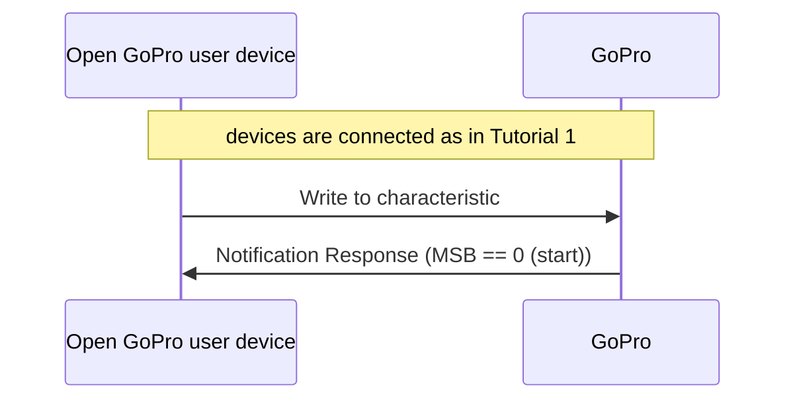
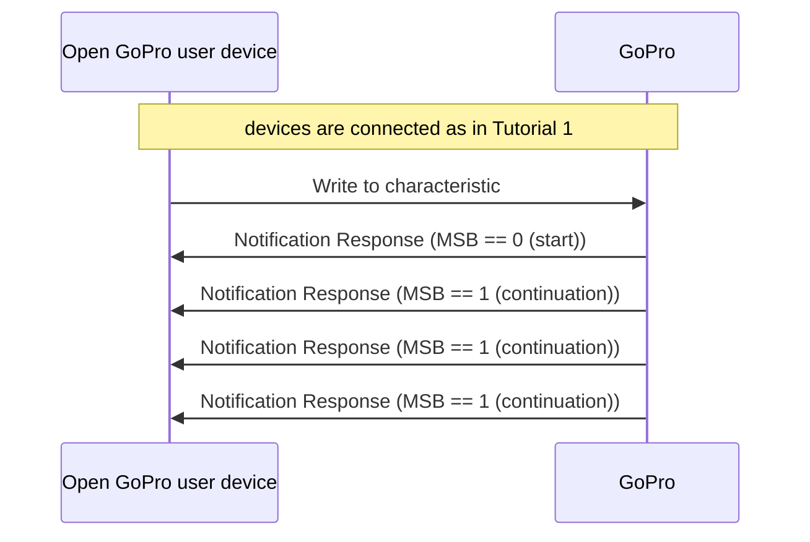
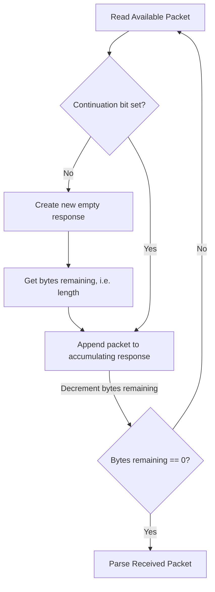

# Tutorial 3: Parse BLE TLV Responses

This document will provide a walk-through tutorial to implement
the [Open GoPro Interface]({{site.baseurl}}/ble/index.html) to parse BLE
[Type-Length-Value](https://en.wikipedia.org/wiki/Type-length-value) (TLV) Responses.


Besides TLV, some BLE operations instead return protobuf responses. These are not considered here and will be
discussed in a [future tutorial]()


This tutorial will provide an overview of how to handle responses of both single and multiple packets lengths, then
give parsing examples for each case, and finally create `Response` and `TlvResponse` classes that will be reused in
future tutorials.

# Requirements

It is assumed that the hardware and software requirements from the
[connecting BLE tutorial]()
are present and configured correctly.


It is suggested that you have first completed the
[connect](#requirements)
and [sending commands]() tutorials before going
through this tutorial.


# Just Show me the Demo(s)!!



Each of the scripts for this tutorial can be found in the Tutorial 3
[directory](https://github.com/gopro/OpenGoPro/tree/main/demos/python/tutorial/tutorial_modules/tutorial_3_parse_ble_tlv_responses/).


Python >= 3.9 and < 3.12 must be used as specified in the requirements




You can test parsing a one packet TLV response with your camera through BLE using the following script:

```console
$ python ble_command_get_version.py
```

See the help for parameter definitions:

```console
$ python ble_command_get_version.py --help
usage: ble_command_get_version.py [-h] [-i IDENTIFIER]

Connect to a GoPro camera via BLE, then get the Open GoPro version.

optional arguments:
  -h, --help            show this help message and exit
  -i IDENTIFIER, --identifier IDENTIFIER
                        Last 4 digits of GoPro serial number, which is the last 4 digits of the
                        default camera SSID. If not used, first discovered GoPro will be connected to
```





You can test parsing multiple packet TVL responses with your camera through BLE using the following script:

```console
$ python ble_command_get_hardware_info.py
```

See the help for parameter definitions:

```console
$ python ble_command_get_hardware_info.py --help
usage: ble_command_get_hardware_info.py [-h] [-i IDENTIFIER]

Connect to a GoPro camera via BLE, then get its hardware info.

options:
  -h, --help            show this help message and exit
  -i IDENTIFIER, --identifier IDENTIFIER
                        Last 4 digits of GoPro serial number, which is the last 4 digits of
                        the default camera SSID. If not used, first discovered GoPro will be
                        connected to
```





The Kotlin file for this tutorial can be found on
[Github](https://github.com/gopro/OpenGoPro/tree/main/demos/kotlin/tutorial/app/src/main/java/com/example/open_gopro_tutorial/tutorials/Tutorial3ParseBleTlvResponses.kt).

To perform the tutorial, run the Android Studio project, select "Tutorial 3" from the dropdown and click on "Perform."
This requires that a GoPro is already connected via BLE, i.e. that Tutorial 1 was already run. You can
check the BLE status at the top of the app.

{% include figure image_path="/assets/images/tutorials/kotlin/tutorial_3.png" alt="kotlin_tutorial_3" size="40%" caption="Perform Tutorial 3" %}

This will start the tutorial and log to the screen as it executes. When the tutorial is complete, click
"Exit Tutorial" to return to the Tutorial selection screen.




# Setup

We must first connect as was discussed in the
[connecting BLE tutorial](). When enabling notifications,
one of the notification handlers described in the following sections will be used.

# Response Overview

In the preceding tutorials, we have been using a very simple response handling procedure where the notification
handler simply checks that the UUID is the expected UUID and that the status byte of the response is 0 (Success).
This has been fine since we were only performing specific operations where this works and we know that the sequence
always appears as such (connection sequence left out for brevity):



In actuality, responses can be more complicated. As described in the
[BLE Spec]({{site.baseurl}}/ble/protocol/data_protocol.html#packetization), responses can be be comprised of multiple
packets where each packet is <= 20 bytes such as:



This requires the implementation of accumulating and parsing algorithms which will be described
[below](#parsing-multiple-packet-tlv-responses).

# Parsing a One Packet TLV Response

This section will describe how to parse one packet (<= 20 byte) responses. A one-packet response
is formatted as such:

| Header (length) | Operation ID | Status  | Response         |
| --------------- | ------------ | ------- | ---------------- |
| 1 byte          | 1 byte       | 1 bytes | Length - 2 bytes |

## Responses with Payload Length 0

These are the only responses that we have seen thus far through the first 2 tutorials. They
return a status but have a 0 length additional response. For example, consider
[Set Shutter](#set-shutter). It returned a response
of:

```
02:01:00
```

This equates to:

| Header (length) | Command ID          | Status          | Response         |
| --------------- | ------------------- | --------------- | ---------------- |
| 1 byte          | 1 byte              | 1 bytes         | Length - 2 bytes |
| 0x02            | 0x01 == Set Shutter | 0x00 == Success | (2 -2 = 0 bytes) |

We can see how this response includes the status but no additional response data. This type of
response will be used for most Commands and Setting Responses as seen in the
[previous tutorial]().

## Responses with Payload

However, there are some operations that do return additional response data. These are identified by the presence of
`parameters` in their Response documentation as shown in the red box here:

{% include figure image_path="/assets/images/tutorials/complex_response_doc.png" alt="complex response example" size="40%" caption="Response With Payload" %}

In this tutorial, we will walk through creating a simple parser to parse the
[Open GoPro Get Version Command]({{site.baseurl}}/ble/features/query.html#get-open-gopro-version) which is an example
of such an operation.


It is important to always query the version after connecting in order to know which API is supported.
See the relevant version of the BLE and / or WiFi spec for more details about each version.


First, we send the Get Version Command to the Command Request
[UUID]({{site.baseurl}}/ble/protocol/ble_setup.html#configure-gatt-characteristics) in the same manner as commands
were sent in the previous tutorial:




```python
request_uuid = GoProUuid.COMMAND_REQ_UUID
request = bytes([0x01, 0x51])
await client.write_gatt_char(request_uuid.value, request, response=True)
await event.wait()  # Wait to receive the notification response
```

We receive a response at the expected handle (as a TLV Response). This is logged as:

```console
Getting the Open GoPro version...
Writing to GoProUuid.COMMAND_REQ_UUID: 01:51
Received response GoProUuid.COMMAND_RSP_UUID: 06:51:00:01:02:01:00
```




```kotlin
val versionRequest = ubyteArrayOf(0x01U, 0x51U)
ble.writeCharacteristic(goproAddress, GoProUUID.CQ_COMMAND.uuid, versionRequest)
var tlvResponse = receivedResponses.receive() as Response.Tlv
```

We then receive a response at the expected handle. This is logged as:

This is logged as such:

```console
Getting the Open GoPro version
Writing characteristic b5f90072-aa8d-11e3-9046-0002a5d5c51b ==> 01:51
Wrote characteristic b5f90072-aa8d-11e3-9046-0002a5d5c51b
Characteristic b5f90073-aa8d-11e3-9046-0002a5d5c51b changed | value: 06:51:00:01:02:01:00
Received response on CQ_COMMAND_RSP
Received packet of length 6. 0 bytes remaining
```




This response equates to:

| Header (length) | Command ID          | Status          | Response            |
| --------------- | ------------------- | --------------- | ------------------- |
| 1 byte          | 1 byte              | 1 bytes         | Length - 2 bytes    |
| 0x06            | 0x51 == Get Version | 0x00 == Success | 0x01 0x02 0x01 0x00 |

We can see that this response payload contains 4 additional bytes that need to be parsed. Using the information
from the [Get Version Documentation]({{site.baseurl}}/ble/features/query.html#get-open-gopro-version), we know to
parse this as:

| Byte | Meaning                               |
| ---- | ------------------------------------- |
| 0x01 | Length of Major Version Number        |
| 0x02 | Major Version Number of length 1 byte |
| 0x01 | Length of Minor Version Number        |
| 0x00 | Minor Version Number of length 1 byte |

We implement this as follows. First, we parse the length, command ID, and status from the first 3 bytes of the response.
The remainder is stored as the payload. This is all of the common parsing across TLV Responses. Each individual
response will document how to further parse the payload.





The snippets of code included in this section are taken from the `notification handler`


```python
# First byte is the length of this response.
length = data[0]
# Second byte is the ID
command_id = data[1]
# Third byte is the status
status = data[2]
# The remainder is the payload
payload = data[3 : length + 1]
```





The snippets of code included in this section are taken from the `Response.Tlv.Parse` method


```kotlin
// Parse header bytes
tlvResponse.parse()

...

open fun parse() {
    require(isReceived)
    id = rawBytes[0].toInt()
    status = rawBytes[1].toInt()
    // Store remainder as payload
    payload = rawBytes.drop(2).toUByteArray()
}

```




From the response definition, we know these parameters are one byte each and equate to the major and
the minor version so let's print them (and all of the other response information) as such:




```python
major_length = payload[0]
payload.pop(0)
major = payload[:major_length]
payload.pop(major_length)
minor_length = payload[0]
payload.pop(0)
minor = payload[:minor_length]
logger.info(f"The version is Open GoPro {major[0]}.{minor[0]}")
logger.info(f"Received a response to {command_id=} with {status=}: version={major[0]}.{minor[0]}")
```

which shows on the log as:

```console
Received a response to command_id=81 with status=0, payload=01:02:01:00
The version is Open GoPro 2.0
```





The snippets of code included in this section are taken from the `OpenGoProVersion` `from_bytes` method. This class
is a simple data class to contain the Get Version information.


```kotlin
var buf = data.toUByteArray()
val minorLen = buf[0].toInt()
buf = buf.drop(1).toUByteArray()
val minor = buf.take(minorLen).toInt()
val majorLen = buf[0].toInt()
buf = buf.drop(1).toUByteArray()
val major = buf.take(majorLen).toInt()
return OpenGoProVersion(minor, major)
```

which shows on the log as such:

```console
Received response: ID: 81, Status: 0, Payload: 01:02:01:00
Got the Open GoPro version successfully: 2.0
```




**Quiz time! 📚 ✏️**





{% quiz
    question="How many packets are command responses composed of?"
    option="A:::Always 1 packet"
    option="B:::Always multiple packets."
    option="C:::A variable amount of packets depending on the payload size"
    correct="C"
    info="Command responses are sometimes 1 packet (just returning the status).
    Other times, command responses also contain a payload and can thus be multiple packets if the payload is big enough
    (i.e. in the case of Get Hardware Info). This is described in the per-command documentation in the BLE spec."
%}



# Parsing Multiple Packet TLV Responses

This section will describe parsing TLV responses that contain more than one packet. It will first describe how
to accumulate such responses and then provide a parsing example. We will be creating small _Response_ and _TlvResponse_
classes that will be re-used for future tutorials.

## Accumulating the Response

The first step is to accumulate the multiple packets into one response. Whereas for all tutorials until now, we
have just used the header bytes of the response as the length, we now must completely parse the headers as they are
[defined]({{site.baseurl}}/ble/protocol/data_protocol.html#packet-headers), reproduced for reference here:

<table border="1">
  <tbody>
    <tr>
        <td colspan="8">Byte 1</td>
        <td colspan="8">Byte 2 (optional)</td>
        <td colspan="8">Byte 3 (optional)</td>
    </tr>
    <tr>
        <td>7</td>
        <td>6</td>
        <td>5</td>
        <td>4</td>
        <td>3</td>
        <td>2</td>
        <td>1</td>
        <td>0</td>
        <td>7</td>
        <td>6</td>
        <td>5</td>
        <td>4</td>
        <td>3</td>
        <td>2</td>
        <td>1</td>
        <td>0</td>
        <td>7</td>
        <td>6</td>
        <td>5</td>
        <td>4</td>
        <td>3</td>
        <td>2</td>
        <td>1</td>
        <td>0</td>
    </tr>
    <tr>
        <td>0: Start</td>
        <td colspan="2">00: General</td>
        <td colspan="5">Message Length: 5 bits</td>
        <td colspan="16"></td>
    </tr>
    <tr>
        <td>0: Start</td>
        <td colspan="2">01: Extended (13-bit)</td>
        <td colspan="13">Message Length: 13 bits</td>
        <td colspan="8"></td>
    </tr>
    <tr>
        <td>0: Start</td>
        <td colspan="2">10: Extended (16-bit)</td>
        <td colspan="5"></td>
        <td colspan="16">Message Length: 16 bits</td>
    </tr>
    <tr>
        <td>0: Start</td>
        <td colspan="2">11: Reserved</td>
        <td colspan="21"></td>
    </tr>
    <tr>
        <td>1: Continuation</td>
        <td colspan="24"></td>
    </tr>
  </tbody>
</table>

The basic accumulation algorithm (which is implemented in the _Response.Accumulate_ method) is as follows:

---

<div class="md_column">
<div markdown="1">
Is the continuation bit set?





The example script that will be walked through for this section is `ble_command_get_hardware_info.py`.


```python
if buf[0] & CONT_MASK:
    buf.pop(0)
else:
    ...
```




```kotlin
if (data.first().and(Mask.Continuation.value) == Mask.Continuation.value) {
    buf = buf.drop(1).toUByteArray() // Pop the header byte
} else { // This is a new packet
    ...
```




No, the continuation bit was not set. Therefore create new response, then get its length.




```python
# This is a new packet so start with an empty byte array
self.bytes = bytearray()
hdr = Header((buf[0] & HDR_MASK) >> 5)
if hdr is Header.GENERAL:
    self.bytes_remaining = buf[0] & GEN_LEN_MASK
    buf = buf[1:]
elif hdr is Header.EXT_13:
    self.bytes_remaining = ((buf[0] & EXT_13_BYTE0_MASK) << 8) + buf[1]
    buf = buf[2:]
elif hdr is Header.EXT_16:
    self.bytes_remaining = (buf[1] << 8) + buf[2]
    buf = buf[3:]
```




```kotlin
// This is a new packet so start with empty array
packet = ubyteArrayOf()
when (Header.fromValue((buf.first() and Mask.Header.value).toInt() shr 5)) {
    Header.GENERAL -> {
        bytesRemaining = buf[0].and(Mask.GenLength.value).toInt()
        buf = buf.drop(1).toUByteArray()
    }
    Header.EXT_13 -> {
        bytesRemaining = ((buf[0].and(Mask.Ext13Byte0.value)
            .toLong() shl 8) or buf[1].toLong()).toInt()
        buf = buf.drop(2).toUByteArray()
    }
    Header.EXT_16 -> {
        bytesRemaining = ((buf[1].toLong() shl 8) or buf[2].toLong()).toInt()
        buf = buf.drop(3).toUByteArray()
    }
    Header.RESERVED -> {
        throw Exception("Unexpected RESERVED header")
    }
}
```




Append current packet to response and decrement bytes remaining.




```python
# Append payload to buffer and update remaining / complete
self.bytes.extend(buf)
self.bytes_remaining -= len(buf)
```




```kotlin
// Accumulate the payload now that headers are handled and dropped
packet += buf
bytesRemaining -= buf.size
```




In the notification handler, we are then enqueueing the received response if there are no bytes remaining.




```python
    if response.is_received:
        ...
        await received_responses.put(response)
```

and finally parsing the payload back in the main task after it receives the accumulated response from the queue which,
at the current TLV Response level, is just extracting the ID, status, and payload:

```python
class TlvResponse(Response):
    def parse(self) -> None:
        self.id = self.raw_bytes[0]
        self.status = self.raw_bytes[1]
        self.payload = self.raw_bytes[2:]

...

response = await received_responses.get()
response.parse()
```




```kotlin
if (response.isReceived) {
    if (uuid == GoProUUID.CQ_COMMAND_RSP) {
        CoroutineScope(Dispatchers.IO).launch { receivedResponses.send(response) }
    }
    ...
```




</div>

<div markdown="1" style="flex-basis: 50em; max-width: max-content">
<br><br><br>

</div>
</div>

---

We can see this in action when we send the
[Get Hardware Info]({{site.baseurl}}/ble/features/query.html#get-hardware-info) Command:




```python
request_uuid = GoProUuid.COMMAND_REQ_UUID
request = bytearray([0x01, 0x3C])
await client.write_gatt_char(request_uuid.value, request, response=True)
response = await received_responses.get()
```




```kotlin
val hardwareInfoRequest = ubyteArrayOf(0x01U, 0x3CU)
ble.writeCharacteristic(goproAddress, GoProUUID.CQ_COMMAND.uuid, hardwareInfoRequest)
```




Then, in the notification handler, we continuously receive and accumulate packets (per UUID) until we have
received an entire response, at which point we perform common TLV parsing (via the `TlvResponse`'s `parse` method)
to extract Command ID, Status, and payload. Then we enqueue the received response to notify the writer that the response
is ready. Finally we reset the per-UUID response to prepare it to receive a new response.


This notification handler is only designed to handle TlvResponses. This is fine for this tutorial since that is all
we will be receiving.





```python
request_uuid = GoProUuid.COMMAND_REQ_UUID
response_uuid = GoProUuid.COMMAND_RSP_UUID
responses_by_uuid = GoProUuid.dict_by_uuid(TlvResponse)
received_responses: asyncio.Queue[TlvResponse] = asyncio.Queue()

async def tlv_notification_handler(characteristic: BleakGATTCharacteristic, data: bytearray) -> None:
    uuid = GoProUuid(client.services.characteristics[characteristic.handle].uuid)
    response = responses_by_uuid[uuid]
    response.accumulate(data)

    if response.is_received:
        # If this is the correct handle, enqueue it for processing
        if uuid is response_uuid:
            logger.info("Received the get hardware info response")
            await received_responses.put(response)
        # Anything else is unexpected. This shouldn't happen
        else:
            logger.error("Unexpected response")
        # Reset the per-UUID response
        responses_by_uuid[uuid] = TlvResponse(uuid)
```




```kotlin
private fun notificationHandler(characteristic: UUID, data: UByteArray) {
    ...
    responsesByUuid[uuid]?.let { response ->
        response.accumulate(data)
        if (response.isReceived) {
            if (uuid == GoProUUID.CQ_COMMAND_RSP) {
                CoroutineScope(Dispatchers.IO).launch { receivedResponses.send(response) }
            }
            ...
            responsesByUuid[uuid] = Response.muxByUuid(uuid)
        }
    }
}
```




We can see the individual packets being accumulated in the log:




```console
Getting the camera's hardware info...
Writing to GoProUuid.COMMAND_REQ_UUID: 01:3c
Received response at handle 47: 20:62:3c:00:04:00:00:00:3e:0c:48:45:52:4f:31:32:20:42:6c:61
self.bytes_remaining=80
Received response at handle 47: 80:63:6b:04:30:78:30:35:0f:48:32:33:2e:30:31:2e:30:31:2e:39
self.bytes_remaining=61
Received response at handle 47: 81:39:2e:35:36:0e:43:33:35:30:31:33:32:34:35:30:30:37:30:32
self.bytes_remaining=42
Received response at handle 47: 82:11:48:45:52:4f:31:32:20:42:6c:61:63:6b:64:65:62:75:67:0c
self.bytes_remaining=23
Received response at handle 47: 83:32:36:37:34:66:37:66:36:36:31:30:34:01:00:01:01:01:00:02
self.bytes_remaining=4
Received response at handle 47: 84:5b:5d:01:01
self.bytes_remaining=0
Received the get hardware info response
```




```console
Getting the Hardware Info
Writing characteristic b5f90072-aa8d-11e3-9046-0002a5d5c51b ==> 01:3C
Characteristic b5f90073-aa8d-11e3-9046-0002a5d5c51b changed | value: 20:5B:3C:00:04:00:00:00:3E:0C:48:45:52:4F:31:32:20:42:6C:61
Received response on CQ_COMMAND_RSP
Received packet of length 18. 73 bytes remaining
Characteristic b5f90073-aa8d-11e3-9046-0002a5d5c51b changed | value: 80:63:6B:04:30:78:30:35:0F:48:32:33:2E:30:31:2E:30:31:2E:39
Received response on CQ_COMMAND_RSP
Received packet of length 19. 54 bytes remaining
Wrote characteristic b5f90072-aa8d-11e3-9046-0002a5d5c51b
Characteristic b5f90073-aa8d-11e3-9046-0002a5d5c51b changed | value: 81:39:2E:35:36:0E:43:33:35:30:31:33:32:34:35:30:30:37:30:32
Received response on CQ_COMMAND_RSP
Received packet of length 19. 35 bytes remaining
Characteristic b5f90073-aa8d-11e3-9046-0002a5d5c51b changed | value: 82:0A:47:50:32:34:35:30:30:37:30:32:0C:32:36:37:34:66:37:66
Received response on CQ_COMMAND_RSP
Received packet of length 19. 16 bytes remaining
Characteristic b5f90073-aa8d-11e3-9046-0002a5d5c51b changed | value: 83:36:36:31:30:34:01:00:01:01:01:00:02:5B:5D:01:01
Received response on CQ_COMMAND_RSP
Received packet of length 16. 0 bytes remaining
```




At this point the response has been accumulated. We then parse and log the payload using the
[Get Hardware Info]({{site.baseurl}}/ble/features/query.html#get-hardware-info) response documentation:




```python
hardware_info = HardwareInfo.from_bytes(response.payload)
logger.info(f"Received hardware info: {hardware_info}")
```

where the parsing is done as such:

```python
    @classmethod
    def from_bytes(cls, data: bytes) -> HardwareInfo:
        buf = bytearray(data)
        # Get model number
        model_num_length = buf.pop(0)
        model = int.from_bytes(buf[:model_num_length])
        buf = buf[model_num_length:]
        # Get model name
        model_name_length = buf.pop(0)
        model_name = (buf[:model_name_length]).decode()
        buf = buf[model_name_length:]
        # Advance past deprecated bytes
        deprecated_length = buf.pop(0)
        buf = buf[deprecated_length:]
        # Get firmware version
        firmware_length = buf.pop(0)
        firmware = (buf[:firmware_length]).decode()
        buf = buf[firmware_length:]
        # Get serial number
        serial_length = buf.pop(0)
        serial = (buf[:serial_length]).decode()
        buf = buf[serial_length:]
        # Get AP SSID
        ssid_length = buf.pop(0)
        ssid = (buf[:ssid_length]).decode()
        buf = buf[ssid_length:]
        # Get MAC address
        mac_length = buf.pop(0)
        mac = (buf[:mac_length]).decode()
        buf = buf[mac_length:]

        return cls(model, model_name, firmware, serial, ssid, mac)
```

This logs as:

```console
Parsed hardware info: {
        "model_name": "HERO12 Black",
        "firmware_version": "H23.01.01.99.56",
        "serial_number": "C3501324500702",
        "ap_ssid": "HERO12 Blackdebug",
        "ap_mac_address": "2674f7f66104"
    }
```




```kotlin
tlvResponse.parse()
val hardwareInfo = HardwareInfo.fromBytes(tlvResponse.payload)
```

where the parsing is done as such:

```kotlin
fun fromBytes(data: UByteArray): HardwareInfo {
    // Parse header bytes
    var buf = data.toUByteArray()
    // Get model number
    val modelNumLength = buf.first().toInt()
    buf = buf.drop(1).toUByteArray()
    val model = buf.take(modelNumLength).toInt()
    buf = buf.drop(modelNumLength).toUByteArray()
    // Get model name
    val modelNameLength = buf.first().toInt()
    buf = buf.drop(1).toUByteArray()
    val modelName = buf.take(modelNameLength).decodeToString()
    buf = buf.drop(modelNameLength).toUByteArray()
    // Advance past deprecated bytes
    val deprecatedLength = buf.first().toInt()
    buf = buf.drop(1).toUByteArray()
    buf = buf.drop(deprecatedLength).toUByteArray()
    // Get firmware version
    val firmwareLength = buf.first().toInt()
    buf = buf.drop(1).toUByteArray()
    val firmware = buf.take(firmwareLength).decodeToString()
    buf = buf.drop(firmwareLength).toUByteArray()
    // Get serial number
    val serialLength = buf.first().toInt()
    buf = buf.drop(1).toUByteArray()
    val serial = buf.take(serialLength).decodeToString()
    buf = buf.drop(serialLength).toUByteArray()
    // Get AP SSID
    val ssidLength = buf.first().toInt()
    buf = buf.drop(1).toUByteArray()
    val ssid = buf.take(ssidLength).decodeToString()
    buf = buf.drop(ssidLength).toUByteArray()
    // Get MAC Address
    val macLength = buf.first().toInt()
    buf = buf.drop(1).toUByteArray()
    val mac = buf.take(macLength).decodeToString()

    return HardwareInfo(model, modelName, firmware, serial, ssid, mac)
}
```

This logs as:

```console
Got the Hardware Info successfully: HardwareInfo(
    modelNumber=1040187392,
    modelName=HERO12 Black,
    firmwareVersion=H23.01.01.99.56,
    serialNumber=C3501324500702,
    apSsid=GP24500702,
    apMacAddress=2674f7f66104
)
```




**Quiz time! 📚 ✏️**

{% quiz
    question="How can we know that a response has been completely received?"
    option="A:::The stop bit will be set in the header"
    option="B:::The response has accumulated length bytes"
    option="C:::By checking for the end of frame (EOF) sentinel character"
    correct="B"
    info="The length of the entire response is parsed from the first packet. We
        then accumulate packets, keeping track of the received length, until all of the bytes
        have been received. A and C are just made up 😜."
%}

# Troubleshooting

See the first tutorial's
[troubleshooting section](#troubleshooting).

# Good Job!


Congratulations 🤙


You now know how to accumulate TLV responses that are received from the GoPro, at least if they are received uninterrupted.
There is additional logic required for a complete solution such as checking the UUID the response is received
on and storing a dict of response per UUID. At the current time, this endeavor is left for the reader. For a
complete example of this, see the [Open GoPro Python SDK](https://gopro.github.io/OpenGoPro/python_sdk/).

To learn about a different type of operation (Queries), go to the next tutorial.
