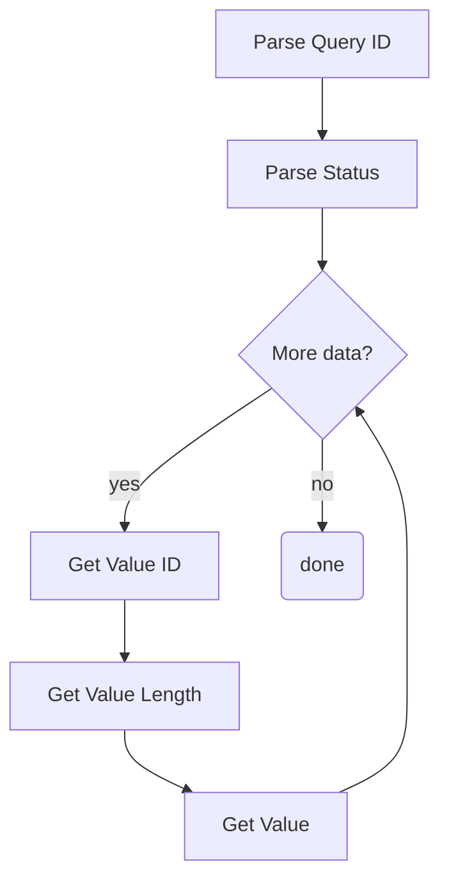

# Tutorial 3: Parse BLE TLV Responses

This document will provide a walk-through tutorial to implement
the [Open GoPro Interface]() to parse BLE
[Type-Length-Value](https://en.wikipedia.org/wiki/Type-length-value) (TLV) Responses.

Besides TLV, some BLE commands instead return protobuf responses. These are not considered here and will be
discussed in a future tutorial.


It is suggested that you have first completed the
[connect](#requirements)
and [sending commands]() tutorials before going
through this tutorial.


This tutorial will give an overview of types of responses, then give examples of parsing each type
before finally providing a **Response** class that will be used in future tutorials.

# Requirements

It is assumed that the hardware and software requirements from the
[connect tutorial]()
are present and configured correctly.

# Just Show me the Demo(s)!!



Each of the scripts for this tutorial can be found in the Tutorial 2
[directory](https://github.com/gopro/OpenGoPro/tree/main/demos/python/tutorial/tutorial_modules/tutorial_3_parse_ble_tlv_responses/).


Python >= 3.8.x must be used as specified in the requirements




You can test parsing a one packet TLV response with your camera through BLE using the following script:
```console
$ python ble_command_get_version.py
```

See the help for parameter definitions:

```console
$ python ble_command_get_version.py --help
usage: ble_command_get_version.py [-h] [-i IDENTIFIER]

Connect to a GoPro camera via BLE, then get the Open GoPro version.

optional arguments:
  -h, --help            show this help message and exit
  -i IDENTIFIER, --identifier IDENTIFIER
                        Last 4 digits of GoPro serial number, which is the last 4 digits of the
                        default camera SSID. If not used, first discovered GoPro will be connected to
```





You can test parsing multiple packet TVL responses with your camera through BLE using the following script:
```console
$ python ble_command_get_state.py
```

See the help for parameter definitions:

```console
$ python ble_command_get_state.py --help
usage: ble_command_get_state.py [-h] [-i IDENTIFIER]

Connect to a GoPro camera via BLE, then get its statuses and settings.

optional arguments:
  -h, --help            show this help message and exit
  -i IDENTIFIER, --identifier IDENTIFIER
                        Last 4 digits of GoPro serial number, which is the last 4 digits of the
                        default camera SSID. If not used, first discovered GoPro will be connected to
```




The Kotlin file for this tutorial can be found on
[Github](https://github.com/gopro/OpenGoPro/tree/main/demos/kotlin/tutorial/app/src/main/java/com/example/open_gopro_tutorial/tutorials/Tutorial3ParseBleTlvResponses.kt).

To perform the tutorial, run the Android Studio project, select "Tutorial 3" from the dropdown and click on "Perform."
This requires that a GoPro is already connected via BLE, i.e. that Tutorial 1 was already run. You can
check the BLE status at the top of the app.

{% include figure image_path="/assets/images/tutorials/kotlin/tutorial_3.png" alt="kotlin_tutorial_3" size="40%" caption="Perform Tutorial 3" %}

This will start the tutorial and log to the screen as it executes. When the tutorial is complete, click
"Exit Tutorial" to return to the Tutorial selection screen.




# Setup

We must first connect as was discussed in the
[connect tutorial](). When enabling notifications,
one of the notification handlers described in the following sections will be used.

# Response Overview

In the preceding tutorials, we have been using a very simple response handling procedure where the notification
handler simply checks that the UUID is the expected UUID and that the status byte of the response is 0 (Success).
This has been fine since we were only sending specific commands where this works and we know that the sequence
always appears as such (connection sequence left out for brevity):


In actuality, responses can be more complicated. As described in the
[Open GoPro Interface](#packet-headers), responses can be
be comprised of multiple packets where each packet is <= 20 bytes such as:


This requires the implementation of accumulating and parsing algorithms which will be described in
[Parsing Multiple Packet TLV Responses].

# Parsing a One Packet TLV Response

This section will describe how to parse one packet (<= 20 byte) responses. A one-packet response
is formatted as such:

| Header (length) | Command / Setting ID | Status  | Response         |
| --------------- | -------------------- | ------- | ---------------- |
| 1 byte          | 1 byte               | 1 bytes | Length - 2 bytes |

## Command / Setting Responses with Response Length 0

These are the only responses that we have seen thus far through the first 2 tutorials. They
return a status but have a 0 length additional response. For example, consider
[Set Shutter](#set-shutter). It returned a response
of:

```
02:01:00
```

This equates to:

| Header (length) | Command / Setting / Status ID | Status          | Response         |
| --------------- | ----------------------------- | --------------- | ---------------- |
| 1 byte          | 1 byte                        | 1 bytes         | Length - 2 bytes |
| 0x02            | 0x01 == Set Shutter           | 0x00 == Success | (2 -2 = 0 bytes) |

We can see how this response includes the status but no additional response data. This type of
response will be used for most Commands and Setting Responses as seen in the
[previous tutorial]().

## Complex Command Response

There are some commands that do return additional response data. These are called "complex responses."
From the [commands reference](#commands-quick-reference), we can see that these are:

-   Get Open GoPro Version (ID == 0x51)
-   Get Hardware Info (ID == 0x3C)

In this tutorial, we will walk through creating a simple parser to parse the Open GoPro Get Version Command.


It is important to always query the version after connecting in order to know which API is supported.
See the relevant version of the BLE and / or WiFi spec for more details about each version.


First, we send the command to the Command Request [UUID](#services-and-characteristics):



```python
COMMAND_REQ_UUID = GOPRO_BASE_UUID.format("0072")
event.clear()
await client.write_gatt_char(COMMAND_REQ_UUID, bytearray([0x01, 0x51]))
await event.wait()  # Wait to receive the notification response
```

We then receive a response at the expected handle. This is logged as:

```console
INFO:root:Getting the Open GoPro version...
INFO:root:Received response at handle=52: b'06:51:00:01:02:01:00'
```


```kotlin
    val getVersion = ubyteArrayOf(0x01U, 0x51U)
    ble.writeCharacteristic(goproAddress, GoProUUID.CQ_COMMAND.uuid, getVersion)
    val version = receivedResponse.receive() as Response.Complex // Wait to receive response
```

This is loged as such:

```console
Getting the Open GoPro version
Writing characteristic b5f90072-aa8d-11e3-9046-0002a5d5c51b ==> 01:51
Wrote characteristic b5f90072-aa8d-11e3-9046-0002a5d5c51b
Characteristic b5f90073-aa8d-11e3-9046-0002a5d5c51b changed | value: 06:51:00:01:02:01:00
Received response on b5f90073-aa8d-11e3-9046-0002a5d5c51b: 06:51:00:01:02:01:00
```



This response equates to:

| Header (length) | Command / Setting / Status ID | Status          | Response            |
| --------------- | ----------------------------- | --------------- | ------------------- |
| 1 byte          | 1 byte                        | 1 bytes         | Length - 2 bytes    |
| 0x06            | 0x51 == Get Version           | 0x00 == Success | 0x01 0x02 0x01 0x00 |

We can see that this "complex response" contains 4 additional bytes that need to be parsed. Using the information
from the [interface description](#complex-command-responses),
we know to parse this as:

| Byte | Meaning                        |
| ---- | ------------------------------ |
| 0x01 | Length of Major Version Number |
| 0x02 | Major Version Number           |
| 0x01 | Length of Minor Version Number |
| 0x00 | Minor Version Number           |

We implement this in the notification handler as follows. First, we parse the length, command ID, and status
from the first 3 bytes of the response. Then we parse the remaining four bytes of the response as individual
values formatted as such:

| Length | Value        |
| ------ | ------------ |
| 1 byte | Length bytes |




The snippets of code included in this section are taken from the `notification handler`



```python
# Parse first 3 bytes
length = data[0]
command_id = data[1]
status = data[2]
```

```python
# Parse remaining four bytes
index = 3
params = []
while index <= length:
    param_len = data[index]
    index += 1
    params.append(data[index : index + param_len])
    index += param_len
```



The snippets of code included in this section are taken from the `Response.Complex` `parse` method. For the
contrived code in this tutorial, we have separate `Response` sealed classes to handle each use case.


```kotlin
// Parse header bytes
id = packet[0].toInt()
status = packet[1].toInt()
var buf = packet.drop(2)
```

```kotlin
// Parse remaining packet
while (buf.isNotEmpty()) {
    // Get each parameter's ID and length
    val paramLen = buf[0].toInt()
    buf = buf.drop(1)
    // Get the parameter's value
    val paramVal = buf.take(paramLen)
    // Store in data list
    data += paramVal.toUByteArray()
    // Advance the buffer for continued parsing
    buf = buf.drop(paramLen)
}
```



From the complex response definition, we know these parameters are one byte each and equate to the major and
the minor version so let's print them (and all of the other response information) as such:



```python
major, minor = params
logger.info(f"Received a response to {command_id=} with {status=}: version={major[0]}.{minor[0]}")
```

which shows on the log as:

```console
INFO:root:Received a response to command_id=81 with status=0: version=2.0
```


```kotlin
val version = receivedResponse.receive() as Response.Complex // Wait to receive response
val major = version.data[0].first().toInt()
val minor = version.data[1].first().toInt()
Timber.i("Got the Open GoPro version successfully: $major.$minor")
```

which shows on the log as such:

```console
Got the Open GoPro version successfully: 2.0
```





**Quiz time! 📚 ✏️**









# Parsing Multiple Packet TLV Responses

This section will describe parsing TLV responses that contain more than one packet. It will first describe how
to accumulate such responses and then provide a parsing example. The example script that will be walked through
for this section is `ble_command_get_state.py`. We will be creating a small _Response_ class that will be
re-used for future tutorials.

## Accumulating the Response

The first step is to accumulate the multiple packets into one response. Whereas for all tutorials until now, we
have just used the header bytes of the response as the length, we now must completely parse the header as it is
defined:

<table border="1">
  <tbody>
    <tr>
        <td colspan="8">Byte 1</td>
        <td colspan="8">Byte 2 (optional)</td>
        <td colspan="8">Byte 3 (optional)</td>
    </tr>
    <tr>
        <td>7</td>
        <td>6</td>
        <td>5</td>
        <td>4</td>
        <td>3</td>
        <td>2</td>
        <td>1</td>
        <td>0</td>
        <td>7</td>
        <td>6</td>
        <td>5</td>
        <td>4</td>
        <td>3</td>
        <td>2</td>
        <td>1</td>
        <td>0</td>
        <td>7</td>
        <td>6</td>
        <td>5</td>
        <td>4</td>
        <td>3</td>
        <td>2</td>
        <td>1</td>
        <td>0</td>
    </tr>
    <tr>
        <td>0: Start</td>
        <td colspan="2">00: General</td>
        <td colspan="5">Message Length: 5 bits</td>
        <td colspan="16"></td>
    </tr>
    <tr>
        <td>0: Start</td>
        <td colspan="2">01: Extended (13-bit)</td>
        <td colspan="13">Message Length: 13 bits</td>
        <td colspan="8"></td>
    </tr>
    <tr>
        <td>0: Start</td>
        <td colspan="2">10: Extended (16-bit)</td>
        <td colspan="5"></td>
        <td colspan="16">Message Length: 16 bits</td>
    </tr>
    <tr>
        <td>0: Start</td>
        <td colspan="2">11: Reserved</td>
        <td colspan="21"></td>
    </tr>
    <tr>
        <td>1: Continuation</td>
        <td colspan="24"></td>
    </tr>
  </tbody>
</table>

The basic algorithm here (which is implemented in the _Message.accumulate_ method) is as follows:

---

<div class="md_column">
<div markdown="1">
Continuation bit set?



```python
if buf[0] & CONT_MASK:
    buf.pop(0)
else:
    ...
```


```kotlin
if (data.first().and(Mask.Continuation.value) == Mask.Continuation.value) {
    buf = buf.drop(1).toUByteArray() // Pop the header byte
} else { // This is a new packet
    ...
```



No, continuation bit was not set. So create new response, then get its length.



```python
# This is a new packet so start with an empty byte array
self.bytes = bytearray()
hdr = Header((buf[0] & HDR_MASK) >> 5)
if hdr is Header.GENERAL:
    self.bytes_remaining = buf[0] & GEN_LEN_MASK
    buf = buf[1:]
elif hdr is Header.EXT_13:
    self.bytes_remaining = ((buf[0] & EXT_13_BYTE0_MASK) << 8) + buf[1]
    buf = buf[2:]
elif hdr is Header.EXT_16:
    self.bytes_remaining = (buf[1] << 8) + buf[2]
    buf = buf[3:]
```


```kotlin
// This is a new packet so start with empty array
packet = ubyteArrayOf()
when (Header.fromValue((buf.first() and Mask.Header.value).toInt() shr 5)) {
    Header.GENERAL -> {
        bytesRemaining = buf[0].and(Mask.GenLength.value).toInt()
        buf = buf.drop(1).toUByteArray()
    }
    Header.EXT_13 -> {
        bytesRemaining = ((buf[0].and(Mask.Ext13Byte0.value)
            .toLong() shl 8) or buf[1].toLong()).toInt()
        buf = buf.drop(2).toUByteArray()
    }
    Header.EXT_16 -> {
        bytesRemaining = ((buf[1].toLong() shl 8) or buf[2].toLong()).toInt()
        buf = buf.drop(3).toUByteArray()
    }
    Header.RESERVED -> {
        throw Exception("Unexpected RESERVED header")
    }
}
```



Append current packet to response and decrement bytes remaining.



```python
# Append payload to buffer and update remaining / complete
self.bytes.extend(buf)
self.bytes_remaining -= len(buf)
```


```kotlin
// Accumulate the payload now that headers are handled and dropped
packet += buf
bytesRemaining -= buf.size
```



In the notification handler, we are then parsing if there are no bytes remaining.



```python
    if response.is_received:
        response.parse()
```


```kotlin
rsp.accumulate(data)
if (rsp.isReceived) {
    rsp.parse()
    ...
```



</div>

<div markdown="1" style="60%">
<br><br><br>

</div>
</div>

---

We can see this in action when we send the _Get All Setting Values_ Query.


Queries aren't introduced until the next tutorial so for now, just pay attention to the response.


We send the command as such:



```python
QUERY_REQ_UUID = GOPRO_BASE_UUID.format("0076")
event.clear()
await client.write_gatt_char(QUERY_REQ_UUID, bytearray([0x01, 0x12]))
await event.wait()  # Wait to receive the notification response
```


```kotlin
val getCameraSettings = ubyteArrayOf(0x01U, 0x12U)
ble.writeCharacteristic(goproAddress, GoProUUID.CQ_QUERY.uuid, getCameraSettings)
val settings = receivedResponse.receive()
```



Then, in the notification handler, we continuously receive and accumulate packets until we have
received the entire response, at which point we notify the writer that the response is ready:



```python
 def notification_handler(handle: int, data: bytes) -> None:
        response.accumulate(data)

        if response.is_received:
            response.parse()

            # Notify writer that procedure is complete
            event.set()
```


```kotlin
private fun tlvResponseNotificationHandler(characteristic: UUID, data: UByteArray) {
    ...
    rsp.accumulate(data)
    if (rsp.isReceived) {
        rsp.parse()

        // Notify the command sender the the procedure is complete
        response = null // Clear for next command
        CoroutineScope(Dispatchers.IO).launch { receivedResponse.send(rsp) }
    }
```




We also first parse the response but that will be described in the next section.


We can see the individual packets being accumulated in the log:



```console
INFO:root:Getting the camera's settings...
INFO:root:Received response at handle=62: b'21:25:12:00:02:01:09:03:01:01:05:0
INFO:root:self.bytes_remaining=275
INFO:root:Received response at handle=62: b'80:01:00:18:01:00:1e:04:00:00:00:0
INFO:root:self.bytes_remaining=256
INFO:root:Received response at handle=62: b'81:0a:25:01:00:29:01:09:2a:01:05:2
INFO:root:self.bytes_remaining=237
INFO:root:Received response at handle=62: b'82:2f:01:04:30:01:03:36:01:00:3b:0
INFO:root:self.bytes_remaining=218
INFO:root:Received response at handle=62: b'83:04:00:00:00:00:3e:04:00:00:00:0
INFO:root:self.bytes_remaining=199
INFO:root:Received response at handle=62: b'84:00:42:04:00:00:00:00:43:04:00:0
INFO:root:self.bytes_remaining=180
INFO:root:Received response at handle=62: b'85:4f:01:00:53:01:00:54:01:00:55:0
INFO:root:self.bytes_remaining=161
INFO:root:Received response at handle=62: b'86:01:28:5b:01:02:60:01:00:66:01:0
INFO:root:self.bytes_remaining=142
INFO:root:Received response at handle=62: b'87:00:6a:01:00:6f:01:0a:70:01:ff:7
INFO:root:self.bytes_remaining=123
INFO:root:Received response at handle=62: b'88:75:01:00:76:01:04:79:01:00:7a:0
INFO:root:self.bytes_remaining=104
INFO:root:Received response at handle=62: b'89:01:00:7e:01:00:80:01:0c:81:01:0
INFO:root:self.bytes_remaining=85
INFO:root:Received response at handle=62: b'8a:0c:85:01:09:86:01:00:87:01:01:8
INFO:root:self.bytes_remaining=66
INFO:root:Received response at handle=62: b'8b:92:01:00:93:01:00:94:01:02:95:0
INFO:root:self.bytes_remaining=47
INFO:root:Received response at handle=62: b'8c:01:00:9c:01:00:9d:01:00:9e:01:0
INFO:root:self.bytes_remaining=28
INFO:root:Received response at handle=62: b'8d:00:a2:01:00:a3:01:01:a4:01:00:a
INFO:root:self.bytes_remaining=9
INFO:root:Received response at handle=62: b'8e:a8:04:00:00:00:00:a9:01:01'
INFO:root:self.bytes_remaining=0
INFO:root:Successfully received the response
```



```console
Writing characteristic b5f90076-aa8d-11e3-9046-0002a5d5c51b ==> 01:12
Wrote characteristic b5f90076-aa8d-11e3-9046-0002a5d5c51b
Characteristic b5f90077-aa8d-11e3-9046-0002a5d5c51b changed | value: 21:2B:12:00:02:01:04:03:01:05:05:01:00:06:01:01:0D:01:01:13
Received response on b5f90077-aa8d-11e3-9046-0002a5d5c51b: 21:2B:12:00:02:01:04:03:01:05:05:01:00:06:01:01:0D:01:01:13
Received packet of length 18. 281 bytes remaining
Characteristic b5f90077-aa8d-11e3-9046-0002a5d5c51b changed | value: 80:01:00:18:01:00:1E:04:00:00:00:6E:1F:01:00:20:04:00:00:00
Received response on b5f90077-aa8d-11e3-9046-0002a5d5c51b: 80:01:00:18:01:00:1E:04:00:00:00:6E:1F:01:00:20:04:00:00:00
Received packet of length 19. 262 bytes remaining
Characteristic b5f90077-aa8d-11e3-9046-0002a5d5c51b changed | value: 81:0A:25:01:00:29:01:09:2A:01:08:2B:01:00:2C:01:09:2D:01:08
Received response on b5f90077-aa8d-11e3-9046-0002a5d5c51b: 81:0A:25:01:00:29:01:09:2A:01:08:2B:01:00:2C:01:09:2D:01:08
Received packet of length 19. 243 bytes remaining
Characteristic b5f90077-aa8d-11e3-9046-0002a5d5c51b changed | value: 82:2F:01:07:36:01:01:3B:01:04:3C:04:00:00:00:00:3D:04:00:00
Received response on b5f90077-aa8d-11e3-9046-0002a5d5c51b: 82:2F:01:07:36:01:01:3B:01:04:3C:04:00:00:00:00:3D:04:00:00
Received packet of length 19. 224 bytes remaining
Characteristic b5f90077-aa8d-11e3-9046-0002a5d5c51b changed | value: 83:00:00:3E:04:00:12:4F:80:40:01:04:41:04:00:00:00:00:42:04
Received response on b5f90077-aa8d-11e3-9046-0002a5d5c51b: 83:00:00:3E:04:00:12:4F:80:40:01:04:41:04:00:00:00:00:42:04
Received packet of length 19. 205 bytes remaining
Characteristic b5f90077-aa8d-11e3-9046-0002a5d5c51b changed | value: 84:00:00:00:00:43:04:00:12:4F:80:4B:01:00:4C:01:00:53:01:01
Received response on b5f90077-aa8d-11e3-9046-0002a5d5c51b: 84:00:00:00:00:43:04:00:12:4F:80:4B:01:00:4C:01:00:53:01:01
Received packet of length 19. 186 bytes remaining
Characteristic b5f90077-aa8d-11e3-9046-0002a5d5c51b changed | value: 85:54:01:00:55:01:00:56:01:00:57:01:00:58:01:32:5B:01:03:66
Received response on b5f90077-aa8d-11e3-9046-0002a5d5c51b: 85:54:01:00:55:01:00:56:01:00:57:01:00:58:01:32:5B:01:03:66
Received packet of length 19. 167 bytes remaining
Characteristic b5f90077-aa8d-11e3-9046-0002a5d5c51b changed | value: 86:01:08:67:01:03:69:01:00:6F:01:0A:70:01:64:72:01:01:73:01
Received response on b5f90077-aa8d-11e3-9046-0002a5d5c51b: 86:01:08:67:01:03:69:01:00:6F:01:0A:70:01:64:72:01:01:73:01
Received packet of length 19. 148 bytes remaining
Characteristic b5f90077-aa8d-11e3-9046-0002a5d5c51b changed | value: 87:00:74:01:02:75:01:01:76:01:04:79:01:03:7A:01:65:7B:01:65
Received response on b5f90077-aa8d-11e3-9046-0002a5d5c51b: 87:00:74:01:02:75:01:01:76:01:04:79:01:03:7A:01:65:7B:01:65
Received packet of length 19. 129 bytes remaining
Characteristic b5f90077-aa8d-11e3-9046-0002a5d5c51b changed | value: 88:7C:01:64:7D:01:00:7E:01:00:80:01:0D:81:01:02:82:01:69:83
Received response on b5f90077-aa8d-11e3-9046-0002a5d5c51b: 88:7C:01:64:7D:01:00:7E:01:00:80:01:0D:81:01:02:82:01:69:83
Received packet of length 19. 110 bytes remaining
Characteristic b5f90077-aa8d-11e3-9046-0002a5d5c51b changed | value: 89:01:03:84:01:0C:86:01:02:87:01:01:8B:01:03:90:01:0C:91:01
Received response on b5f90077-aa8d-11e3-9046-0002a5d5c51b: 89:01:03:84:01:0C:86:01:02:87:01:01:8B:01:03:90:01:0C:91:01
Received packet of length 19. 91 bytes remaining
Characteristic b5f90077-aa8d-11e3-9046-0002a5d5c51b changed | value: 8A:00:92:01:00:93:01:00:94:01:01:95:01:02:96:01:00:97:01:00
Received response on b5f90077-aa8d-11e3-9046-0002a5d5c51b: 8A:00:92:01:00:93:01:00:94:01:01:95:01:02:96:01:00:97:01:00
Received packet of length 19. 72 bytes remaining
Characteristic b5f90077-aa8d-11e3-9046-0002a5d5c51b changed | value: 8B:99:01:64:9A:01:02:9B:01:64:9C:01:64:9D:01:64:9E:01:01:9F
Received response on b5f90077-aa8d-11e3-9046-0002a5d5c51b: 8B:99:01:64:9A:01:02:9B:01:64:9C:01:64:9D:01:64:9E:01:01:9F
Received packet of length 19. 53 bytes remaining
Characteristic b5f90077-aa8d-11e3-9046-0002a5d5c51b changed | value: 8C:01:01:A0:01:00:A1:01:64:A2:01:00:A3:01:01:A4:01:64:A7:01
Received response on b5f90077-aa8d-11e3-9046-0002a5d5c51b: 8C:01:01:A0:01:00:A1:01:64:A2:01:00:A3:01:01:A4:01:64:A7:01
Received packet of length 19. 34 bytes remaining
Characteristic b5f90077-aa8d-11e3-9046-0002a5d5c51b changed | value: 8D:04:A8:04:00:00:00:00:A9:01:01:AE:01:00:AF:01:01:B0:01:03
Received response on b5f90077-aa8d-11e3-9046-0002a5d5c51b: 8D:04:A8:04:00:00:00:00:A9:01:01:AE:01:00:AF:01:01:B0:01:03
Received packet of length 19. 15 bytes remaining
Characteristic b5f90077-aa8d-11e3-9046-0002a5d5c51b changed | value: 8E:B1:01:00:B2:01:01:B3:01:03:B4:01:00:B5:01:00
Received response on b5f90077-aa8d-11e3-9046-0002a5d5c51b: 8E:B1:01:00:B2:01:01:B3:01:03:B4:01:00:B5:01:00
Received packet of length 15. 0 bytes remaining
Received the expected successful response
Got the camera's settings successfully
```



At this point the response has been accumulated. See the next section for how to parse it.

**Quiz time! 📚 ✏️**

{% quiz
    question="How can we know that a response has been completely received?"
    option="A:::The stop bit will be set in the header"
    option="B:::The response has accumulated length bytes"
    option="C:::By checking for the end of frame (EOF) sentinel character"
    correct="B"
    info="The length of the entire response is parsed from the first packet. We
        then accumulate packets, keeping track of the received length, until all of the bytes
        have been received. A and C are just made up 😜."
%}

## Parsing a Query Response

This section is going to describe responses to to BLE status / setting queries. We don't actually
introduce such queries until [the next tutorial]() so
for now, only the parsing of the response is important.


While multi-packet responses are almost always Query Responses, they can also be from Command Complex
responses. In a real-world implementation, it is therefore necessary to check the received UUID to see
how to parse.


Query Responses contain one or more TLV groups in their Response data. To recap, the generic response format is:

| Header (length) | Query ID | Status  | Response         |
| --------------- | -------- | ------- | ---------------- |
| 1-2 bytes       | 1 byte   | 1 bytes | Length - 2 bytes |

This means that query responses will contain an array of additional TLV groups in the "Response" field as such:

| ID1    | Length1 | Value1        | ID2    | Length2 | Value 2       | ... | IDN    | LengthN | ValueN        |
| ------ | ------- | ------------- | ------ | ------- | ------------- | --- | ------ | ------- | ------------- |
| 1 byte | 1 byte  | Length1 bytes | 1 byte | 1 byte  | Length2 bytes | ... | 1 byte | 1 byte  | LengthN bytes |

Depending on the amount of query results in the response, this response can be one or multiple packets.
Therefore, we need to account for the possibility that it may always be more than 1 packet.

We can see an example of such parsing in the response parse method as shown below:

---

<div class="md_column">
<div markdown="1">

We have already parsed the length when we were accumulating the packet. So the next step is to parse the Query
ID and Status:



```python
self.id = self.bytes[0]
self.status = self.bytes[1]
```


```kotlin
id = packet[0].toInt()
status = packet[1].toInt()
```



We then continuously parse **Type (ID) - Length - Value** groups until we have consumed the response. We are
storing each value in a hash map indexed by ID for later access.



```python
buf = self.bytes[2:]
while len(buf) > 0:
    # Get ID and Length
    param_id = buf[0]
    param_len = buf[1]
    buf = buf[2:]
    # Get the value
    value = buf[:param_len]

    # Store in dict for later access
    self.data[param_id] = value

    # Advance the buffer
    buf = buf[param_len:]
```


```kotlin
while (buf.isNotEmpty()) {
    // Get each parameter's ID and length
    val paramId = buf[0]
    val paramLen = buf[1].toInt()
    buf = buf.drop(2)
    // Get the parameter's value
    val paramVal = buf.take(paramLen)
    // Store in data dict for access later
    data[paramId] = paramVal.toUByteArray()
    // Advance the buffer for continued parsing
    buf = buf.drop(paramLen)
}
```



</div>
<div markdown="1" style="flex:60%">

<br><br><br>



</div>
</div>

---

In the tutorial demo, we then log this entire dict after parsing is complete as such (abbreviated for brevity):




```console
INFO:root:Received settings
: {
    "2": "09",
    "3": "01",
    "5": "00",
    "6": "01",
    "13": "01",
    "19": "00",
    "30": "00:00:00:00",
    "31": "00",
    "32": "00:00:00:0a",
    "41": "09",
    "42": "05",
    "43": "00",
    ...
    "160": "00",
    "161": "00",
    "162": "00",
    "163": "01",
    "164": "00",
    "165": "00",
    "166": "00",
    "167": "04",
    "168": "00:00:00:00",
    "169": "01"
}
```



```console
{
    "2": "09",
    "3": "01",
    "5": "00",
    "6": "01",
    "13": "01",
    "19": "00",
    "24": "00",
    "30": "00:00:00:6E",
    "31": "00",
    "32": "00:00:00:0A",
    "37": "00",
    "41": "09",
    "42": "08",
    "43": "00",
    "44": "09",
    "45": "08",
    "47": "07",
       ...
    "115": "00",
    "116": "02",
    "117": "01",
    "151": "00",
    "153": "64",
    "154": "02",
    "155": "64",
    "156": "64",
    "157": "64",
    "158": "01",
    "159": "01",
    "160": "00",
    "161": "64",
    "162": "00",
    "163": "01",
    "164": "64",
    "167": "04",
    "168": "00:00:00:00",
    "169": "01",
    "174": "00",
    "175": "01",
    "176": "03",
    "177": "00",
    "178": "01",
    "179": "03",
    "180": "00",
    "181": "00"
}
```





We can see what each of these values mean by looking at the
[Open GoPro Interface](#settings-quick-reference).

For example:

-   ID 2 == 9 equates to Resolution == 1080
-   ID 3 == 1 equates to FPS == 120





# Troubleshooting

See the first tutorial's
[troubleshooting section](#troubleshooting).

# Good Job!


Congratulations 🤙


You can now parse any TLV response that is received from the GoPro, at least if it is received uninterrupted.
There is additional logic required for a complete solution such as checking the UUID the response is received
on and storing a dict of response per UUID. At the current time, this endeavor is left for the reader. For a
complete example of this, see the [Open GoPro Python SDK](https://gopro.github.io/OpenGoPro/python_sdk/).

To learn more about queries, go to the next tutorial.