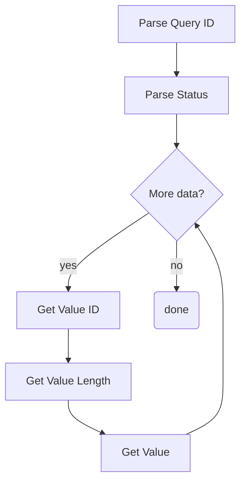
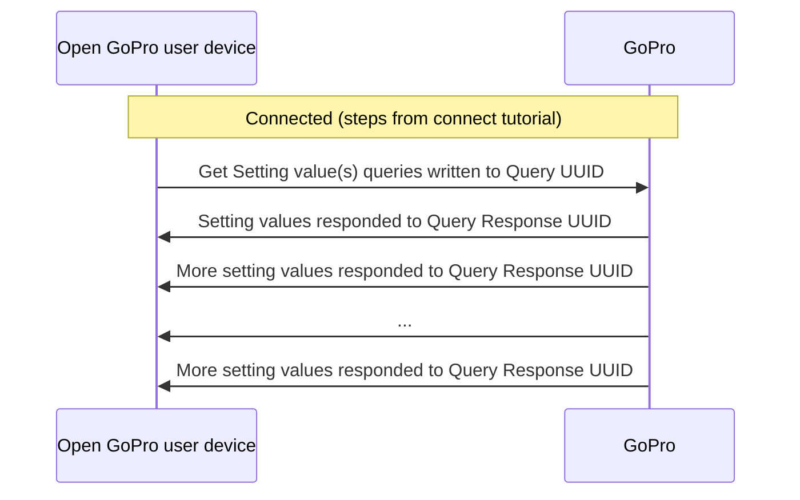
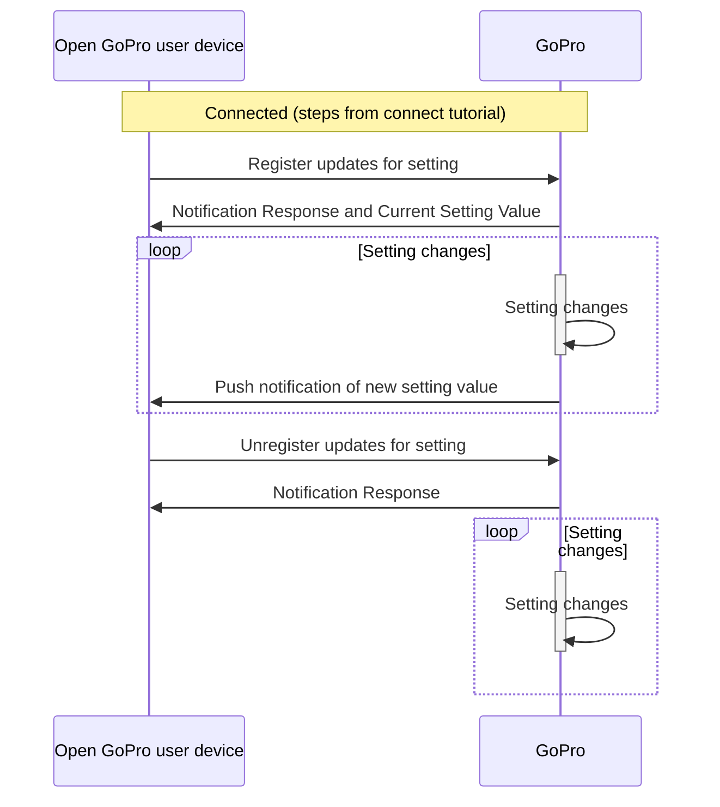

# Tutorial 4: BLE TLV Queries

This document will provide a walk-through tutorial to use the Open GoPro Interface to query the camera's setting
and status information via BLE.

[Queries]({{site.baseurl}}/ble/protocol/data_protocol.html#queries) in this sense are operations that are initiated by
writing to the Query [UUID]({{site.baseurl}}/ble/protocol/ble_setup.html#ble-characteristics) and receiving responses
via the Query Response [UUID]({{site.baseurl}}/ble/protocol/ble_setup.html#ble-characteristics).

A list of queries can be found in the [Query ID Table]({{site.baseurl}}/ble/protocol/id_tables.html#query-ids).

It is important to distinguish between queries and
[commands]() because they each have different request
and response packet formats.


This tutorial only considers sending these queries as one-off queries. That is, it does not consider state
management / synchronization when sending multiple queries. This will be discussed in a future lab.


# Requirements

It is assumed that the hardware and software requirements from the
[connecting BLE tutorial]()
are present and configured correctly.


It is suggested that you have first completed the
[connect](#requirements),
[sending commands](), and
[parsing responses]() tutorials before going
through this tutorial.


# Just Show me the Demo(s)!!



Each of the scripts for this tutorial can be found in the Tutorial 4
[directory](https://github.com/gopro/OpenGoPro/tree/main/demos/python/tutorial/tutorial_modules/tutorial_4_ble_queries/).


Python >= 3.9 and < 3.12 must be used as specified in the requirements




You can test an individual query poll with your camera through BLE using the following script:

```console
$ python ble_query_poll_resolution_value.py
```

See the help for parameter definitions:

```console
$ python ble_query_poll_resolution_value.py --help
usage: ble_query_poll_resolution_value.py [-h] [-i IDENTIFIER]

Connect to a GoPro camera, get the current resolution, modify the resolution, and confirm the change was successful.

optional arguments:
  -h, --help            show this help message and exit
  -i IDENTIFIER, --identifier IDENTIFIER
                        Last 4 digits of GoPro serial number, which is the last 4 digits of the
                        default camera SSID. If not used, first discovered GoPro will be connected to
```





You can test querying multiple queries simultaneously with your camera through BLE using the following script:

```console
$ python ble_query_poll_multiple_setting_values.py
```

See the help for parameter definitions:

```console
$ python ble_query_poll_multiple_setting_values.py --help
usage: ble_query_poll_multiple_setting_values.py [-h] [-i IDENTIFIER]

Connect to a GoPro camera then get the current resolution, fps, and fov.

optional arguments:
  -h, --help            show this help message and exit
  -i IDENTIFIER, --identifier IDENTIFIER
                        Last 4 digits of GoPro serial number, which is the last 4 digits of the
                        default camera SSID. If not used, first discovered GoPro will be connected to
```





You can test registering for querties and receiving push notifications with your camera through BLE using the following
script:

```console
$ python ble_query_register_resolution_value_updates.py
```

See the help for parameter definitions:

```console
$ python ble_query_register_resolution_value_updates.py --help
usage: ble_query_register_resolution_value_updates.py [-h] [-i IDENTIFIER]

Connect to a GoPro camera, register for updates to the resolution, receive the current resolution, modify the resolution,
and confirm receipt of the change notification.

optional arguments:
  -h, --help            show this help message and exit
  -i IDENTIFIER, --identifier IDENTIFIER
                        Last 4 digits of GoPro serial number, which is the last 4 digits of the
                        default camera SSID. If not used, first discovered GoPro will be connected to
```




The Kotlin file for this tutorial can be found on
[Github](https://github.com/gopro/OpenGoPro/tree/main/demos/kotlin/tutorial/app/src/main/java/com/example/open_gopro_tutorial/tutorials/Tutorial4BleQueries.kt).

To perform the tutorial, run the Android Studio project, select "Tutorial 4" from the dropdown and click on "Perform."
This requires that a GoPro is already connected via BLE, i.e. that Tutorial 1 was already run. You can
check the BLE status at the top of the app.

{% include figure image_path="/assets/images/tutorials/kotlin/tutorial_4.png" alt="kotlin_tutorial_4" size="40%" caption="Perform Tutorial 4" %}

This will start the tutorial and log to the screen as it executes. When the tutorial is complete, click
"Exit Tutorial" to return to the Tutorial selection screen.




# Setup

We must first connect as was discussed in the
[connecting BLE tutorial]().




We have slightly updated the notification handler from the previous tutorial to handle a `QueryResponse` instead of
a `TlvResponse` where `QueryResponse` is a subclass of `TlvResponse` that will be created in this tutorial.

```python
responses_by_uuid = GoProUuid.dict_by_uuid(QueryResponse)
received_responses: asyncio.Queue[QueryResponse] = asyncio.Queue()

query_request_uuid = GoProUuid.QUERY_REQ_UUID
query_response_uuid = GoProUuid.QUERY_RSP_UUID
setting_request_uuid = GoProUuid.SETTINGS_REQ_UUID
setting_response_uuid = GoProUuid.SETTINGS_RSP_UUID

async def notification_handler(characteristic: BleakGATTCharacteristic, data: bytearray) -> None:
    uuid = GoProUuid(client.services.characteristics[characteristic.handle].uuid)
    response = responses_by_uuid[uuid]
    response.accumulate(data)

    # Notify the writer if we have received the entire response
    if response.is_received:
        # If this is query response, it must contain a resolution value
        if uuid is query_response_uuid:
            logger.info("Received a Query response")
            await received_responses.put(response)
        # If this is a setting response, it will just show the status
        elif uuid is setting_response_uuid:
            logger.info("Received Set Setting command response.")
            await received_responses.put(response)
        # Anything else is unexpected. This shouldn't happen
        else:
            logger.error("Unexpected response")
        # Reset per-uuid Response
        responses_by_uuid[uuid] = QueryResponse(uuid)
```


The code above is taken from `ble_query_poll_resolution_value.py`





We are defining a resolution enum that will be updated as we receive new resolutions:

```kotlin
private enum class Resolution(val value: UByte) {
    RES_4K(1U),
    RES_2_7K(4U),
    RES_2_7K_4_3(6U),
    RES_1080(9U),
    RES_4K_4_3(18U),
    RES_5K(24U);

    companion object {
        private val valueMap: Map<UByte, Resolution> by lazy { values().associateBy { it.value } }

        fun fromValue(value: UByte) = valueMap.getValue(value)
    }
}

private lateinit var resolution: Resolution
```




There are two methods to query status / setting information, each of which will be described in a following
section:

-   [Polling Query Information](#polling-query-information)
-   [Registering for query push notifications](#registering-for-query-push-notifications)

# Parsing a Query Response

Before sending queries, we must first describe how Query response parsing differs from the Command response parsing
that was introduced in the previous tutorial.

To recap, the generic response format for both Commands and Queries is:

| Header (length) | Operation ID (Command / Query ID) | Status  | Response         |
| --------------- | --------------------------------- | ------- | ---------------- |
| 1-2 bytes       | 1 byte                            | 1 bytes | Length - 2 bytes |

Query Responses contain an array of additional TLV groups in the **Response** field as such:

| ID1    | Length1 | Value1        | ID2    | Length2 | Value 2       | ... | IDN    | LengthN | ValueN        |
| ------ | ------- | ------------- | ------ | ------- | ------------- | --- | ------ | ------- | ------------- |
| 1 byte | 1 byte  | Length1 bytes | 1 byte | 1 byte  | Length2 bytes | ... | 1 byte | 1 byte  | LengthN bytes |

We will be extending the `TlvResponse` class that was defined in the
[parsing responses]() tutorial to perform common
parsing shared among all queries into a `QueryResponse` class as seen below:

---

<div class="md_column">
<div markdown="1">

We have already parsed the length, Operation ID, and status, and extracted the payload in the `TlvResponse` class.
The next step is to parse the payload.

Therefore, we now continuously parse **Type (ID) - Length - Value** groups until we have consumed the response. We are
storing each value in a hash map indexed by ID for later access.




```python
class QueryResponse(TlvResponse):
    ...

    def parse(self) -> None:
        super().parse()
        buf = bytearray(self.payload)
        while len(buf) > 0:
            # Get ID and Length of query parameter
            param_id = buf[0]
            param_len = buf[1]
            buf = buf[2:]
            # Get the value
            value = buf[:param_len]
            # Store in dict for later access
            self.data[param_id] = bytes(value)

            # Advance the buffer
            buf = buf[param_len:]
```




```kotlin
while (buf.isNotEmpty()) {
    // Get each parameter's ID and length
    val paramId = buf[0]
    val paramLen = buf[1].toInt()
    buf = buf.drop(2)
    // Get the parameter's value
    val paramVal = buf.take(paramLen)
    // Store in data dict for access later
    data[paramId] = paramVal.toUByteArray()
    // Advance the buffer for continued parsing
    buf = buf.drop(paramLen)
}
```




</div>
<div markdown="1" style="flex:60%">

<br><br><br>



</div>
</div>





# Polling Query Information

It is possible to poll one or more setting / status values using the following queries:

| Query ID | Request                                                                               | Query        |
| -------- | ------------------------------------------------------------------------------------- | ------------ |
| 0x12     | [Get Setting value(s)]({{site.baseurl}}/ble/features/query.html#get-setting-values) | len:12:xx:xx |
| 0x13     | [Get Status value(s)]({{site.baseurl}}/ble/features/query.html#get-status-values)   | len:13:xx:xx |

where **xx** are setting / status ID(s) and **len** is the length of the rest of the query (the number of query bytes
plus one for the request ID byte). There will be specific examples below.


Since they are two separate queries, combination of settings / statuses can not be polled simultaneously.


Here is a generic sequence diagram (the same is true for statuses):



The number of notification responses will vary depending on the amount of settings that have been queried.
Note that setting values will be combined into one notification until it reaches the maximum notification
size (20 bytes). At this point, a new response will be sent. Therefore, it is necessary to accumulate and then
parse these responses as was described in
[parsing query responses](#parsing-a-query-response)

## Individual Query Poll

Here we will walk through an example of polling one setting (Resolution).

First we send the query:





The sample code can be found in in `ble_query_poll_resolution_value.py`.


```python
query_request_uuid = GoProUuid.QUERY_REQ_UUID
request = bytes([0x02, 0x12, RESOLUTION_ID])
await client.write_gatt_char(query_request_uuid.value, request, response=True)
```




```kotlin
val pollResolution = ubyteArrayOf(0x02U, 0x12U, RESOLUTION_ID)
ble.writeCharacteristic(goproAddress, GoProUUID.CQ_QUERY.uuid, pollResolution)
```




Then when the response is received from the notification handler we parse it into individual query elements in the
`QueryResponse` class and extract the new resolution value.




```python
# Wait to receive the notification response
response = await received_responses.get()
response.parse()
resolution = Resolution(response.data[RESOLUTION_ID][0])
```

which logs as such:

```console
Getting the current resolution
 Writing to GoProUuid.QUERY_REQ_UUID: 02:12:02
Received response at handle=62: b'05:12:00:02:01:09'
eceived the Resolution Query response
Resolution is currently Resolution.RES_1080
```




```kotlin
// Wait to receive the response and then convert it to resolution
val queryResponse = (receivedResponses.receive() as Response.Query).apply { parse() }
resolution = Resolution.fromValue(queryResponse.data.getValue(RESOLUTION_ID).first())
```

which logs as such:

```console
Polling the current resolution
Writing characteristic b5f90076-aa8d-11e3-9046-0002a5d5c51b ==> 02:12:02
Wrote characteristic b5f90076-aa8d-11e3-9046-0002a5d5c51b
Characteristic b5f90077-aa8d-11e3-9046-0002a5d5c51b changed | value: 05:12:00:02:01:09
Received response on CQ_QUERY_RSP
Received packet of length 5. 0 bytes remaining
Received Query Response
Camera resolution is RES_1080
```




For verification purposes, we are then changing the resolution and polling again to verify that the setting
has changed:




```python
while resolution is not target_resolution:
    request = bytes([0x02, 0x12, RESOLUTION_ID])
    await client.write_gatt_char(query_request_uuid.value, request, response=True)
    response = await received_responses.get()  # Wait to receive the notification response
    response.parse()
    resolution = Resolution(response.data[RESOLUTION_ID][0])
```

which logs as such:

```console
Changing the resolution to Resolution.RES_2_7K...
Writing to GoProUuid.SETTINGS_REQ_UUID: 03:02:01:04
Writing to GoProUuid.SETTINGS_REQ_UUID: 03:02:01:04
Received response at GoProUuid.SETTINGS_RSP_UUID: 02:02:00
Received Set Setting command response.
Polling the resolution to see if it has changed...
Writing to GoProUuid.QUERY_REQ_UUID: 02:12:02
Received response at GoProUuid.QUERY_RSP_UUID: 05:12:00:02:01:04
Received the Resolution Query response
Resolution is currently Resolution.RES_2_7K
Resolution has changed as expected. Exiting...
```




```kotlin
while (resolution != newResolution) {
    ble.writeCharacteristic(goproAddress, GoProUUID.CQ_QUERY.uuid, pollResolution)
    val queryNotification = (receivedResponses.receive() as Response.Query).apply { parse() }
    resolution = Resolution.fromValue(queryNotification.data.getValue(RESOLUTION_ID).first())
}
```

which logs as such:

```console
Changing the resolution to RES_2_7K
Writing characteristic b5f90074-aa8d-11e3-9046-0002a5d5c51b ==> 03:02:01:04
Wrote characteristic b5f90074-aa8d-11e3-9046-0002a5d5c51b
Characteristic b5f90075-aa8d-11e3-9046-0002a5d5c51b changed | value: 02:02:00
Received response on CQ_SETTING_RSP
Received packet of length 2. 0 bytes remaining
Received set setting response.
Resolution successfully changed
Polling the resolution until it changes
Writing characteristic b5f90076-aa8d-11e3-9046-0002a5d5c51b ==> 02:12:02
Characteristic b5f90077-aa8d-11e3-9046-0002a5d5c51b changed | value: 05:12:00:02:01:04
Received response on CQ_QUERY_RSP
Received packet of length 5. 0 bytes remaining
Received Query Response
Wrote characteristic b5f90076-aa8d-11e3-9046-0002a5d5c51b
Camera resolution is currently RES_2_7K
```




## Multiple Simultaneous Query Polls

Rather than just polling one setting, it is also possible to poll multiple settings. An example of this is shown
below. It is very similar to the previous example except that the query now includes 3 settings:
[Resolution]({{site.baseurl}}/ble/features/settings.html#setting-2),
[FPS]({{site.baseurl}}/ble/features/settings.html#setting-3),
and [FOV]({{site.baseurl}}/ble/features/settings.html#setting-121).




```python
RESOLUTION_ID = 2
FPS_ID = 3
FOV_ID = 121

request = bytes([0x04, 0x12, RESOLUTION_ID, FPS_ID, FOV_ID])
await client.write_gatt_char(query_request_uuid.value, request, response=True)
response = await received_responses.get()  # Wait to receive the notification response
```



TODO




The length (first byte of the query) has been increased to 4 to accommodate the extra settings


We are also parsing the response to get all 3 values:




```python
response.parse()
logger.info(f"Resolution is currently {Resolution(response.data[RESOLUTION_ID][0])}")
logger.info(f"Video FOV is currently {VideoFOV(response.data[FOV_ID][0])}")
logger.info(f"FPS is currently {FPS(response.data[FPS_ID][0])}")
```



TODO




When we are storing the updated setting, we are just taking the first byte (i..e index 0). A real-world
implementation would need to know the length (and type) of the setting / status response by the ID. For example,
sometimes settings / statuses are bytes, words, strings, etc.


They are then printed to the log which will look like the following:




```console
Getting the current resolution, fps, and fov.
Writing to GoProUuid.QUERY_REQ_UUID: 04:12:02:03:79
Received response at GoProUuid.QUERY_RSP_UUID: 0b:12:00:02:01:09:03:01:00:79:01:00
Received the Query Response
Resolution is currently Resolution.RES_1080
Video FOV is currently VideoFOV.FOV_WIDE
FPS is currently FPS.FPS_240
```



TODO



In general, we can parse query values by looking at relevant documentation linked from the
[Setting]({{site.baseurl}}/ble/protocol/id_tables.html#setting-ids) or
[Status]({{site.baseurl}}/ble/protocol/id_tables.html#status-ids) ID tables.

For example (for settings):

-   ID 2 == 9 equates to [Resolution]({{site.baseurl}}/ble/features/settings.html#setting-2) == 1080
-   ID 3 == 1 equates to [FPS]({{site.baseurl}}/ble/features/settings.html#setting-3) == 120

## Query All

It is also possible to query all settings / statuses by not passing any ID's into the the query, i.e.:

| Query ID | Request          | Query |
| -------- | ---------------- | ----- |
| 0x12     | Get All Settings | 01:12 |
| 0x13     | Get All Statuses | 01:13 |

**Quiz time! 📚 ✏️**

{% quiz
    question="How can we poll the encoding status and the resolution setting using one query?"
    option="A:::Concatenate a 'Get Setting Value' query and a 'Get Status' query with the relevant ID's"
    option="B:::Concatenate the 'Get All Setting' and 'Get All Status' queries."
    option="C:::It is not possible"
    correct="C"
    info="It is not possible to concatenate queries. This would result in an unknown sequence of bytes
        from the camera's perspective. So it is not possible to get a setting value and a status value in one
        query. The Get Setting Query (with resolution ID) and Get Status Query (with encoding ID) must be
        sent sequentially in order to get this information."
%}

# Registering for Query Push Notifications

Rather than polling the query information, it is also possible to use an interrupt scheme to register for
push notifications when the relevant query information changes.

The relevant queries are:

| Query ID | Request                                                                                                              | Query        |
| -------- | -------------------------------------------------------------------------------------------------------------------- | ------------ |
| 0x52     | [Register updates for setting(s)]({{site.baseurl}}/ble/features/query.html#register-for-setting-value-updates)     | len:52:xx:xx |
| 0x53     | [Register updates for status(es)]({{site.baseurl}}/ble/features/query.html#register-for-status-value-updates)      | len:53:xx:xx |
| 0x72     | [Unregister updates for setting(s)]({{site.baseurl}}/ble/features/query.html#unregister-for-setting-value-updates) | len:72:xx:xx |
| 0x73     | [Unregister updates for status(es)]({{site.baseurl}}/ble/features/query.html#unregister-for-status-value-updates)  | len:73:xx:xx |

where **xx** are setting / status ID(s) and **len** is the length of the rest of the query (the number of query bytes plus one for the request ID byte).

The [Query ID's]({{site.baseurl}}/ble/protocol/id_tables.html#query-ids) for push notification responses are as follows:

| Query ID | Response                        |
| -------- | ------------------------------- |
| 0x92     | Setting Value Push Notification |
| 0x93     | Status Value Push Notification  |

Here is a generic sequence diagram of how this looks (the same is true for statuses):



That is, after registering for push notifications for a given query, notification responses will continuously
be sent whenever the query changes until the client unregisters for push notifications for the given query.


The initial response to the Register query also contains the current setting / status value.


We will walk through an example of this below:

First, let's register for updates when the resolution setting changes:




```python
query_request_uuid = GoProUuid.QUERY_REQ_UUID
request = bytes([0x02, 0x52, RESOLUTION_ID])
await client.write_gatt_char(query_request_uuid.value, request, response=True)
# Wait to receive the notification response
response = await received_responses.get()
```




```kotlin
val registerResolutionUpdates = ubyteArrayOf(0x02U, 0x52U, RESOLUTION_ID)
ble.writeCharacteristic(goproAddress, GoProUUID.CQ_QUERY.uuid, registerResolutionUpdates)
```




and parse its response (which includes the current resolution value). This is very similar to the polling
example with the exception that the Query ID is now 0x52
([Register Updates for Settings]({{site.baseurl}}/ble/features/query.html#register-for-setting-value-updates)).
This can be seen in the raw byte data as well as by inspecting the response's `id` property.




```python
response.parse()
resolution = Resolution(response.data[RESOLUTION_ID][0])
logger.info(f"Resolution is currently {resolution}")
```

This will show in the log as such:

```console
Registering for resolution updates
Writing to GoProUuid.QUERY_REQ_UUID: 02:52:02
Received response at GoProUuid.QUERY_RSP_UUID: 05:52:00:02:01:09
Received the Resolution Query response
Successfully registered for resolution value updates
Resolution is currently Resolution.RES_1080
```




```kotlin
val queryResponse = (receivedResponses.receive() as Response.Query).apply { parse() }
resolution = Resolution.fromValue(queryResponse.data.getValue(RESOLUTION_ID).first())
```

This will show in the log as such:

```console
Registering for resolution value updates
Writing characteristic b5f90076-aa8d-11e3-9046-0002a5d5c51b ==> 02:52:02
Wrote characteristic b5f90076-aa8d-11e3-9046-0002a5d5c51b
Characteristic b5f90077-aa8d-11e3-9046-0002a5d5c51b changed | value: 05:52:00:02:01:04
Received response on CQ_QUERY_RSP
Received packet of length 5. 0 bytes remaining
Received Query Response
Camera resolution is RES_2_7K
```




We are now successfully registered for resolution value updates and will receive push notifications whenever
the resolution changes. We verify this in the demo by then changing the resolution and waiting to receive the update.
notification..




```python
target_resolution = Resolution.RES_2_7K if resolution is Resolution.RES_1080 else Resolution.RES_1080
request = bytes([0x03, 0x02, 0x01, target_resolution.value])
await client.write_gatt_char(setting_request_uuid.value, request, response=True)
response = await received_responses.get()
response.parse()

while resolution is not target_resolution:
    request = bytes([0x02, 0x12, RESOLUTION_ID])
    await client.write_gatt_char(query_request_uuid.value, request, response=True)
    response = await received_responses.get()  # Wait to receive the notification response
    response.parse()
    resolution = Resolution(response.data[RESOLUTION_ID][0])
```

This will show in the log as such:

```console
Changing the resolution to Resolution.RES_2_7K...
Writing to GoProUuid.SETTINGS_REQ_UUID: 03:02:01:04
Received response at GoProUuid.SETTINGS_RSP_UUID: 02:02:00
Received Set Setting command response.
Waiting to receive new resolution
Received response at GoProUuid.QUERY_RSP_UUID: 05:92:00:02:01:04
Received the Resolution Query response
Resolution is currently Resolution.RES_2_7K
Resolution has changed as expected. Exiting...
```




```kotlin
val targetResolution = if (resolution == Resolution.RES_2_7K) Resolution.RES_1080 else Resolution.RES_2_7K
val setResolution = ubyteArrayOf(0x03U, RESOLUTION_ID, 0x01U, targetResolution.value)
ble.writeCharacteristic(goproAddress, GoProUUID.CQ_SETTING.uuid, setResolution)
val setResolutionResponse = (receivedResponses.receive() as Response.Tlv).apply { parse() }

// Verify we receive the update from the camera when the resolution changes
while (resolution != targetResolution) {
    val queryNotification = (receivedResponses.receive() as Response.Query).apply { parse() }
    resolution = Resolution.fromValue(queryNotification.data.getValue(RESOLUTION_ID).first())
}
```

We can see change happen in the log:

```console
Changing the resolution to RES_2_7K
Writing characteristic b5f90074-aa8d-11e3-9046-0002a5d5c51b ==> 03:02:01:04
Wrote characteristic b5f90074-aa8d-11e3-9046-0002a5d5c51b
Resolution successfully changed
Waiting for camera to inform us about the resolution change
Characteristic b5f90077-aa8d-11e3-9046-0002a5d5c51b changed | value: 05:92:00:02:01:04
Received response on b5f90077-aa8d-11e3-9046-0002a5d5c51b: 05:92:00:02:01:04
Received resolution query response
Resolution is now RES_2_7K
```




In this case, the Query ID is 0x92 (Setting Value Push Notification) as expected.

---


Multiple push notifications can be registered / received in a similar manner that multiple queries were
polled above


**Quiz time! 📚 ✏️**





# Troubleshooting

See the first tutorial's
[troubleshooting section](#troubleshooting).

# Good Job!


Congratulations 🤙


You can now query any of the settings / statuses from the camera using one of the above patterns.
