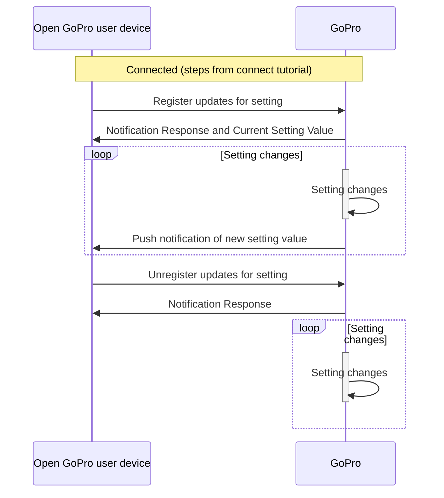

# Tutorial 4: BLE Queries

This document will provide a walk-through tutorial to implement the
[Open GoPro Interface]() to query the camera's setting and status
information via BLE.

"Queries" in this sense are specifically procedures that:

-   are initiated by writing to the Query UUID
-   receive responses via the Query Response UUID.

This will be described in more detail below.


It is suggested that you have first completed the
[connect](#requirements),
[sending commands](), and
[parsing responses]() tutorials before going
through this tutorial.


This tutorial only considers sending these queries as one-off commands. That is, it does not consider state
management / synchronization when sending multiple commands. This will be discussed in a future lab.

# Requirements

It is assumed that the hardware and software requirements from the
[connect tutorial]()
are present and configured correctly.

# Just Show me the Demo(s)!!



Each of the scripts for this tutorial can be found in the Tutorial 2
[directory](https://github.com/gopro/OpenGoPro/tree/main/demos/python/tutorial/tutorial_modules/tutorial_4_ble_queries/).


Python >= 3.8.x must be used as specified in the requirements




You can test an individual query poll with your camera through BLE using the following script:
```console
$ python ble_command_poll_resolution_value.py
```

See the help for parameter definitions:

```console
$ python ble_command_poll_resolution_value.py --help
usage: ble_command_poll_resolution_value.py [-h] [-i IDENTIFIER]

Connect to a GoPro camera, get the current resolution, modify the resolution, and confirm the change was successful.

optional arguments:
  -h, --help            show this help message and exit
  -i IDENTIFIER, --identifier IDENTIFIER
                        Last 4 digits of GoPro serial number, which is the last 4 digits of the
                        default camera SSID. If not used, first discovered GoPro will be connected to
```





You can test querying multiple queries simultaneously with your camera through BLE using the following script:
```console
$ python ble_command_poll_multiple_setting_values.py
```

See the help for parameter definitions:

```console
$ python ble_command_poll_multiple_setting_values.py --help
usage: ble_command_poll_multiple_setting_values.py [-h] [-i IDENTIFIER]

Connect to a GoPro camera then get the current resolution, fps, and fov.

optional arguments:
  -h, --help            show this help message and exit
  -i IDENTIFIER, --identifier IDENTIFIER
                        Last 4 digits of GoPro serial number, which is the last 4 digits of the
                        default camera SSID. If not used, first discovered GoPro will be connected to
```





You can test registering for querties and receiving push notifications with your camera through BLE using the following script:
```console
$ python ble_command_register_resolution_value_updates.py
```

See the help for parameter definitions:

```console
$ python ble_command_register_resolution_value_updates.py --help
usage: ble_command_register_resolution_value_updates.py [-h] [-i IDENTIFIER]

Connect to a GoPro camera, register for updates to the resolution, receive the current resolution, modify the resolution, and confirm receipt of the change notification.

optional arguments:
  -h, --help            show this help message and exit
  -i IDENTIFIER, --identifier IDENTIFIER
                        Last 4 digits of GoPro serial number, which is the last 4 digits of the
                        default camera SSID. If not used, first discovered GoPro will be connected to
```



The Kotlin file for this tutorial can be found on
[Github](https://github.com/gopro/OpenGoPro/tree/main/demos/kotlin/tutorial/app/src/main/java/com/example/open_gopro_tutorial/tutorials/Tutorial4BleQueries.kt).

To perform the tutorial, run the Android Studio project, select "Tutorial 4" from the dropdown and click on "Perform."
This requires that a GoPro is already connected via BLE, i.e. that Tutorial 1 was already run. You can
check the BLE status at the top of the app.

{% include figure image_path="/assets/images/tutorials/kotlin/tutorial_4.png" alt="kotlin_tutorial_4" size="40%" caption="Perform Tutorial 4" %}

This will start the tutorial and log to the screen as it executes. When the tutorial is complete, click
"Exit Tutorial" to return to the Tutorial selection screen.




# Setup

We must first connect as was discussed in the
[connect tutorial]().

We will also be using the **Response** class that was defined in the
[parsing responses]() tutorial to accumulate
and parse notification responses to the Query Response
[characteristic](#services-and-characteristics).
Throughout this tutorial, the query information that we will be reading is the Resolution Setting (ID 0x02).


Therefore, we have slightly changed the notification handler to update a global resolution variable as it
queries the resolution:

```python
def notification_handler(characteristic: BleakGATTCharacteristic, data: bytes) -> None:
    response.accumulate(data)

    if response.is_received:
        response.parse()

        if client.services.characteristics[characteristic.handle].uuid == QUERY_RSP_UUID:
            resolution = Resolution(response.data[RESOLUTION_ID][0])

        # Notify writer that the procedure is complete
        event.set()
```


Therefore, we have slightly updated the notification handler to only handle query responses:

```kotlin
fun resolutionPollingNotificationHandler(characteristic: UUID, data: UByteArray) {
    GoProUUID.fromUuid(characteristic)?.let {
        // If response is currently empty, create a new one
        response = response ?: Response.Query() // We're only handling queries in this tutorial
    } ?: return // We don't care about non-GoPro characteristics (i.e. the BT Core Battery service)

    Timber.d("Received response on $characteristic: ${data.toHexString()}")

    response?.let { rsp ->
        rsp.accumulate(data)
        if (rsp.isReceived) {
            rsp.parse()

            // If this is a query response, it must contain a resolution value
            if (characteristic == GoProUUID.CQ_QUERY_RSP.uuid) {
                Timber.i("Received resolution query response")
            }
    ...
```

We are also defining a resolution enum that will be updated as we receive new resolutions:

```kotlin
private enum class Resolution(val value: UByte) {
    RES_4K(1U),
    RES_2_7K(4U),
    RES_2_7K_4_3(6U),
    RES_1080(9U),
    RES_4K_4_3(18U),
    RES_5K(24U);

    companion object {
        private val valueMap: Map<UByte, Resolution> by lazy { values().associateBy { it.value } }

        fun fromValue(value: UByte) = valueMap.getValue(value)
    }
}

private lateinit var resolution: Resolution
```




There are two methods to query status / setting information, each of which will be described in a following
section:

-   [Polling Query Information](#polling-query-information)
-   [Registering for query push notifications](#registering-for-query-push-notifications)

# Polling Query Information

It is possible to poll one or more setting / status values using the following
[commands](#query-commands):

| Query ID | Request              | Query        |
| -------- | -------------------- | ------------ |
| 0x12     | Get Setting value(s) | len:12:xx:xx |
| 0x13     | Get Status value(s)  | len:13:xx:xx |

where **xx** are setting / status ID(s) and **len** is the length of the rest of the query (the number of query bytes plus one for the request ID byte).
There will be specific examples below.


Since they are two separate commands, combination of settings / statuses can not be polled simultaneously.


Here is a generic sequence diagram (the same is true for statuses):


The number of notification responses will vary depending on the amount of settings that have been queried.
Note that setting values will be combined into one notification until it reaches the maximum notification
size (20 bytes). At this point, a new response will be sent. Therefore, it is necessary to accumulate and then
parse these responses as was described in
[parsing query responses](#query-responses)

## Individual Query Poll

Here we will walk through an example of polling one setting (Resolution).

First we send the query command:



The sample code can be found in in `ble_query_poll_resolution_value.py`.
Let's first define the UUID's to write to and receive from:

```python
QUERY_REQ_UUID = GOPRO_BASE_UUID.format("0076")
QUERY_RSP_UUID = GOPRO_BASE_UUID.format("0077")
```

Then actually send the command:

```python
event.clear()
await client.write_gatt_char(QUERY_REQ_UUID, bytearray([0x02, 0x12, RESOLUTION_ID]))
await event.wait()  # Wait to receive the notification response
```


```kotlin
val pollResolution = ubyteArrayOf(0x02U, 0x12U, RESOLUTION_ID)
ble.writeCharacteristic(goproAddress, GoProUUID.CQ_QUERY.uuid, pollResolution)
```



When the response is received in / from the notification handler, we update the global resolution variable:



```python
def notification_handler(characteristic: BleakGATTCharacteristic, data: bytes) -> None:
    response.accumulate(data)

    # Notify the writer if we have received the entire response
    if response.is_received:
        response.parse()

        # If this is query response, it must contain a resolution value
        if client.services.characteristics[characteristic.handle].uuid == QUERY_RSP_UUID:
            resolution = Resolution(response.data[RESOLUTION_ID][0])
```

which logs as such:

```console
INFO:root:Getting the current resolution
INFO:root:Received response at handle=62: b'05:12:00:02:01:09'
INFO:root:self.bytes_remaining=0
INFO:root:Resolution is currently Resolution.RES_1080
```



```kotlin
// Wait to receive the response and then convert it to resolution
resolution = Resolution.fromValue(
    receivedResponse.receive().data.getValue(RESOLUTION_ID).first()
)
```

which logs as such:

```console
 Polling the current resolution
Writing characteristic b5f90076-aa8d-11e3-9046-0002a5d5c51b ==> 02:12:02
Wrote characteristic b5f90076-aa8d-11e3-9046-0002a5d5c51b
Characteristic b5f90077-aa8d-11e3-9046-0002a5d5c51b changed | value: 05:12:00:02:01:04
Received response on b5f90077-aa8d-11e3-9046-0002a5d5c51b: 05:12:00:02:01:04
Received packet of length 5. 0 bytes remaining
Received resolution query response
Camera resolution is RES_2_7K
```




For verification purposes, we are then changing the resolution and polling again to verify that the setting
has changed:



```console
INFO:root:Changing the resolution to Resolution.RES_2_7K...
INFO:root:Received response at handle=57: b'02:02:00'
INFO:root:self.bytes_remaining=0
INFO:root:Command sent successfully
INFO:root:Polling the resolution to see if it has changed...
INFO:root:Received response at handle=62: b'05:12:00:02:01:07'
INFO:root:self.bytes_remaining=0
INFO:root:Resolution is currently Resolution.RES_2_7K
```



```kotlin
    while (resolution != newResolution) {
        ble.writeCharacteristic(goproAddress, GoProUUID.CQ_QUERY.uuid, pollResolution)
        resolution = Resolution.fromValue(
            receivedResponse.receive().data.getValue(RESOLUTION_ID).first()
        )
        Timber.i("Camera resolution is currently $resolution")
    }
```

which logs as such:

```console
Changing the resolution to RES_1080
Writing characteristic b5f90074-aa8d-11e3-9046-0002a5d5c51b ==> 03:02:01:09
Wrote characteristic b5f90074-aa8d-11e3-9046-0002a5d5c51b
Characteristic b5f90075-aa8d-11e3-9046-0002a5d5c51b changed | value: 02:02:00
Received response on b5f90075-aa8d-11e3-9046-0002a5d5c51b: 02:02:00
Command sent successfully
Resolution successfully changed
Polling the resolution until it changes
Writing characteristic b5f90076-aa8d-11e3-9046-0002a5d5c51b ==> 02:12:02
Characteristic b5f90077-aa8d-11e3-9046-0002a5d5c51b changed | value: 05:12:00:02:01:09
Received response on b5f90077-aa8d-11e3-9046-0002a5d5c51b: 05:12:00:02:01:09
Received resolution query response
Wrote characteristic b5f90076-aa8d-11e3-9046-0002a5d5c51b
Camera resolution is currently RES_1080
```




## Multiple Simultaneous Query Polls

Rather than just polling one setting, it is also possible to poll multiple settings. An example of this is shown
below. It is very similar to the previous example except for the following:

The query command now includes 3 settings: Resolution, FPS, and FOV.



```python
RESOLUTION_ID = 2
FPS_ID = 3
FOV_ID = 121

await client.write_gatt_char(QUERY_REQ_UUID, bytearray([0x04, 0x12, RESOLUTION_ID, FPS_ID, FOV_ID]))
```


TODO




The length (first byte of the command) has been increased to 4 to accommodate the extra settings


We are also parsing the response to get all 3 values:



```python
def notification_handler(characteristic: BleakGATTCharacteristic, data: bytes) -> None:
    response.accumulate(data)

    if response.is_received:
        response.parse()

        if client.services.characteristics[characteristic.handle].uuid == QUERY_RSP_UUID:
            resolution = Resolution(response.data[RESOLUTION_ID][0])
            fps = FPS(response.data[FPS_ID][0])
            video_fov = VideoFOV(response.data[FOV_ID][0])
```


TODO




When we are storing the updated setting, we are just taking the first byte (i..e index 0). A real-world
implementation would need to know the length (and type) of the setting / status response by the ID. For example,
sometimes settings / statuses are bytes, words, strings, etc.


They are then printed to the log which will look like the following:



```console
INFO:root:Received response at handle=62: b'0b:12:00:02:01:07:03:01:01:79:01:00'
INFO:root:self.bytes_remaining=0
INFO:root:Resolution is currently Resolution.RES_2_7K
INFO:root:Video FOV is currently VideoFOV.FOV_WIDE
INFO:root:FPS is currently FPS.FPS_120
```


TODO



## Query All

It is also possible to query all settings / statuses by not passing any ID's into the the query command, i.e.:

| Query ID | Request          | Query |
| -------- | ---------------- | ----- |
| 0x12     | Get All Settings | 01:12 |
| 0x13     | Get All Statuses | 01:13 |

An example of this can be seen in the
[parsing query responses](#query-responses)
tutorial

**Quiz time! 📚 ✏️**

{% quiz
    question="How can we poll the encoding status and the resolution setting using one command?"
    option="A:::Concatenate a 'Get Setting Value' command and a 'Get Status' command with the relevant ID's"
    option="B:::Concatenate the 'Get All Setting' and 'Get All Status' commands."
    option="C:::It is not possible"
    correct="C"
    info="It is not possible to concatenate commands. This would result in an unknown sequence of bytes
        from the camera's perspective. So it is not possible to get a setting value and a status value in one
        command. The Get Setting command (with resolution ID) and Get Status command(with encoding ID) must be
        sent sequentially in order to get this information."
%}

# Registering for Query Push Notifications

Rather than polling the query information, it is also possible to use an interrupt scheme to register for
push notifications when the relevant query information changes.

The relevant [commands](#query-commands) are:

| Query ID | Request                           | Query        |
| -------- | --------------------------------- | ------------ |
| 0x52     | Register updates for setting(s)   | len:52:xx:xx |
| 0x53     | Register updates for status(es)   | len:53:xx:xx |
| 0x72     | Unregister updates for setting(s) | len:72:xx:xx |
| 0x73     | Unregister updates for status(es) | len:73:xx:xx |

where **xx** are setting / status ID(s) and **len** is the length of the rest of the query (the number of query bytes plus one for the request ID byte).

The Query ID's for push notification responses are as follows:

| Query ID | Response                        |
| -------- | ------------------------------- |
| 0x92     | Setting Value Push Notification |
| 0x93     | Status Value Push Notification  |

Here is a generic sequence diagram of how this looks (the same is true for statuses):



That is, after registering for push notifications for a given query, notification responses will continuously
be sent whenever the query changes until the client unregisters for push notifications for the given query.


The initial response to the Register command also contains the current setting / status value.


We will walk through an example of this below:

First, let's register for updates when the resolution setting changes:



First, let's define the UUID's we will be using:

```python
SETTINGS_REQ_UUID = GOPRO_BASE_UUID.format("0074")
SETTINGS_RSP_UUID = GOPRO_BASE_UUID.format("0075")
QUERY_REQ_UUID = GOPRO_BASE_UUID.format("0076")
QUERY_RSP_UUID = GOPRO_BASE_UUID.format("0077")
```

Then, let's send the register BLE message...

```python
event.clear()
await client.write_gatt_char(QUERY_REQ_UUID, bytearray([0x02, 0x52, RESOLUTION_ID]))
await event.wait()  # Wait to receive the notification response
```



```kotlin
val registerResolutionUpdates = ubyteArrayOf(0x02U, 0x52U, RESOLUTION_ID)
ble.writeCharacteristic(goproAddress, GoProUUID.CQ_QUERY.uuid, registerResolutionUpdates)
```




and parse its response (which includes the current resolution value). This is very similar to the polling
example with the exception that the Query ID is now 0x52 (Register Updates for Settings). This can be seen in
the raw byte data as well as by inspecting the response's `id` property.



```python
def notification_handler(characteristic: BleakGATTCharacteristic, data: bytes) -> None:
    logger.info(f'Received response at handle {characteristic.handle}: {data.hex(":")}')

    response.accumulate(data)

    # Notify the writer if we have received the entire response
    if response.is_received:
        response.parse()

        # If this is query response, it must contain a resolution value
        if client.services.characteristics[characteristic.handle].uuid == QUERY_RSP_UUID:
            global resolution
            resolution = Resolution(response.data[RESOLUTION_ID][0])
```

This will show in the log as such:

```console
INFO:root:Registering for resolution updates
INFO:root:Received response at handle=62: b'05:52:00:02:01:07'
INFO:root:self.bytes_remaining=0
INFO:root:Successfully registered for resolution value updates.
INFO:root:Resolution is currently Resolution.RES_2_7K
```


```kotlin
fun resolutionRegisteringNotificationHandler(characteristic: UUID, data: UByteArray) {
    ...

    if (rsp.isReceived) {
        rsp.parse()

        if (characteristic == GoProUUID.CQ_QUERY_RSP.uuid) {
            Timber.i("Received resolution query response")
            resolution = Resolution.fromValue(rsp.data.getValue(RESOLUTION_ID).first())
            Timber.i("Resolution is now $resolution")
    ...
```

This will show in the log as such:

```console
Registering for resolution value updates
Writing characteristic b5f90076-aa8d-11e3-9046-0002a5d5c51b ==> 02:52:02
Wrote characteristic b5f90076-aa8d-11e3-9046-0002a5d5c51b
```



We are now successfully registered for resolution value updates and will receive push notifications whenever
the resolution changes. We verify this in the demo by then changing the resolution.



This will show in the log as such:

```console
INFO:root:Successfully changed the resolution
INFO:root:Received response at handle=62: b'05:92:00:02:01:09'
INFO:root:self.bytes_remaining=0
INFO:root:Resolution is now Resolution.RES_1080
```


```kotlin
val newResolution = if (resolution == Resolution.RES_2_7K) Resolution.RES_1080 else Resolution.RES_2_7K
val setResolution = ubyteArrayOf(0x03U, RESOLUTION_ID, 0x01U, newResolution.value)
ble.writeCharacteristic(goproAddress, GoProUUID.CQ_SETTING.uuid, setResolution)
val setResolutionResponse = receivedResponse.receive()

// Verify we receive the update from the camera when the resolution changes
while (resolution != newResolution) {
    receivedResponse.receive()
}
```

We can see change happen in the log:

```console
Changing the resolution to RES_2_7K
Writing characteristic b5f90074-aa8d-11e3-9046-0002a5d5c51b ==> 03:02:01:04
Wrote characteristic b5f90074-aa8d-11e3-9046-0002a5d5c51b
Resolution successfully changed
Waiting for camera to inform us about the resolution change
Characteristic b5f90077-aa8d-11e3-9046-0002a5d5c51b changed | value: 05:92:00:02:01:04
Received response on b5f90077-aa8d-11e3-9046-0002a5d5c51b: 05:92:00:02:01:04
Received resolution query response
Resolution is now RES_2_7K
```



In this case, the Query ID is 0x92 (Setting Value Push Notification) as expected.

---


Multiple push notifications can be registered / received in a similar manner that multiple queries were
polled above


**Quiz time! 📚 ✏️**





# Troubleshooting

See the first tutorial's
[troubleshooting section](#troubleshooting).

# Good Job!


Congratulations 🤙


You can now query any of the settings / statuses from the camera using one of the above patterns.

If you have been following these tutorials in order, here is an extra 🥇🍾 **Congratulations** 🍰👍 because you have
completed all of the BLE tutorials.

Next, to get started with WiFI (specifically to enable and connect to it),
proceed to the next tutorial.
