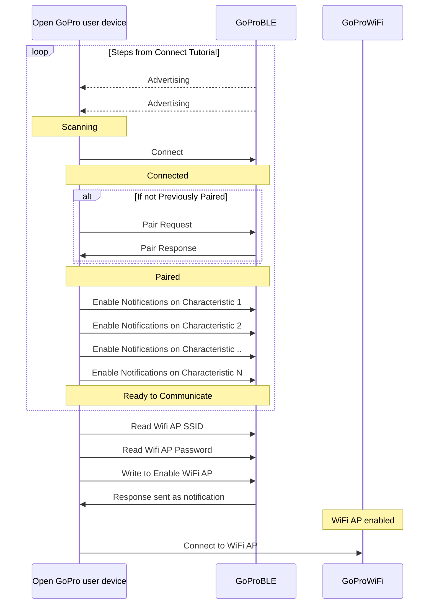

# Tutorial 5: Connect WiFi

This document will provide a walk-through tutorial to implement
the [Open GoPro Interface](/http) to enable the GoPro's WiFi Access Point (AP) so that it
can be connected to. It will also provide an example of connecting to the WiFi AP.


It is recommended that you have first completed the
[connecting](),
[sending commands](), and
[parsing responses]() tutorials before proceeding.


# Requirements

It is assumed that the hardware and software requirements from the
[connect tutorial](#requirements)
are present and configured correctly.

The scripts that will be used for this tutorial can be found in the
[Tutorial 5 Folder](https://github.com/gopro/OpenGoPro/tree/main/demos/python/tutorial/tutorial_modules/tutorial_5_connect_wifi).

# Just Show me the Demo(s)!!



Each of the scripts for this tutorial can be found in the Tutorial 2
[directory](https://github.com/gopro/OpenGoPro/tree/main/demos/python/tutorial/tutorial_modules/tutorial_5_connect_wifi/).


Python >= 3.8.x must be used as specified in the requirements




You can test querying the current Resolution on your camera through BLE using the following script:
```console
$ python wifi_enable.py
```

See the help for parameter definitions:

```console
$ python wifi_enable.py --help
usage: wifi_enable.py [-h] [-i IDENTIFIER] [-t TIMEOUT]

Connect to a GoPro camera via BLE, get WiFi info, and enable WiFi.

optional arguments:
  -h, --help            show this help message and exit
  -i IDENTIFIER, --identifier IDENTIFIER
                        Last 4 digits of GoPro serial number, which is the last 4 digits of the
                        default camera SSID. If not used, first discovered GoPro will be connected to
  -t TIMEOUT, --timeout TIMEOUT
                        time in seconds to maintain connection before disconnecting. If not set, will
                        maintain connection indefinitely
```




The Kotlin file for this tutorial can be found on
[Github](https://github.com/gopro/OpenGoPro/tree/main/demos/kotlin/tutorial/app/src/main/java/com/example/open_gopro_tutorial/tutorials/Tutorial5ConnectWifi.kt).

To perform the tutorial, run the Android Studio project, select "Tutorial 5" from the dropdown and click on "Perform."
This requires that a GoPro is already connected via BLE, i.e. that Tutorial 1 was already run. You can
check the BLE status at the top of the app.

{% include figure image_path="/assets/images/tutorials/kotlin/tutorial_5.png" alt="kotlin_tutorial_5" size="40%" caption="Perform Tutorial 5" %}

This will start the tutorial and log to the screen as it executes. When the tutorial is complete, click
"Exit Tutorial" to return to the Tutorial selection screen.




# Setup

We must first connect to BLE as was discussed in the
[connect tutorial](). We are also
using the same notification handler as was used in the
[sending commands tutorial](#setup)

# Connecting to WiFi AP

Now that we are connected via BLE, paired, and have enabled notifications, we can send the command to enable
the WiFi AP.

Here is an outline of the steps to do so:



Essentially we will be finding the WiFi AP information (SSID and password) via BLE, enabling the WiFi AP via
BLE, then connecting to the WiFi AP.

## Find WiFi Information

Note that the process to get this information is different than all procedures described up to this point.
Whereas the previous command, setting, and query procedures all followed the Write Request-Notification
Response pattern, the WiFi Information is retrieved via direct Read Requests to BLE characteristics.

### Get WiFi SSID

The WiFi SSID can be found by reading from the WiFi AP SSID
[characteristic](/ble/index.html#services-and-characteristics) of the
WiFi Access Point service.

First, let's send the read request to get the SSID (and decode it into a string).



Let's define the attribute to read from:

```python
WIFI_AP_SSID_UUID = GOPRO_BASE_UUID.format("0002")
```

Then send the BLE read request:

```python
ssid = await client.read_gatt_char(WIFI_AP_SSID_UUID)
ssid = ssid.decode()
```


There is no need for a synchronization event as the information is available when the `read_gatt_char` method
returns.


In the demo, this information is logged as such:

```console
INFO:root:Reading the WiFi AP SSID
INFO:root:SSID is GP24500456
```


```kotlin
ble.readCharacteristic(goproAddress, GoProUUID.WIFI_AP_SSID.uuid).onSuccess { ssid = it.decodeToString() }
Timber.i("SSID is $ssid")
```

In the demo, this information is logged as such:

```console
Getting the SSID
Read characteristic b5f90002-aa8d-11e3-9046-0002a5d5c51b : value: 64:65:62:75:67:68:65:72:6F:31:31
SSID is debughero11
```



### Get WiFi Password

The WiFi password can be found by reading from the WiFi AP password
[characteristic](/ble/index.html#services-and-characteristics) of the
WiFi Access Point service.

First, let's send the read request to get the password (and decode it into a string).



Let's define the attribute to read from:

```python
WIFI_AP_PASSWORD_UUID = GOPRO_BASE_UUID.format("0003")
```
Then send the BLE read request:


There is no need for a synchronization event as the information is available when the `read_gatt_char` method
returns.


In the demo, this information is logged as such:

```console
INFO:root:Reading the WiFi AP password
INFO:root:Password is g@6-Tj9-C7K
```


```kotlin
ble.readCharacteristic(goproAddress, GoProUUID.WIFI_AP_PASSWORD.uuid).onSuccess { password = it.decodeToString() }
Timber.i("Password is $password")
```

In the demo, this information is logged as such:

```console
Getting the password
Read characteristic b5f90003-aa8d-11e3-9046-0002a5d5c51b : value: 7A:33:79:2D:44:43:58:2D:50:68:6A
Password is z3y-DCX-Phj
```



## Enable WiFi AP

Before we can connect to the WiFi AP, we have to make sure it is enabled. This is accomplished by using the
"AP Control" [command](/ble/index.html#commands-quick-reference):

| Command            |        Bytes        |
| ------------------ | :-----------------: |
| Ap Control Enable  | 0x03 0x17 0x01 0x01 |
| Ap Control Disable | 0x03 0x17 0x01 0x00 |

This is done in the same manner that we did in the
[sending commands tutorial]().

Now, let's write the bytes to the "Command Request UUID" to enable the WiFi AP!



```python
event.clear()
await client.write_gatt_char(COMMAND_REQ_UUID, bytearray([0x03, 0x17, 0x01, 0x01]))
await event.wait()  # Wait to receive the notification response
```


We make sure to clear the synchronization event before writing, then pend on the event until it is set in
the notification callback.



```kotlin
val enableWifiCommand = ubyteArrayOf(0x03U, 0x17U, 0x01U, 0x01U)
ble.writeCharacteristic(goproAddress, GoProUUID.CQ_COMMAND.uuid, enableWifiCommand)
receivedData.receive()
```



Note that we have received the "Command Status" notification response from the
Command Response characteristic since we enabled it's notifications in
[Enable Notifications](#enable-notifications). This can
be seen in the demo log:



```console
INFO:root:Enabling the WiFi AP
INFO:root:Received response at handle=52: b'02:17:00'
INFO:root:Command sent successfully
INFO:root:WiFi AP is enabled
```


```console
Enabling the camera's Wifi AP
Writing characteristic b5f90072-aa8d-11e3-9046-0002a5d5c51b ==> 03:17:01:01
Wrote characteristic b5f90072-aa8d-11e3-9046-0002a5d5c51b
Characteristic b5f90073-aa8d-11e3-9046-0002a5d5c51b changed | value: 02:17:00
Received response on b5f90073-aa8d-11e3-9046-0002a5d5c51b: 02:17:00
Command sent successfully
```



As expected, the response was received on the correct handle and the status was "success".

## Establish Connection to WiFi AP



If you have been following through the `ble_enable_wifi.py` script, you will notice that it ends here such that
we know the WiFi SSID and password and the WiFi AP is enabled and ready to connect to. This is because there
are many different methods of connecting to the WiFi AP depending on your OS and the framework you are
using to develop. You could, for example, simply use your OS's WiFi GUI to connect.


While out of the scope of these tutorials, there is a programmatic example of this in the cross-platform
`WiFi Demo` from the [Open GoPro Python SDK](https://gopro.github.io/OpenGoPro/python_sdk/quickstart.html#wifi-demo).




Using the passwsord and SSID we discovered above, we will now connect to the camera's network:

```kotlin
wifi.connect(ssid, password)
```

This should show a system popup on your Android device that eventually goes away once the Wifi is
connected.


This connection process appears to vary drastically in time.




**Quiz time! 📚 ✏️**

{% quiz
    question="How is the WiFi password response received?"
    option="A:::As a read response from the WiFi AP Password characteristic"
    option="B:::As write responses to the WiFi Request characteristic"
    option="C:::As notifications of the Command Response characteristic"
    correct="A"
    info="This (and WiFi AP SSID) is an exception to the rule. Usually responses
    are received as notifications to a response characteristic. However, in this case, it is
    received as a direct read response (since we are reading from the characteristic and not
    writing to it)."
%}

{% quiz
    question="Which of the following statements about the GoPro WiFi AP is true?"
    option="A:::It only needs to be enabled once and it will then always remain on"
    option="B:::The WiFi password will never change"
    option="C:::The WiFi SSID will never change"
    option="D:::None of the Above"
    correct="D"
    info="While the WiFi AP will remain on for some time, it can and will eventually turn off so
    it is always recommended to first connect via BLE and ensure that it is enabled. The password
    and SSID will almost never change. However, they will change if the connections are reset via
    Connections->Reset Connections."
%}

# Troubleshooting

See the first tutorial's
[troubleshooting section](#troubleshooting).

# Good Job!


Congratulations 🤙


You are now connected to the GoPro's Wifi AP and can send any of the HTTP commands defined in the
[Open GoPro Interface](/http). Proceed to the next tutorial.
