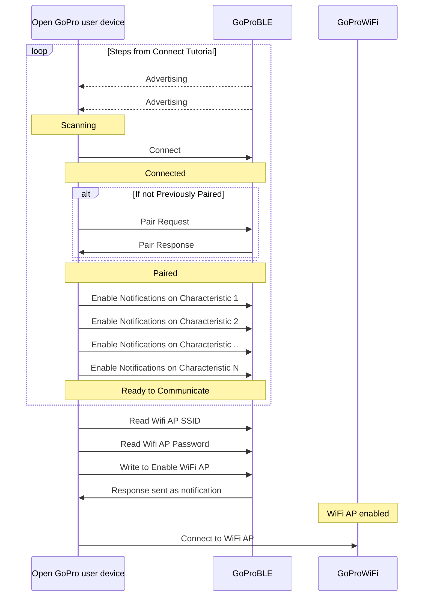

# Tutorial 6: Connect WiFi

This document will provide a walk-through tutorial to use the Open GoPro Interface to connect the GoPro to a Wifi
network either in Access Point (AP) mode or Station (STA) Mode.


It is recommended that you have first completed the
[connecting BLE](),
[sending commands](),
[parsing responses](), and
[protobuf]() tutorials before proceeding.


# Requirements

It is assumed that the hardware and software requirements from the
[connecting BLE tutorial](#requirements)
are present and configured correctly.

The scripts that will be used for this tutorial can be found in the
[Tutorial 6 Folder](https://github.com/gopro/OpenGoPro/tree/main/demos/python/tutorial/tutorial_modules/tutorial_6_connect_wifi).

# Just Show me the Demo(s)!!



Each of the scripts for this tutorial can be found in the Tutorial 6
[directory](https://github.com/gopro/OpenGoPro/tree/main/demos/python/tutorial/tutorial_modules/tutorial_6_connect_wifi/).


Python >= 3.9 and < 3.12 must be used as specified in the requirements




You can enable the GoPro's Access Point to allow it accept Wifi connections as an Access Point via:

```console
$ python wifi_enable.py
```

See the help for parameter definitions:

```console
$ python wifi_enable.py --help
usage: enable_wifi_ap.py [-h] [-i IDENTIFIER] [-t TIMEOUT]

Connect to a GoPro camera via BLE, get its WiFi Access Point (AP) info, and enable its AP.

options:
  -h, --help            show this help message and exit
  -i IDENTIFIER, --identifier IDENTIFIER
                        Last 4 digits of GoPro serial number, which is the last 4 digits of the default camera SSID. If not used, first
                        discovered GoPro will be connected to
  -t TIMEOUT, --timeout TIMEOUT
                        time in seconds to maintain connection before disconnecting. If not set, will maintain connection indefinitely
```





You can connect the GoPro to a Wifi network where the GoPro is in Station Mode (STA) via:

```console
$ python connect_as_sta.py
```

See the help for parameter definitions:

```console
$ python connect_as_sta.py --help
Connect the GoPro to a Wifi network where the GoPro is in Station Mode (STA).

positional arguments:
  ssid                  SSID of network to connect to
  password              Password of network to connect to

options:
  -h, --help            show this help message and exit
  -i IDENTIFIER, --identifier IDENTIFIER
                        Last 4 digits of GoPro serial number, which is the last 4 digits of the default camera SSID.
                        If not used, first discovered GoPro will be connected to
```





The Kotlin file for this tutorial can be found on
[Github](https://github.com/gopro/OpenGoPro/tree/main/demos/kotlin/tutorial/app/src/main/java/com/example/open_gopro_tutorial/tutorials/Tutorial5ConnectWifi.kt).

To perform the tutorial, run the Android Studio project, select "Tutorial 6" from the dropdown and click on "Perform."
This requires that a GoPro is already connected via BLE, i.e. that Tutorial 1 was already run. You can
check the BLE status at the top of the app.

{% include figure image_path="/assets/images/tutorials/kotlin/tutorial_5.png" alt="kotlin_connect_wifi" size="40%" caption="Perform Tutorial 6" %}

This will start the tutorial and log to the screen as it executes. When the tutorial is complete, click
"Exit Tutorial" to return to the Tutorial selection screen.




# Setup

For both cases, we must first connect to BLE as was discussed in the
[connecting BLE tutorial]().

# Access Point Mode (AP)

In AP mode, the GoPro operates as an Access Point, allowing wireless clients to connect and communicate using the
Open GoPro [HTTP API]({{site.baseurl}}/http). The HTTP API provides much of the same functionality as the BLE API as
well as some additional functionality. For more information on the HTTP API, see the next 2 tutorials.

```plantuml!
left to right direction
rectangle AccessPoint {
   frame GoPro as gopro
}
component client
gopro <--[dashed]--> client: BLE
gopro <----> client: WiFi
```

In order to connect to the camera in AP mode, after connecting via BLE, pairing, and enabling notifications, we must:

-   find the GoPro's WiFi AP information (SSID and password) via BLE,
-   enable the WiFi AP via BLE
-   connect to the WiFi AP.

Here is an outline of the steps to do so:



The following subsections will detail this process.

## Find WiFi Information

First we must find the target Wifi network's SSID and password.


The process to get this information is different than all other BLE operations described up to this point.
Whereas the previous command, setting, and query operations all followed the Write Request-Notification
Response pattern, the WiFi Information is retrieved via direct Read Requests to BLE characteristics.


### Get WiFi SSID

The WiFi SSID can be found by reading from the WiFi AP SSID
[characteristic]({{site.baseurl}}/ble/protocol/ble_setup.html#ble-characteristics) of the
WiFi Access Point service.

Let's send the read request to get the SSID and decode it into a string.




```python
ssid_uuid = GoProUuid.WIFI_AP_SSID_UUID
logger.info(f"Reading the WiFi AP SSID at {ssid_uuid}")
ssid = (await client.read_gatt_char(ssid_uuid.value)).decode()
logger.info(f"SSID is {ssid}")
```


There is no need for a synchronization event as the information is available when the `read_gatt_char` method
returns.


In the demo, this information is logged as such:

```console
Reading the WiFi AP SSID at GoProUuid.WIFI_AP_SSID_UUID
SSID is GP24500702
```




```kotlin
ble.readCharacteristic(goproAddress, GoProUUID.WIFI_AP_SSID.uuid).onSuccess { ssid = it.decodeToString() }
Timber.i("SSID is $ssid")
```

In the demo, this information is logged as such:

```console
Getting the SSID
Read characteristic b5f90002-aa8d-11e3-9046-0002a5d5c51b : value: 64:65:62:75:67:68:65:72:6F:31:31
SSID is debughero11
```




### Get WiFi Password

The WiFi password can be found by reading from the WiFi AP password
[characteristic]({{site.baseurl}}/ble/protocol/ble_setup.html#ble-characteristics) of the
WiFi Access Point service.

Let's send the read request to get the password and decode it into a string.




```python
password_uuid = GoProUuid.WIFI_AP_PASSWORD_UUID
logger.info(f"Reading the WiFi AP password at {password_uuid}")
password = (await client.read_gatt_char(password_uuid.value)).decode()
logger.info(f"Password is {password}")
```


There is no need for a synchronization event as the information is available when the `read_gatt_char` method
returns.


In the demo, this information is logged as such:

```console
Reading the WiFi AP password at GoProUuid.WIFI_AP_PASSWORD_UUID
Password is p@d-NNc-2ts
```




```kotlin
ble.readCharacteristic(goproAddress, GoProUUID.WIFI_AP_PASSWORD.uuid).onSuccess { password = it.decodeToString() }
Timber.i("Password is $password")
```

In the demo, this information is logged as such:

```console
Getting the password
Read characteristic b5f90003-aa8d-11e3-9046-0002a5d5c51b : value: 7A:33:79:2D:44:43:58:2D:50:68:6A
Password is z3y-DCX-Phj
```




## Enable WiFi AP

Before we can connect to the WiFi AP, we have to make sure the access point is enabled. This is accomplished via the
[AP Control command]({{site.baseurl}}/ble/features/control.html#set-ap-control):

| Command            |        Bytes        |
| ------------------ | :-----------------: |
| Ap Control Enable  | 0x03 0x17 0x01 0x01 |
| Ap Control Disable | 0x03 0x17 0x01 0x00 |


We are using the same notification handler that was defined in the
[sending commands tutorial](#setup).


Let's write the bytes to the "Command Request UUID" to enable the WiFi AP!




```python
event.clear()
request = bytes([0x03, 0x17, 0x01, 0x01])
command_request_uuid = GoProUuid.COMMAND_REQ_UUID
await client.write_gatt_char(command_request_uuid.value, request, response=True)
await event.wait()  # Wait to receive the notification response
```


We make sure to clear the synchronization event before writing, then pend on the event until it is set in
the notification callback.




```kotlin
val enableWifiCommand = ubyteArrayOf(0x03U, 0x17U, 0x01U, 0x01U)
ble.writeCharacteristic(goproAddress, GoProUUID.CQ_COMMAND.uuid, enableWifiCommand)
receivedData.receive()
```




Note that we have received the "Command Status" notification response from the
Command Response characteristic since we enabled it's notifications in
[Enable Notifications](#enable-notifications). This can
be seen in the demo log:




```console
Enabling the WiFi AP
Writing to GoProUuid.COMMAND_REQ_UUID: 03:17:01:01
Received response at GoProUuid.COMMAND_RSP_UUID: 02:17:00
Command sent successfully
WiFi AP is enabled
```




```console
Enabling the camera's Wifi AP
Writing characteristic b5f90072-aa8d-11e3-9046-0002a5d5c51b ==> 03:17:01:01
Wrote characteristic b5f90072-aa8d-11e3-9046-0002a5d5c51b
Characteristic b5f90073-aa8d-11e3-9046-0002a5d5c51b changed | value: 02:17:00
Received response on b5f90073-aa8d-11e3-9046-0002a5d5c51b: 02:17:00
Command sent successfully
```




As expected, the response was received on the correct UUID and the status was "success".

## Establish Connection to WiFi AP



If you have been following through the `ble_enable_wifi.py` script, you will notice that it ends here such that
we know the WiFi SSID / password and the WiFi AP is enabled. This is because there
are many different methods of connecting to the WiFi AP depending on your OS and the framework you are
using to develop. You could, for example, simply use your OS's WiFi GUI to connect.


While out of the scope of these tutorials, there is a programmatic example of this in the cross-platform
`WiFi Demo` from the [Open GoPro Python SDK](https://gopro.github.io/OpenGoPro/python_sdk/quickstart.html#wifi-demo).




Using the passwsord and SSID we discovered above, we will now connect to the camera's network:

```kotlin
wifi.connect(ssid, password)
```

This should show a system popup on your Android device that eventually goes away once the Wifi is
connected.


This connection process appears to vary drastically in time.




**Quiz time! 📚 ✏️**

{% quiz
    question="How is the WiFi password response received?"
    option="A:::As a read response from the WiFi AP Password characteristic"
    option="B:::As write responses to the WiFi Request characteristic"
    option="C:::As notifications of the Command Response characteristic"
    correct="A"
    info="This (and WiFi AP SSID) is an exception to the rule. Usually responses
    are received as notifications to a response characteristic. However, in this case, it is
    received as a direct read response (since we are reading from the characteristic and not
    writing to it)."
%}

{% quiz
    question="Which of the following statements about the GoPro WiFi AP is true?"
    option="A:::It only needs to be enabled once and it will then always remain on"
    option="B:::The WiFi password will never change"
    option="C:::The WiFi SSID will never change"
    option="D:::None of the Above"
    correct="D"
    info="While the WiFi AP will remain on for some time, it can and will eventually turn off so
    it is always recommended to first connect via BLE and ensure that it is enabled. The password
    and SSID will almost never change. However, they will change if the connections are reset via
    Connections->Reset Connections."
%}

You are now connected to the GoPro's Wifi AP and can send any of the HTTP commands defined in the
[HTTP Specification]({{site.baseurl}}/http).

# Station (STA) Mode

Station Mode is where the GoPro operates as a [Station](<https://en.wikipedia.org/wiki/Station_(networking)>), allowing
the camera to connect to and communicate with an Access Point such as a switch or a router. This is used, for example,
in the livestreaming and [camera on the home network]() (COHN) features.

```plantuml!
left to right direction
rectangle Station {
   frame GoPro as gopro
}
component client
rectangle AccessPoint {
   component router
}
gopro <--[dashed]--> client: BLE
gopro <----> router: Wifi
```


When the GoPro is in Station Mode, there is no HTTP communication channel to the Open GoPro client. The GoPro can still
be controlled via BLE.


In order to configure the GoPro in Station mode, after connecting via BLE, pairing, and enabling notifications, we must:

-   scan for available networks
-   connect to a discovered network, using the correct API based on whether or not we have previously connected to this
    network

The following subsections will detail these steps. All of the Protobuf operations are performed in the same manner as
in the [protobuf tutorial]() such as reusing the `ResponseManager`.

## Scan for Networks


It is always necessary to scan for networks, regardless of whether you already have a network's information and know it
is available. Failure to do so follows an untested and unsupported path in the GoPro's connection state machine.


The process of scanning for networks requires several Protobuf Operations as summarized here:

{% include figure image_path="/assets/images/plantuml_ble_scan_for_ssids.png" alt="scan_for_ssids" size="70%" caption="Scan For Networks" %}

First we must request the GoPro to
[Scan For Access Points]({{site.baseurl}}/ble/features/access_points.html#scan-for-access-points):





The code here is taken from `connect_as_sta.py`


Let's send the [scan request]({{site.baseurl}}/ble/protocol/protobuf.html#requeststartscan) and then retrieve and parse
[notifications]({{site.baseurl}}/ble/protocol/protobuf.html#notifstartscanning) until we receive a notification where the
`scanning_state` is set to [SCANNING_SUCCESS]({{site.baseurl}}/ble/protocol/protobuf.html#enumscanning).
Then we store the `scan id` from the notification for later use in retrieving the scan results.

```python
start_scan_request = bytearray(
    [
        0x02,  # Feature ID
        0x02,  # Action ID
        *proto.RequestStartScan().SerializePartialToString(),
    ]
)
start_scan_request.insert(0, len(start_scan_request))
await manager.client.write_gatt_char(GoProUuid.NETWORK_MANAGEMENT_REQ_UUID.value, start_scan_request, response=True)
while response := await manager.get_next_response_as_protobuf():
    ...
    elif response.action_id == 0x0B:  # Scan Notifications
        scan_notification: proto.NotifStartScanning = response.data  # type: ignore
        logger.info(f"Received scan notification: {scan_notification}")
        if scan_notification.scanning_state == proto.EnumScanning.SCANNING_SUCCESS:
            return scan_notification.scan_id
```

This will log as such:

```console
Scanning for available Wifi Networks
Writing: 02:02:02
Received response at GoProUuid.NETWORK_MANAGEMENT_RSP_UUID: 06:02:82:08:01:10:02
Received response at GoProUuid.NETWORK_MANAGEMENT_RSP_UUID: 0a:02:0b:08:05:10:01:18:05:20:01
Received scan notification: scanning_state: SCANNING_SUCCESS
    scan_id: 1
    total_entries: 5
    total_configured_ssid: 1
```



TODO



Next we must request the GoPro to
[return the Scan Results]({{site.baseurl}}/ble/features/access_points.html#get-ap-scan-results).
Using the `scan_id` from above, let's send the
[Get AP Scan Results]({{site.baseurl}}/ble/features/access_points.html#get-ap-scan-results) request, then
retrieve and parse the response:




```python
results_request = bytearray(
    [
        0x02,  # Feature ID
        0x03,  # Action ID
        *proto.RequestGetApEntries(start_index=0, max_entries=100, scan_id=scan_id).SerializePartialToString(),
    ]
)
results_request.insert(0, len(results_request))
await manager.client.write_gatt_char(GoProUuid.NETWORK_MANAGEMENT_REQ_UUID.value, results_request, response=True)
response := await manager.get_next_response_as_protobuf():
entries_response: proto.ResponseGetApEntries = response.data  # type: ignore
logger.info("Found the following networks:")
for entry in entries_response.entries:
    logger.info(str(entry))
return list(entries_response.entries)
```

This will log as such:

```console
Getting the scanned networks.
Writing: 08:02:03:08:00:10:64:18:01
Received response at GoProUuid.NETWORK_MANAGEMENT_RSP_UUID: 20:76:02:83:08:01:10:01:1a:13:0a:0a:64:61:62:75:67:64:61:62
Received response at GoProUuid.NETWORK_MANAGEMENT_RSP_UUID: 80:75:67:10:03:20:e4:28:28:2f:1a:13:0a:0a:41:54:54:54:70:34
Received response at GoProUuid.NETWORK_MANAGEMENT_RSP_UUID: 81:72:36:46:69:10:02:20:f1:2c:28:01:1a:13:0a:0a:41:54:54:62
Received response at GoProUuid.NETWORK_MANAGEMENT_RSP_UUID: 82:37:4a:67:41:77:61:10:02:20:99:2d:28:01:1a:16:0a:0d:52:69
Received response at GoProUuid.NETWORK_MANAGEMENT_RSP_UUID: 83:6e:67:20:53:65:74:75:70:20:65:37:10:01:20:ec:12:28:00:1a
Received response at GoProUuid.NETWORK_MANAGEMENT_RSP_UUID: 84:17:0a:0e:48:6f:6d:65:79:6e:65:74:5f:32:47:45:58:54:10:01
Received response at GoProUuid.NETWORK_MANAGEMENT_RSP_UUID: 85:20:85:13:28:01
Found the following networks:
    ssid: "dabugdabug"
         signal_strength_bars: 3
         signal_frequency_mhz: 5220
         scan_entry_flags: 47
    ssid: "ATTTp4r6Fi"
         signal_strength_bars: 2
         signal_frequency_mhz: 5745
         scan_entry_flags: 1
    ssid: "ATTb7JgAwa"
         signal_strength_bars: 2
         signal_frequency_mhz: 5785
         scan_entry_flags: 1
    ssid: "Ring Setup e7"
         signal_strength_bars: 1
         signal_frequency_mhz: 2412
         scan_entry_flags: 0
    ssid: "Homeynet_2GEXT"
         signal_strength_bars: 1
         signal_frequency_mhz: 2437
         scan_entry_flags: 1
```



TODO



At this point we have all of the discovered networks. Continue on to see how to use this information.

## Connect to Network

Depending on whether the GoPro has already connected to the desired network, we must next perform either the
[Connect]({{site.baseurl}}/ble/features/access_points.html#connect-to-provisioned-access-point) or
[Connect New]({{site.baseurl}}/ble/features/access_points.html#connect-to-a-new-access-point) operation.
This will be described below but first, a note on fragmentation:

### GATT Write Fragmentation

Up to this point in the tutorials, all of the operations we have been performing have resulted in GATT write requests
guaranteed to be less than maximum BLE packet size of 20 bytes. However, depending on the SSID and password used in
the Connect New operation, this maximum size might be surpassed. Therefore, it is necessary to fragment the payload. This
is essentially the inverse of the
[accumulation algorithm](#parsing-multiple-packet-tlv-responses).
We accomplish this as follows:




Let's create a generator to yield fragmented packets (`yield_fragmented_packets`) from a monolithic payload. First,
depending on the length of the payload, we create the
[header]({{site.baseurl}}/ble/protocol/data_protocol.html#packet-headers) for the first packet that specifies the
total payload length:

```python
if length < (2**5 - 1):
    header = bytearray([length])
elif length < (2**13 - 1):
    header = bytearray((length | 0x2000).to_bytes(2, "big", signed=False))
elif length < (2**16 - 1):
    header = bytearray((length | 0x6400).to_bytes(2, "big", signed=False))
```

Then we chunk through the payload, prepending either the above header for the first packet or the continuation header
for subsequent packets:

```python
byte_index = 0
while bytes_remaining := length - byte_index:
    # If this is the first packet, use the appropriate header. Else use the continuation header
    if is_first_packet:
        packet = bytearray(header)
        is_first_packet = False
    else:
        packet = bytearray(CONTINUATION_HEADER)
    # Build the current packet
    packet_size = min(MAX_PACKET_SIZE - len(packet), bytes_remaining)
    packet.extend(bytearray(payload[byte_index : byte_index + packet_size]))
    yield bytes(packet)
    # Increment byte_index for continued processing
    byte_index += packet_size
```

Finally we create a helper method that we can reuse throughout the tutorials to use this generator to send GATT Writes
using a given Bleak client:

```python
async def fragment_and_write_gatt_char(client: BleakClient, char_specifier: str, data: bytes):
    for packet in yield_fragmented_packets(data):
        await client.write_gatt_char(char_specifier, packet, response=True)
```




TODO




The safest solution would be to always use the above fragmentation method. For the sake of simplicity in these tutorials,
we are only using this where there is a possibility of exceeding the maximum BLE packet size.


### Connect Example

In order to proceed, we must first inspect the scan result gathered from the previous section to see which
connect operation to use. Specifically we are checking the
[scan_entry_flags]({{site.baseurl}}/ble/protocol/protobuf.html#responsegetapentries-scanentry) to see if the
[SCAN_FLAG_CONFIGURED]({{site.baseurl}}/ble/protocol/protobuf.html#proto-enumscanentryflags) bit is set. If the
bit is set (and thus we have already provisioned this network) then we must use
[Connect]({{site.baseurl}}/ble/features/access_points.html#connect-to-provisioned-access-point) . Otherwise we must use
[Connect New]({{site.baseurl}}/ble/features/access_points.html#connect-to-a-new-access-point):




```python
if entry.scan_entry_flags & proto.EnumScanEntryFlags.SCAN_FLAG_CONFIGURED:
    connect_request = bytearray(
        [
            0x02, # Feature ID
            0x04, # Action ID
            *proto.RequestConnect(ssid=entry.ssid).SerializePartialToString(),
        ]
    )
else:
    connect_request = bytearray(
        [
            0x02, # Feature ID
            0x05, # Action ID
            *proto.RequestConnectNew(ssid=entry.ssid, password=password).SerializePartialToString(),
        ]
    )
```



TODO



Now that we have the correct request built, we can send it (using our newly created fragmentation method) we can send it.
Then we will continuously receive
[Provisioning Notifications]({{site.baseurl}}/ble/protocol/protobuf.html#notifprovisioningstate) which should be checked until
the `provisioning_state` is set to
[PROVISIONING_SUCCESS_NEW_AP]({{site.baseurl}}/ble/protocol/protobuf.html#proto-enumprovisioning).


The final `provisioning_state` that we are looking for is always `PROVISIONING_SUCCESS_NEW_AP` both in the Connect and
Connect New use cases.


The procedure is summarized here:

{% include figure image_path="/assets/images/plantuml_ble_connect_ap.png" alt="connect_ap" size="60%" caption="Connect to Already Configured Network" %}




```python
await fragment_and_write_gatt_char(manager.client, GoProUuid.NETWORK_MANAGEMENT_REQ_UUID.value, connect_request)
while response := await manager.get_next_response_as_protobuf():
    ...
    elif response.action_id == 0x0C:  # NotifProvisioningState Notifications
        provisioning_notification: proto.NotifProvisioningState = response.data  # type: ignore
        if provisioning_notification.provisioning_state == proto.EnumProvisioning.PROVISIONING_SUCCESS_NEW_AP:
            return
```



TODO



At this point, the GoPro is connect to the desired network in Station Mode!

**Quiz time! 📚 ✏️**



# Troubleshooting

See the first tutorial's
[BLE troubleshooting section](#troubleshooting) to troubleshoot
BLE problems.

# Good Job!


Congratulations 🤙


You have now connected the GoPro to a WiFi network in either AP or STA mode.

To see how to make use of AP mode, continue to the next tutorial.

To see how make use of STA mode, continue to the
[camera on the home network tutorial]().
