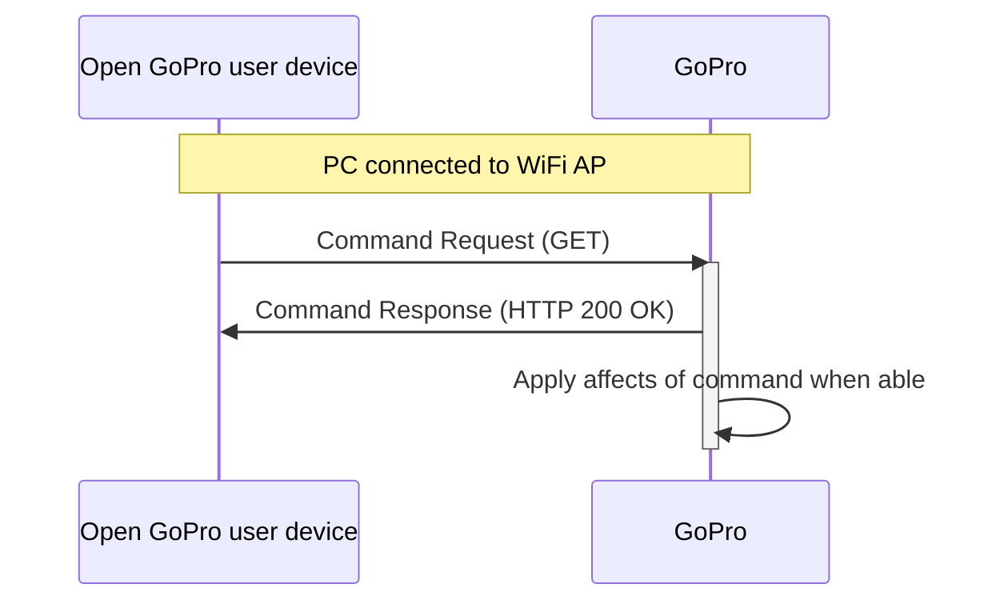

# Tutorial 6: Send WiFi Commands

This document will provide a walk-through tutorial to send Open GoPro
[HTTP commands](/http) to the GoPro.


It is suggested that you have first completed the
[Connecting to Wifi]() tutorial.


This tutorial only considers sending these commands as one-off commands. That is, it does not consider state management /
synchronization when sending multiple commands. This will be discussed in a future tutorial.

There are two types of responses that can be received from the HTTP commands: JSON and binary. This section
will deal with commands that return JSON responses. For commands with binary responses (as well as commands with
JSON responses that work with the media list), see the [next tutorial]().

# Requirements

It is assumed that the hardware and software requirements from the [connect tutorial](#requirements)
are present and configured correctly.

The scripts that will be used for this tutorial can be found in the
[Tutorial 6 Folder](https://github.com/gopro/OpenGoPro/tree/main/demos/python/tutorial/tutorial_modules/tutorial_6_send_wifi_commands).

# Just Show me the Demo(s)!!



Each of the scripts for this tutorial can be found in the Tutorial 2
[directory](https://github.com/gopro/OpenGoPro/tree/main/demos/python/tutorial/tutorial_modules/tutorial_6_send_wifi_commands/).


Python >= 3.8.x must be used as specified in the requirements



You must be connected to the camera via WiFi as stated in
[Tutorial 5](#Establish Connection to WiFi APPermalink).




You can test querying the state of your camera with HTTP over WiFi using the following script:
```console
$ python wifi_command_get_state.py
```

See the help for parameter definitions:

```console
$ python wifi_command_get_state.py --help
usage: wifi_command_get_state.py [-h]

Get the state of the GoPro (status and settings).

optional arguments:
  -h, --help  show this help message and exit
```





You can test enabling the UDP preview stream with HTTP over WiFi using the following script:
```console
$ python wifi_command_preview_stream.py
```

See the help for parameter definitions:

```console
$ python wifi_command_preview_stream.py --help
usage: wifi_command_preview_stream.py [-h]

Enable the preview stream.

optional arguments:
  -h, --help  show this help message and exit
```

Once enabled the stream can be viewed at `udp://@:8554` (For more details see the View Stream tab in the
[Preview Stream](#preview-stream) section below.





You can test sending the load preset group command with HTTP over WiFi using the following script:
```console
$ python wifi_command_load_group.py
```

See the help for parameter definitions:

```console
$ python wifi_command_load_group.py --help
usage: wifi_command_load_group.py [-h]

Load the video preset group.

optional arguments:
  -h, --help  show this help message and exit
```




You can test sending the Set Shutter command with HTTP over WiFi using the following script:
```console
$ python wifi_command_set_shutter.py
```

See the help for parameter definitions:

```console
$ python wifi_command_set_shutter.py --help
usage: wifi_command_set_shutter.py [-h]

Take a 3 second video.

optional arguments:
  -h, --help  show this help message and exit
```





You can test setting the resolution setting with HTTP over WiFi using the following script:
```console
$ python wifi_command_set_resolution.py
```

See the help for parameter definitions:

```console
$ python wifi_command_set_resolution.py --help
usage: wifi_command_set_resolution.py [-h]

Set the video resolution to 1080.

optional arguments:
  -h, --help  show this help message and exit
```




The Kotlin file for this tutorial can be found on
[Github](https://github.com/gopro/OpenGoPro/tree/main/demos/kotlin/tutorial/app/src/main/java/com/example/open_gopro_tutorial/tutorials/Tutorial6SendWifiCommands.kt).

To perform the tutorial, run the Android Studio project, select "Tutorial 6" from the dropdown and click on "Perform."
This requires:
-  a GoPro is already connected via BLE, i.e. that Tutorial 1 was already run.
-  a GoPro is already connected via Wifi, i.e. that Tutorial 5 was already run.

You can check the BLE and Wifi statuses at the top of the app.

{% include figure image_path="/assets/images/tutorials/kotlin/tutorial_6.png" alt="kotlin_tutorial_6" size="40%" caption="Perform Tutorial 6" %}

This will start the tutorial and log to the screen as it executes. When the tutorial is complete, click
"Exit Tutorial" to return to the Tutorial selection screen.




# Setup

We must first connect to The GoPro's WiFi Access Point (AP) as was discussed in the
[Connecting to Wifi]() tutorial.

# Sending HTTP Commands with JSON Responses

Now that we are are connected via WiFi, we can communicate via HTTP commands.



We will use the [requests](https://pypi.org/project/requests/) package to send the various HTTP commands.


We are building the endpoints using the GOPRO_BASE_URL defined in the tutorial package's `__init__.py`



We are using [ktor](https://ktor.io/) for the HTTP client. We are using an abstracted `get` function from our
`Wifi` class to send get requests as such:

```kotlin
private val client by lazy {
    HttpClient(CIO) {
        install(HttpTimeout)
    }
}

suspend fun get(endpoint: String, timeoutMs: Long = 5000L): JsonObject {
    Timber.d("GET request to: $endpoint")
    val response = client.request(endpoint) {
        timeout {
            requestTimeoutMillis = timeoutMs
        }
    }
    val bodyAsString: String = response.body()
    return prettyJson.parseToJsonElement(bodyAsString).jsonObject
}
```



Both Command Requests and Setting Requests follow the same procedure:

1. Send HTTP GET command to appropriate endpoint
1. Receive confirmation from GoPro (via HTTP response) that request was received.
1. GoPro reacts to command


The HTTP response only indicates that the request was received correctly. The relevant behavior of the
GoPro must be observed to verify when the command's effects have been applied.




## Get State

The first command we will be sending is
[Get State](/http#commands-quick-reference). This command will
return all of the current settings and values. It is basically a combination of the
[Get All Settings](#query-all) and
[Get All Statuses](#query-all)
commands that were sent via BLE. Since there is no way to query individual settings / statuses
via WiFi (or register for asynchronous notifications when they change), this is the only option to query
setting / status information via WiFi.

The command writes to the following endpoint:

`/gopro/camera/state`

Let's build the endpoint then send the GET request and check the response for errors.
Any errors will raise an exception.



```python
url = GOPRO_BASE_URL + "/gopro/camera/state"
```

```python
response = requests.get(url)
response.raise_for_status()
```


```kotlin
var response = wifi.get(GOPRO_BASE_URL + "gopro/camera/state")
```



Lastly, we print the response's JSON data:



```python
logger.info(f"Response: {json.dumps(response.json(), indent=4)}")
```

The response will log as such (abbreviated for brevity):

```console
INFO:root:Getting GoPro's status and settings: sending http://10.5.5.9:8080/gopro/camera/state
INFO:root:Command sent successfully
INFO:root:Response: {
    "status": {
        "1": 1,
        "2": 2,
        "3": 0,
        "4": 255,
        "6": 0,
        "8": 0,
        "9": 0,
        "10": 0,
        "11": 0,
        "13": 0,
        "14": 0,
        "17": 1,

  ...

  "settings": {
      "2": 9,
      "3": 1,
      "5": 0,
      "6": 1,
      "13": 1,
      "19": 0,
      "24": 0,
      "30": 0,
      "31": 0,
      "32": 10,
      "41": 9,
      "42": 5,
```


```kotlin
Timber.i(prettyJson.encodeToString(response))
```

The response will log as such (abbreviated for brevity):

```console
Getting camera state
GET request to: http://10.5.5.9:8080/gopro/camera/state
{
    "status": {
        "1": 1,
        "2": 4,
        "3": 0,
        "4": 255,
        "6": 0,
        "8": 0,
        "9": 0,
        "10": 0,
        "11": 0,
        "13": 0,
    ...
        "113": 0,
        "114": 0,
        "115": 0,
        "116": 0,
        "117": 31154688
    },
    "settings": {
        "2": 9,
        "3": 1,
        "5": 0,
        "6": 1,
        "13": 1,
        ...
        "177": 0,
        "178": 1,
        "179": 3,
        "180": 0,
        "181": 0
    }
}
```




We can see what each of these values mean by looking at the
[Open GoPro Interface](/ble/index.html#settings-quick-reference).

For example (for settings):

-   ID 2 == 9 equates to Resolution == 1080
-   ID 3 == 1 equates to FPS == 120

## Load Preset Group

The next command we will be sending is
[Load Preset Group](/ble/index.html#commands-quick-reference), which is used
to toggle between the 3 groups of presets (video, photo, and timelapse). The preset groups ID's are:

| Command                     | Bytes |
| --------------------------- | :---: |
| Load Video Preset Group     | 1000  |
| Load Photo Preset Group     | 1001  |
| Load Timelapse Preset Group | 1002  |


It is possible that the preset GroupID values will vary in future cameras. The only absolutely correct way to know
the preset ID is to read them from the "Get Preset Status" protobuf command. A future lab will discuss protobuf
commands.




```python
url = GOPRO_BASE_URL + "/gopro/camera/presets/set_group?id=1000"
```

```python
response = requests.get(url)
response.raise_for_status()
```


```kotlin
response = wifi.get(GOPRO_BASE_URL + "gopro/camera/presets/load?id=1000")
```



Lastly, we print the response's JSON data:



```python
logger.info(f"Response: {json.dumps(response.json(), indent=4)}")
```

This will log as such:

```console
INFO:root:Loading the video preset group: sending http://10.5.5.9:8080/gopro/camera/presets/set_group?id=1000
INFO:root:Command sent successfully
INFO:root:Response: {}
```


```kotlin
Timber.i(prettyJson.encodeToString(response))
```

The response will log as such:

```console
Loading Video Preset Group
GET request to: http://10.5.5.9:8080/gopro/camera/presets/load?id=1000
{
}
```




Lastly, we print the response's JSON data:


The response JSON is empty. This is expected in the case of a success.


You should hear the camera beep and switch to the Cinematic Preset (assuming it wasn't already set). You can verify
this by seeing the preset name in the pill at bottom middle of the screen.

{% include figure image_path="/assets/images/tutorials/preset.png" alt="Load Preset" size="50%" caption="Load Preset" %}

## Set Shutter

The next command we will be sending is
[Set Shutter](/http#commands-quick-reference). which is
used to start and stop encoding.



```python
url = GOPRO_BASE_URL + f"/gopro/camera/shutter/start"
```

```python
response = requests.get(url)
response.raise_for_status()
```


```kotlin
response = wifi.get(GOPRO_BASE_URL + "gopro/camera/shutter/start")
```



Lastly, we print the response's JSON data:


This command does not return a JSON response so we don't print the response


This will log as such:



```console
INFO:root:Turning the shutter on: sending http://10.5.5.9:8080/gopro/camera/shutter/start
INFO:root:Command sent successfully
```


```kotlin
Timber.i(prettyJson.encodeToString(response))
```

The response will log as such:

```console
Setting Shutter On
GET request to: http://10.5.5.9:8080/gopro/camera/shutter/start
{
}
```




We can then wait a few seconds and repeat the above procedure to set the shutter off using `gopro/camera/shutter/stop`.


The shutter can not be set on if the camera is encoding or set off if the camera is not encoding. An
attempt to do so will result in an error response.


## Set Setting

The next command will be sending is [Set Setting](/http#settings-quick-reference).
This end point is used to update all of the settings on the camera. It is analogous to BLE commands like
[Set Video Resolution](#set-the-video-resolution).

It is important to note that many settings are dependent on the video resolution (and other settings).
For example, certain FPS values are not valid with certain resolutions. In general, higher resolutions
only allow lower FPS values. Check the [camera capabilities](/ble/index.html#camera-capabilities)
to see which settings are valid for given use cases.

Let's build the endpoint first to set the Video Resolution to 1080 (the setting_id and option value comes from
the command table linked above).



```python
url = GOPRO_BASE_URL + f"/gopro/camera/setting?setting=2&option=9"
```

```python
response = requests.get(url)
response.raise_for_status()
```


```kotlin
response = wifi.get(GOPRO_BASE_URL + "gopro/camera/setting?setting=2&option=9")
```



Lastly, we print the response's JSON data:



```python
logger.info(f"Response: {json.dumps(response.json(), indent=4)}")
```

This will log as such:

```console
INFO:root:Setting the video resolution to 1080: sending http://10.5.5.9:8080/gopro/camera/setting?setting_id=2&opt_value=9
INFO:root:Command sent successfully
INFO:root:Response: {}
```



```kotlin
Timber.i(prettyJson.encodeToString(response))
```

The response will log as such:

```console
Setting Resolution to 1080
GET request to: http://10.5.5.9:8080/gopro/camera/setting?setting=2&option=9
{
}
```





The response JSON is empty. This is expected in the case of a success.


You should hear the camera beep and see the video resolution change to 1080 in the pill in the bottom-middle of the
screen:

{% include figure image_path="/assets/images/tutorials/video_resolution.png" alt="Video Resolution" size="50%" caption="Video Resolution" %}

As a reader exercise, try using the [Get State] command to verify that the resolution has changed.

## Preview Stream

The next command we will be sending is
[Preview Stream](/http#commands-quick-reference). This command will
enable (or disable) the preview stream . It is then possible to view the preview stream from a media player.

The commands write to the following endpoints:

| Command              | Endpoint                   |
| -------------------- | -------------------------- |
| start preview stream | /gopro/camera/stream/start |
| stop preview stream  | /gopro/camera/stream/stop  |

Let's build the endpoint then send the GET request and check the response for errors.
Any errors will raise an exception.



```python
url = GOPRO_BASE_URL + "/gopro/camera/stream/start"
```

```python
response = requests.get(url)
response.raise_for_status()
```


TODO



Lastly, we print the response's JSON data:




```python
logger.info(f"Response: {json.dumps(response.json(), indent=4)}")
```

This will log as such:

```console
INFO:root:Starting the preview stream: sending http://10.5.5.9:8080/gopro/camera/stream/start
INFO:root:Command sent successfully
INFO:root:Response: {}
```


TODO




The response JSON is empty. This is expected in the case of a success.


Once enabled, the stream can be viewed at `udp://@:8554`.

Here is an example of viewing this using [VLC](https://www.videolan.org/):


The screen may slightly vary depending on your OS


1. Select **Media-->Open Network Stream**
2. Enter the path as such:

{% include figure image_path="/assets/images/tutorials/preview_stream.png" alt="Preview Stream" size="70%" caption="Configure Preview Stream" %}

1. Select play
1. The preview stream should now be visible.

**Quiz time! 📚 ✏️**





{% quiz
    question="How do you query the current video resolution setting (id = 2) via WiFi?"
    option="A:::Send GET to `/gopro/camera/state?setting_id=2`"
    option="B:::Send GET to `/gopro/camera/state?get_setting=2`"
    option="C:::Send POST to `/gopro/camera/state` with request 'setting_id=2'"
    option="D:::None of the Above"
    correct="D"
    info="You can't query individual settings or statuses with the HTTP API. In order to get the value of a specific setting you'll need to send a GET to `/gopro/camera/state` and parse the value of the desired setting from the JSON response."
%}

# Troubleshooting

## HTTP Logging

[Wireshark](https://www.wireshark.org/) can be used to view the HTTP commands and responses
between the PC and the GoPro.

1. Start a Wireshark capture on the WiFi adapter that is used to connect to the GoPro
2. Filter for the GoPro IP address (10.5.5.9)

{% include figure image_path="/assets/images/tutorials/wireshark.png" alt="Wireshark" size="100%" caption="Wireshark" %}

# Good Job!


Congratulations 🤙


You can now send any of the HTTP commands defined in the
[Open GoPro Interface](/http) that return JSON responses. You
may have noted that we did not discuss one of these (Get Media List) in this tutorial. Proceed to the
next tutorial to see how to get and perform operations using the media list.
