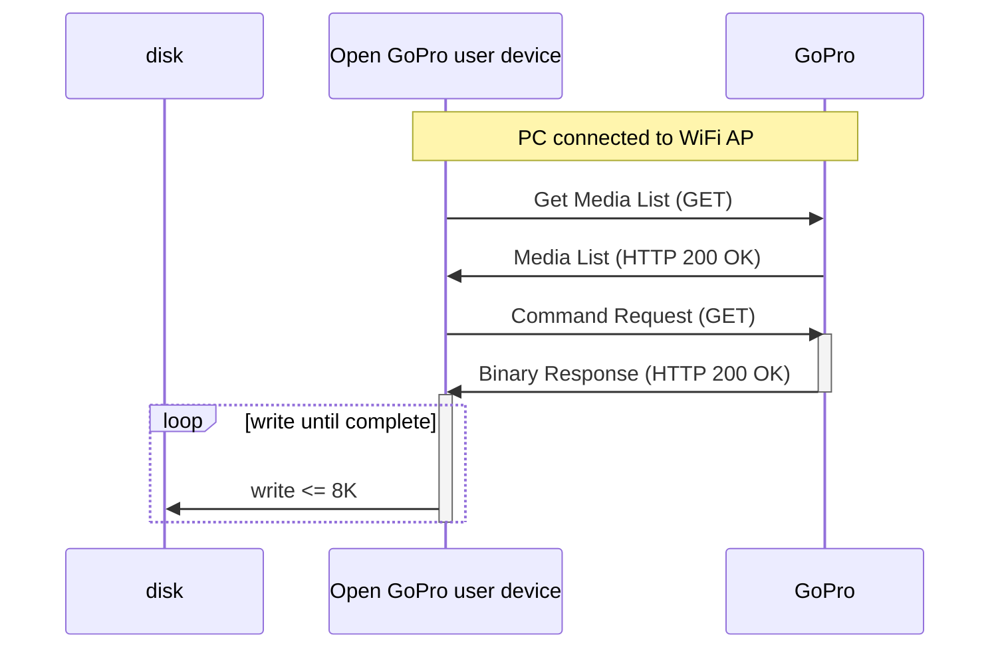

# Tutorial 7: Camera Media List

This document will provide a walk-through tutorial to send Open GoPro
[HTTP commands]() to the GoPro, specifically to get the media list
and perform operations on it (downloading pictures, videos, etc.)


It is suggested that you have first completed the
[Connecting to Wifi]()
and [Sending WiFi Commands]() tutorials.


This tutorial only considers sending these commands as one-off commands. That is, it does not consider state
management / synchronization when sending multiple commands. This will be discussed in a future tutorial.

# Requirements

It is assumed that the hardware and software requirements from the
[connect tutorial](#requirements) are present and
configured correctly.

The scripts that will be used for this tutorial can be found in the
[Tutorial 7 Folder](https://github.com/gopro/OpenGoPro/tree/main/demos/python/tutorial/tutorial_modules/tutorial_7_camera_media_list).

# Just Show me the Demo(s)!!



Each of the scripts for this tutorial can be found in the Tutorial 2
[directory](https://github.com/gopro/OpenGoPro/tree/main/demos/python/tutorial/tutorial_modules/tutorial_7_camera_media_list/).


Python >= 3.8.x must be used as specified in the requirements



You must be connected to the camera via WiFi in order to run these scripts. You can do this by manually to the SSID
and password listed on your camera or by leaving the
`Establish Connection to WiFi AP` script from [Tutorial 5](#just-show-me-the-demos) running in the background.




You can downloading a file from your camera with HTTP over WiFi using the following script:
```console
$ python wifi_media_download_file.py
```

See the help for parameter definitions:

```console
$ python wifi_media_download_file.py --help
usage: wifi_media_download_file.py [-h]

Find a photo on the camera and download it to the computer.

optional arguments:
  -h, --help  show this help message and exit
```




You can downloading the thumbnail for a media file from your camera with HTTP over WiFi using the following script:
```console
$ python wifi_media_get_thumbnail.py
```

See the help for parameter definitions:

```console
$ python wifi_media_get_thumbnail.py --help
usage: wifi_media_get_thumbnail.py [-h]

Get the thumbnail for a media file.

optional arguments:
  -h, --help  show this help message and exit
```



The Kotlin file for this tutorial can be found on
[Github](https://github.com/gopro/OpenGoPro/tree/main/demos/kotlin/tutorial/app/src/main/java/com/example/open_gopro_tutorial/tutorials/Tutorial7CameraMediaList.kt).

To perform the tutorial, run the Android Studio project, select "Tutorial 7" from the dropdown and click on "Perform."
This requires:
-  a GoPro is already connected via BLE, i.e. that Tutorial 1 was already run.
-  a GoPro is already connected via Wifi, i.e. that Tutorial 5 was already run.

You can check the BLE and Wifi statuses at the top of the app.

{% include figure image_path="/assets/images/tutorials/kotlin/tutorial_7.png" alt="kotlin_tutorial_7" size="40%" caption="Perform Tutorial 7" %}

This will start the tutorial and log to the screen as it executes. When the tutorial is complete, click
"Exit Tutorial" to return to the Tutorial selection screen.




# Setup

We must first connect to The GoPro's WiFi Access Point (AP) as was discussed in the
[Connecting to Wifi]() tutorial.

# Get Media List

Now that we are are connected via WiFi, we will get the media list using the same procedure
to send HTTP commands as in the
[previous tutorial]().

We get the media list via the
[Get Media List command](#commands-quick-reference).
This command will return a JSON structure of all of the media files (pictures, videos) on the camera with
corresponding information about each media file.

Let's build the endpoint, send the GET request, and check the response for errors. Any errors will raise
an exception.



```python
url = GOPRO_BASE_URL + "/gopro/media/list"
```

```python
response = requests.get(url)
response.raise_for_status()
```


```python
val response = wifi.get(GOPRO_BASE_URL + "gopro/media/list")
```



Lastly, we print the response's JSON data:



```python
logger.info(f"Response: {json.dumps(response.json(), indent=4)}")
```

The response will log as such (abbreviated for brevity):

```console
INFO:root:Getting the media list: sending http://10.5.5.9:8080/gopro/media/list
INFO:root:Command sent successfully
INFO:root:Response: {
    "id": "2510746051348624995",
    "media": [
        {
            "d": "100GOPRO",
            "fs": [
                {
                    "n": "GOPR0987.JPG",
                    "cre": "1618583762",
                    "mod": "1618583762",
                    "s": "5013927"
                },
                {
                    "n": "GOPR0988.JPG",
                    "cre": "1618583764",
                    "mod": "1618583764",
                    "s": "5009491"
                },
                {
                    "n": "GOPR0989.JPG",
                    "cre": "1618583766",
                    "mod": "1618583766",
                    "s": "5031861"
                },
                {
                    "n": "GX010990.MP4",
                    "cre": "1451608343",
                    "mod": "1451608343",
                    "glrv": "806586",
                    "ls": "-1",
                    "s": "10725219"
                },
```


```kotlin
Timber.i("Files in media list: ${prettyJson.encodeToString(fileList)}")
```

The response will log as such (abbreviated for brevity):

```console
GET request to: http://10.5.5.9:8080/gopro/media/list
Complete media list: {
    "id": "4386457835676877283",
    "media": [
        {
            "d": "100GOPRO",
            "fs": [
                {
                    "n": "GOPR0232.JPG",
                    "cre": "1748997965",
                    "mod": "1748997965",
                    "s": "7618898"
                },
                {
                    "n": "GOPR0233.JPG",
                    "cre": "1748998273",
                    "mod": "1748998273",
                    "s": "7653472"
                },
                ...
                {
                    "n": "GX010259.MP4",
                    "cre": "1677828860",
                    "mod": "1677828860",
                    "glrv": "943295",
                    "ls": "-1",
                    "s": "9788009"
                }
            ]
        }
    ]
}
```



The media list format is defined in the
[Open GoPro Specification](#media-list-format).
We won't be rehashing that here but will provide examples below of using the media list.

One common functionality is to get the list of media file names, which can be done as such:



```python
print([x["n"] for x in media_list["media"][0]["fs"]])
```

That is, access the list at the **fs** tag at the first element of the **media** tag, then
make a list
of all of the names (**n** tag of each element) in the **fs** list.


```kotlin
val fileList =
    response["media"]?.jsonArray?.first()?.jsonObject?.get("fs")?.jsonArray?.map { mediaEntry ->
        mediaEntry.jsonObject["n"]
    }?.map { it.toString().replace("\"", "") }
```

That is:
1. Access the JSON array at the **fs** tag at the first element of the **media** tag
1. Make a list of all of the names (**n** tag of each element) in the **fs** list.
2. Map this list to string and remove backslashes
3.



# Media List Operations

Whereas all of the WiFi commands described until now have returned JSON responses, most of
the media list operations return binary data. From an HTTP perspective, the behavior is the same. However,
the GET response will contain a large binary chunk of information so we will loop through it with the
`requests` library as such, writing up to 8 kB at a time:



## Download Media File

The next command we will be sending is
[Download Media](#downloading-media). Specifically, we
will be downloading a photo. The camera must have at least one photo in its media list in order for this to
work.

First, we get the media list as in
[Get Media List](#get-media-list) .
Then we search through the list of file names in the media list looking for a photo (i.e. a file whose name
ends in **.jpg**). Once we find a photo, we proceed:



```python
media_list = get_media_list()

photo: Optional[str] = None
for media_file in [x["n"] for x in media_list["media"][0]["fs"]]:
    if media_file.lower().endswith(".jpg"):
        logger.info(f"found a photo: {media_file}")
        photo = media_file
        break
```



```kotlin
val photo = fileList?.firstOrNull { it.endsWith(ignoreCase = true, suffix = "jpg") }
    ?: throw Exception("Not able to find a .jpg in the media list")
Timber.i("Found a photo: $photo")
```



Now let's build the endpoint, send the GET request, and check the response for errors. Any errors will raise
an exception.


The endpoint will start with "videos" for both photos and videos




```python
url = GOPRO_BASE_URL + f"videos/DCIM/100GOPRO/{photo}"
```

```python
with requests.get(url, stream=True) as request:
    request.raise_for_status()
```

Lastly, we iterate through the binary content in 8 kB chunks, writing to a local file:

```python
file = photo.split(".")[0] + ".jpg"
with open(file, "wb") as f:
    logger.info(f"receiving binary stream to {file}...")
    for chunk in request.iter_content(chunk_size=8192):
        f.write(chunk)
```



```kotlin
return wifi.getFile(
    GOPRO_BASE_URL + "videos/DCIM/100GOPRO/$photo", appContainer.applicationContext
)
```

TODO FIX THIS




This will log as such:



```console
INFO:root:found a photo: GOPR0987.JPG
INFO:root:Downloading GOPR0987.JPG
INFO:root:Sending: http://10.5.5.9:8080/videos/DCIM/100GOPRO/GOPR0987.JPG
INFO:root:receiving binary stream to GOPR0987.jpg...
```

Once complete, the `GOPR0987_thumbnail.jpg` file will be available from where the demo script was called.


```console
Found a photo: GOPR0232.JPG
Downloading photo: GOPR0232.JPG...
```

Once complete, the photo will display in the tutorial window.




## Get Media Thumbnail

The next command we will be sending is
[Get Media thumbnail ](#downloading-media).
Specifically, we will be getting the thumbnail for a photo. The camera must have at least one photo in its
media list in order for this to work.


There is a separate commandto get a media "screennail"


First, we get the media list as in
[Get Media List](#get-media-list) .
Then we search through the list of file names in the media list looking for a photo (i.e. a file whose name
ends in **.jpg**). Once we find a photo, we proceed:



```python
media_list = get_media_list()

photo: Optional[str] = None
for media_file in [x["n"] for x in media_list["media"][0]["fs"]]:
    if media_file.lower().endswith(".jpg"):
        logger.info(f"found a photo: {media_file}")
        photo = media_file
        break
```



TODO



Now let's build the endpoint, send the GET request, and check the response for errors. Any errors will raise
an exception.



```python
url = GOPRO_BASE_URL + f"/gopro/media/thumbnail?path=100GOPRO/{photo}"
```

```python
with requests.get(url, stream=True) as request:
    request.raise_for_status()
```

Lastly, we iterate through the binary content in 8 kB chunks, writing to a local file:

```python
file = photo.split(".")[0] + ".jpg"
with open(file, "wb") as f:
    logger.info(f"receiving binary stream to {file}...")
    for chunk in request.iter_content(chunk_size=8192):
        f.write(chunk)
```


TODO



This will log as such:



```console
INFO:root:found a photo: GOPR0987.JPG
INFO:root:Getting the thumbnail for GOPR0987.JPG
INFO:root:Sending: http://10.5.5.9:8080/gopro/media/thumbnail?path=100GOPRO/GOPR0987.JPG
INFO:root:receiving binary stream to GOPR0987_thumbnail.jpg...
```


TODO



# Troubleshooting

See the previous tutorial's
[troubleshooting section](#troubleshooting).

# Good Job!


Congratulations 🤙


You can now query the GoPro's media list and retrieve binary information for media file. This is currently
last tutorial. Stay tuned for more 👍

At this point you should be able to start creating a useful example using the Open GoPro Interface. For some
inspiration check out some of the [demos]().
