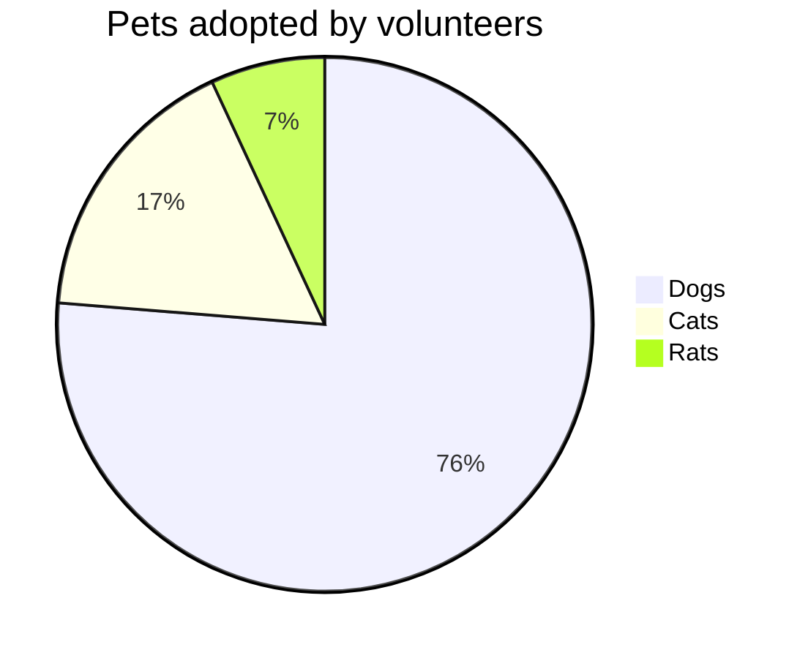

# Contribution

This page will provide  examples for various documentation features available in this repo / theme.

## Examples

### Links

#### External

External links should be created using standard markdown links, i.e.

```
[GoPro](https://gopro.com/)
```

[GoPro](https://gopro.com/)


Note that the `https://` is required otherwise the link will be attempted to resolve to a local file.

#### Internal

Internal links shall be created using the Jekyll [link](https://jekyllrb.com/docs/liquid/tags/#links) tag with the
path to the file from the top of the directory.

For example, to link to [this file]():


```
[this file]()
```


Specific sections can also be linked. For example, to link to [this section](#internal):


```
[this section](#internal):
```


There is an exception to this when linking to a file in the `tutorials`. These are handled differently
since `tutorials` is the base directory for all collections. Therefore, the `tutorials` directory should be omitted
from the path. For example, to link to [the first python tutorial]():


```
[the first python tutorial]()
```



### Callouts

#### Notes

Blue colored notes via:



```markdown

```





#### Successes

Green colored success via:



```markdown

```




#### Warnings

Red colored warnings via:



```markdown

```




#### Tips

Yellow colored tips via:



```markdown

```




If one of the above options does not suit your use case, there is also the option for a simple callout using
default markdown syntax via:

```markdown
> I'm a simple callout
```

> I'm a simple callout

### Collapsible Accordion

Collapsible accordion sections can be added, for example with use for FAQ's via:


```markdown


```


Here is an example:




### Quiz

Multiple choice quizzes via:


```markdown

```




True or false quizzes can be made from this via:


```markdown

```




### Tabs

Tabs can be created via:


```markdown


This is the content of the first tab.


This is the content of the second tab.


This is the content of the third tab.


```




This is the content of the first tab.


This is the content of the second tab.


This is the content of the third tab.



### Diagrams

You can add Mermaid or PlantUML diagrams. They are centered by default.



#### Mermaid

[Mermaid](https://mermaid-js.github.io/mermaid/#/) diagrams via:

````markdown
``mermaid!
pie title Pets adopted by volunteers
  "Dogs" : 386
  "Cats" : 85
  "Rats" : 35
``
````



#### PlantUML

[PlantUML](https://plantuml.com/) diagrams via:

````markdown
``plantuml!
Bob -> Alice : hello world
``
````

```plantuml!
Bob -> Alice : hello world
```

### Icons

Search for them on [font awesome](https://fontawesome.com/icons). Then add them via html:

```html
<i class="fa fa-tools"></i>
```

<i class="fa fa-tools"></i>

```html
<i class="fa fa-hammer"></i>
```

<i class="fa fa-hammer"></i>

### Emojis

Any [Github](https://github.com/ikatyang/emoji-cheat-sheet/blob/master/README.md) emoji can be used:

I give this page two :+1:

Happy clown --> 🤡

### Variable length / width cell tables

For more information, see the Jekyll Spaceship [documentation](https://github.com/jeffreytse/jekyll-spaceship#1-table-usage)

Normal markdown tables work but you can also combine lines (via the trailing backslash):

```markdown
| : Easy Multiline : |        |           |
| :----------------- | :----- | :-------- |
| Apple              | Banana | Orange \  |
| Apple              | Banana | Orange \  |
| Apple              | Banana | Orange    |
| Apple              | Banana | Orange \  |
| Apple              | Banana | Orange    |
| Apple              | Banana | Orange    |
```

| : Easy Multiline : |        |           |
| :----------------- | :----- | :-------- |
| Apple              | Banana | Orange \  |
| Apple              | Banana | Orange \  |
| Apple              | Banana | Orange    |
| Apple              | Banana | Orange \  |
| Apple              | Banana | Orange    |
| Apple              | Banana | Orange    |


or combine individual vertical cells (via `^^`) or horizontal cells (via omitting the `|` separator)

```markdown
|              Stage | Direct Products | ATP Yields |
| -----------------: | --------------: | ---------: |
|         Glycolysis |           2 ATP              |
|                 ^^ |          2 NADH |   3--5 ATP |
| Pyruvaye oxidation |          2 NADH |      5 ATP |
|  Citric acid cycle |           2 ATP |            |
|                 ^^ |          6 NADH |     15 ATP |
|                 ^^ |          2 FADH |      3 ATP |
|         30--32 ATP |                              |
```

|              Stage | Direct Products | ATP Yields |
| -----------------: | --------------: | ---------: |
|         Glycolysis |           2 ATP              |
|                 ^^ |          2 NADH |   3--5 ATP |
| Pyruvaye oxidation |          2 NADH |      5 ATP |
|  Citric acid cycle |           2 ATP |            |
|                 ^^ |          6 NADH |     15 ATP |
|                 ^^ |          2 FADH |      3 ATP |
|         30--32 ATP |                              |

### Figures

Use the `figure` include. Optional parameters are:

- alt: alternate text if image is not found
- size (percentage)
- caption

Remote:


```
{% include figure image_path="https://raw.githubusercontent.com/gopro/gpmf-parser/master/docs/readmegfx/CameraIMUOrientationSM.png" alt="GoPro Logo" size="50%" caption="This is a figure caption." %}
```


{% include figure image_path="https://raw.githubusercontent.com/gopro/gpmf-parser/master/docs/readmegfx/CameraIMUOrientationSM.png" alt="GoPro Logo" size="50%" caption="This is a figure caption." %}

Local:


```
{% include figure image_path="/assets/images/logos/logo.png" alt="GoPro Logo" size="50%" caption="This is a figure caption." %}
```


{% include figure image_path="/assets/images/logos/logo.png" alt="GoPro Logo" size="50%" caption="This is a figure caption." %}

Galleries are also [possible](https://mmistakes.github.io/minimal-mistakes/docs/helpers/#gallery)
