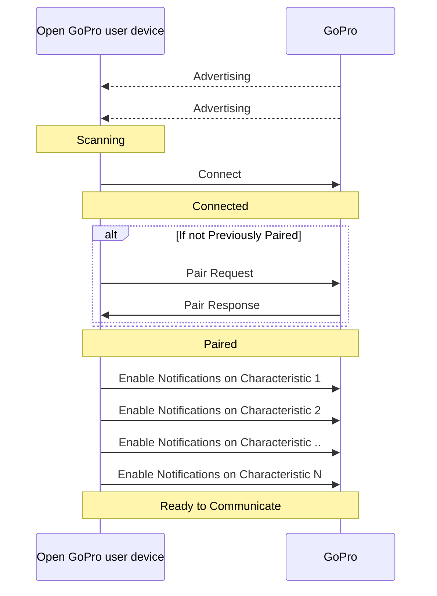

# Python Tutorial 1: Connect BLE

This tutorial will provide a walk-through to connect to the GoPro camera via BLE using
[bleak](https://bleak.readthedocs.io/en/latest/).

# Requirements

## Hardware

1. One of the following systems:

    - Windows 10, version 16299 (Fall Creators Update) or greater
    - Linux distribution with [BlueZ](http://www.bluez.org/) >= 5.43
    - OS X/macOS support via Core Bluetooth API, from at least OS X version 10.11

1. A GoPro camera that is [supported by Open GoPro](#supported-cameras)

## Software

### Python

-   Python 3.8.x must be installed. See this [Python installation guide](https://docs.python-guide.org/starting/installation/).

### Tutorials Package

This set of tutorials is accompanied by a Python package consisting of scripts (separated by tutorial module).
These can be found on [Github](https://github.com/gopro/OpenGoPro/tree/main/demos/python/tutorial/). Once the Github repo has been cloned or downloaded to your
local machine, the package can be installed as follows:

1. Enter the python tutorials directory at `$INSTALL/demos/python/tutorial/` where $INSTALL is the top level of the Open GoPro repo
   where it exists on your local machine
2. Use pip to install the requirements file:

```
pip install -r requirements.txt
```

> This will also install the [Open GoPro Python SDK](https://gopro.github.io/OpenGoPro/python_sdk/) which will be used for some of the optional examples through these tutorials.

You can test that installation was successful by viewing the installed package's information:

```console
$ pip show open-gopro-python-tutorials
Name: open-gopro-python-tutorials
Version: 0.0.2
Summary: Open GoPro Python Tutorials
Home-page: https://github.com/gopro/OpenGoPro
Author: GoPro
Author-email: gopro.com
License: MIT
Location: c:\gopro\opengopro\tutorials\python\bleak
Requires: bleak
Required-by:
```

The scripts that will be used for this tutorial can be found in the
[Tutorial 1 Folder](https://github.com/gopro/OpenGoPro/tree/main/demos/python/tutorial/tutorial_modules/tutorial_1_connect_ble).

# Basic BLE Tutorial

This tutorial will walk through the process of connecting to the GoPro via Bluetooth Low Energy
(BLE). It is basically just an
explanation of the `ble_connect.py`. This same connect functionality will be used as a foundation
for all future BLE tutorials.

Here is a summary of the sequence that will be described in detail in the following
sections:



## A Special Consideration for BlueZ

The Bleak BLE controller does not currently support autonomous pairing for the BlueZ backend. So if you are using
BlueZ (i.e. Ubuntu, RaspberryPi, etc.), you need to first pair the camera from the command line as shown in the
[BlueZ tutorial](https://gopro.github.io/OpenGoPro/tutorials/bash/bluez). There is work to add this feature
and progress can be tracked on the [Github Issue](https://github.com/gopro/OpenGoPro/issues/29).

## Just Show me the Demo!!

If you just want to run the demo, you can do:

```console
python ble_connect.py
```



See the help for parameter definition:

```console
$ python ble_connect.py --help
usage: ble_connect.py [-h] [-i IDENTIFIER]

Connect to a GoPro camera, pair, then enable notifications.

optional arguments:
  -h, --help            show this help message and exit
  -i IDENTIFIER, --identifier IDENTIFIER
                        Last 4 digits of GoPro serial number, which is the last 4 digits of the default camera SSID. If not used, first discovered GoPro will be connected to
```

## Asyncio

The bleak module is based on asyncio which means that its awaitable functions need to
be called from an async coroutine. In order to do this, all of the code below should be
running in an async function. We accomplish this in the tutorial scripts
by making _main_ async as such:

```python
import asyncio

async def main() -> None:
    # Put our code here

if __name__ == "__main__":
    asyncio.run(main())
```

## Advertise

First, we need to ensure the camera is discoverable (i.e. it is advertising).
Ensure that the Camera is powered on, then select
Connections --> Connect Device --> Quik App

The screen should appear as such:

{% include figure image_path="/assets/images/tutorials/quik.png" alt="Quik" size="50%" caption="Camera is discoverable." %}

## Scan




Next, we must find the GoPro Camera using bleak. Let's initialize an empty dict that will
store discovered devices, indexed by name:

```python
# Map of devices indexed by name
devices: Dict[str, BleakDevice] = {}
```

We're then going to scan for all devices.
We are passing a scan callback to bleak in order to also find non-connectable scan responses.
We are keeping any devices that have a device name.

```python
# Scan callback to also catch nonconnectable scan responses
def _scan_callback(device: BleakDevice, _: Any) -> None:
    # Add to the dict if not unknown
    if device.name != "Unknown" and device.name is not None:
        devices[device.name] = device

# Now discover and add connectable advertisements
for device in await BleakScanner.discover(timeout=5, detection_callback=_scan_callback):
    if device.name != "Unknown" and device.name is not None:
        devices[device.name] = device
```

Now we can search through the discovered devices to see if we found a GoPro. Any GoPro
device name will be structured as `GoPro XXXX` where XXXX is the last four digits of
your camera's serial number.

First, we define a regex which is either "GoPro " followed by any four alphanumeric characters if no identifier was passed,
or "GoPro " concatenated with the identifier if it exists. In the demo `ble_connect.py`, the identifier is taken
from the command-line arguments.

```python
token = re.compile(r"GoPro [A-Z0-9]{4}" if identifier is None else f"GoPro {identifier}")
```

Now we build a list of matched devices by checking if each device's name includes the token regex.

```python
matched_devices: List[BleakDevice] = []
# Now look for our matching device(s)
matched_devices = [device for name, device in devices.items() if token.match(name)]
```

Due to potential RF interference and the asynchronous nature of BLE advertising / scanning, it is possible that
the advertising GoPro will not be discovered by the scanning PC in one scan. Therefore, you may need to redo
the scan (as `ble_connect.py` does) until a GoPro is found. That is, `matched_device` must contain at least one device.

When running the demo, discovered devices will be logged to the console as they are found. Click the output tab
to see an example of this.





```console
Here is an example of the log from `ble_connect.py` of scanning for devices. Note that this
includes several rescans until the devices was found.

$ python ble_connect.py
INFO:root:Scanning for bluetooth devices...
INFO:root:      Discovered:
INFO:root:      Discovered: TR8600 seri
INFO:root:Found 0 matching devices.
INFO:root:      Discovered:
INFO:root:      Discovered: TR8600 seri
INFO:root:      Discovered: GoPro Cam
INFO:root:      Discovered: GoPro 0456
INFO:root:Found 1 matching devices.
```

Among other devices, you should see `GoPro XXXX` where XXXX is the last four digits of
your camera's serial number.




## Connect




Now that we have discovered at least one GoPro device to connect to, the next step is to
establish a BLE connection to the camera as such:

```python
# We're just taking the first device if there are multiple.
device = matched_devices[0]
client = BleakClient(device)
await client.connect(timeout=15)
```

Click the output tab to see an example of what the log from `ble_connect.py` will show.





```console
INFO:root:Establishing BLE connection to EF:5A:F6:13:E6:5A: GoPro 0456...
INFO:bleak.backends.dotnet.client:Services resolved for BleakClientDotNet (EF:5A:F6:13:E6:5A)
INFO:root:BLE Connected!
```

Here we can see that the connection has successfully been established as well as the GoPro's
BLE MAC address.




## Pair

The GoPro has encryption-protected characteristics which require us to pair before
writing to them. Therefore now that we are connected, we need to attempt to pair:

```python
try:
    await client.pair()
except NotImplementedError:
    # This is expected on Mac
    pass
```

Not all OS's allow pairing but some require it. Rather than checking for the OS, we are just
catching the exception when it fails.

Once paired, the camera should beep and display "Connection Successful".



## Enable Notifications




As specified in the [Open GoPro Bluetooth API](#sending-and-receiving-messages),
we must enable notifications for a given characteristic to receive responses from it.



To enable notifications, we loop over each characteristic in each service and enable the characteristic
for notification if it has `notify` properties:

```python
for service in client.services:
    for char in service.characteristics:
        if "notify" in char.properties:
            await client.start_notify(char, notification_handler)
```

Go to the next tab to see the log output.





Here we can see that notifications are enabled for each characteristic that is notifiable.

```console
INFO:root:Enabling notifications...
INFO:root:Enabling notification on char 00002a19-0000-1000-8000-00805f9b34fb
INFO:root:Enabling notification on char b5f90073-aa8d-11e3-9046-0002a5d5c51b
INFO:root:Enabling notification on char b5f90075-aa8d-11e3-9046-0002a5d5c51b
INFO:root:Enabling notification on char b5f90077-aa8d-11e3-9046-0002a5d5c51b
INFO:root:Enabling notification on char b5f90079-aa8d-11e3-9046-0002a5d5c51b
INFO:root:Enabling notification on char b5f90092-aa8d-11e3-9046-0002a5d5c51b
INFO:root:Enabling notification on char b5f90081-aa8d-11e3-9046-0002a5d5c51b
INFO:root:Enabling notification on char b5f90083-aa8d-11e3-9046-0002a5d5c51b
INFO:root:Enabling notification on char b5f90084-aa8d-11e3-9046-0002a5d5c51b
INFO:root:Done enabling notifications
```

The characteristics that correspond to each UUID listed in the log can be found in the
[Open GoPro API](#services-and-characteristics). These
will be used in a future tutorial to send data.




**Quiz time! 📚 ✏️**

{% quiz
    question="How often is it necessary to pair?"
    option="A:::Pairing must occur every time to ensure safe BLE communication."
    option="B:::We never need to pair as the GoPro does not require it to communicate."
    option="C:::Pairing only needs to occur once as the keys will be automatically re-used for future connections."
    correct="C"
    info="Pairing is only needed once (assuming neither side deletes the keys). If the
    GoPro deletes the keys (via Connections->Reset Connections), the devices will need to re-pair."
%}

# Troubleshooting

## Device not connecting

If the connection is not starting, it is likely because the camera is not advertising. This can be due to either:
1. The camera is not in pairing mode. Ensure that this is achieved as done in
[the advertise section](#advertise).
2. The devices never disconnected from the previous session so are thus already connected. If this is the case,
   perform the "Complete System Reset" shown below.

## Complete System Reset

BLE is a fickle beast. If at any point it is impossible to discover or connect to the camera,
perform the following.

1. Reset the camera by choosing Connections --> Reset Connections
1. Use your OS's bluetooth settings GUI to remove / unpair the Gopro
1. Restart the procedure detailed above

## Logs

The demo program has enabled bleak logs and is also using the default [python logging module](https://docs.python.org/3/library/logging.html)
to write its own logs.

To enable more bleak logs, follow bleak's
[troubleshooting section](https://bleak.readthedocs.io/en/latest/troubleshooting.html#enable-logging).

# Good Job!



You can now successfully connect to the GoPro via BLE and prepare it to receive / send data. To see how
to send commands, you should advance to the next tutorial.
