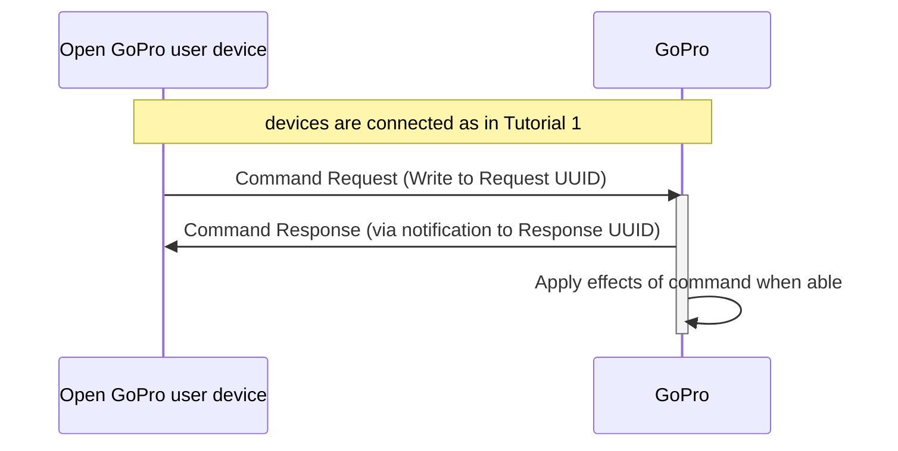

# Python Tutorial 2: Send BLE Commands

This document will provide a walk-through tutorial to use [bleak](https://pypi.org/project/bleak/) to implement the
[Open GoPro Interface]() to send commands and receive responses.

Commands in this sense are specifically procedures that are initiated by either:

-   Writing to the Command Request UUID and receiving responses via the Command Response UUID. They are listed [here](#commands).
-   Writing to the Setting UUID and receiving responses via the Setting Response UUID. They are listed [here](#settings).

> It is required that you have first completed the [connect tutorial](#requirements) before going through this tutorial.

This tutorial only considers sending these commands as one-off commands. That is, it does not consider state management /
synchronization when sending multiple commands. This will be discussed in a future lab.

# Requirements

It is assumed that the hardware and software requirements from the [connect tutorial]()
are present and configured correctly.

The scripts that will be used for this tutorial can be found in the
[Tutorial 2 Folder](https://github.com/gopro/OpenGoPro/tree/main/demos/python/tutorial/tutorial_modules/tutorial_2_send_ble_commands).

# Just Show me the Demo(s)!!

Each of the commands detailed in [Sending Commands](#sending-commands) has a corresponding script to demo it. If you don't want to read this
tutorial and just want to see the demo, for example, run:

```console
$ python ble_command_set_shutter.py
```

> Note! Python 3.8.x must be used as specified in [the requirements](#requirements)

Note that each script has a command-line help which can be found via:

```console
$ python ./ble_command_set_shutter.py --help
usage: ble_command_set_shutter.py [-h] [-i IDENTIFIER]

Connect to a GoPro camera, set the shutter on, wait 2 seconds, then set the shutter off.

optional arguments:
  -h, --help            show this help message and exit
  -i IDENTIFIER, --identifier IDENTIFIER
                        Last 4 digits of GoPro serial number, which is the last 4 digits of the default camera SSID. If not used, first discovered GoPro will be connected to
```

# Setup

We must first connect as was discussed in the [connect tutorial](). In
this case, however, we are defining a meaningful (albeit naive) notification handler that will:

1. print byte data and handle that the notification was received on
1. check if the response is what we expected
1. set an event to notify the writer that the response was received

This is a very simple handler: response parsing will be expanded upon in the [next tutorial]().

```python
def notification_handler(handle: int, data: bytes) -> None:
    logger.info(f'Received response at {handle=}: {hexlify(data, ":")!r}')

    # If this is the correct handle and the status is success, the command was a success
    if client.services.characteristics[handle].uuid == response_uuid and data[2] == 0x00:
        logger.info("Command sent successfully")
    # Anything else is unexpected. This shouldn't happen
    else:
        logger.error("Unexpected response")

    # Notify the writer
    event.set()
```

The event used above is a simple synchronization event that is only alerting the writer that a notification was
received. There is much more to the synchronization and data parsing than this but this will be
discussed in future tutorials. For now, we're just checking that the handle matches what is expected and
that the status (third byte) is success (0x00).

# Command Overview

Both Command Requests and Setting Requests follow the same procedure:

1. Write to relevant request UUID
1. Receive confirmation from GoPro (via notification from relevant response UUID) that request was received.
1. GoPro reacts to command



Here is the procedure from power-on to finish:



# Sending Commands

Now that we are are connected, paired, and have enabled notifications (using our defined callback), we can send commands.

First, we need to define the attributes to write to and receive responses from, which, for commands, are the "Command Request"
characteristic (UUID `b5f90072-aa8d-11e3-9046-0002a5d5c51b`) and "Command Response" characteristic (UUID
`b5f90073-aa8d-11e3-9046-0002a5d5c51b`).

```python
COMMAND_REQ_UUID = GOPRO_BASE_UUID.format("0072")
COMMAND_RSP_UUID = GOPRO_BASE_UUID.format("0073")
```

Or, for settings, the "Settings" characteristic (UUID `b5f90074-aa8d-11e3-9046-0002a5d5c51b`) and "Settings
Response" (UUID `b5f90075-aa8d-11e3-9046-0002a5d5c51b`).

```python
SETTINGS_REQ_UUID = GOPRO_BASE_UUID.format("0074")
SETTINGS_RSP_UUID = GOPRO_BASE_UUID.format("0075")
```



## Set Shutter

The first command we will be sending is [Set Shutter](#commands-quick-reference), which at byte level is:

| Command         |        Bytes        |
| --------------- | :-----------------: |
| Set Shutter Off | 0x03 0x01 0x01 0x00 |
| Set Shutter On  | 0x03 0x01 0x01 0x01 |





Now, let's write the bytes to the "Command Request" UUID to turn the shutter on and start encoding!

```python
event.clear()
await client.write_gatt_char(COMMAND_REQ_UUID, bytearray([3, 1, 1, 1]))
await event.wait() # Wait to receive the notification response
```



You should hear the camera beep and it will either take a picture or start recording
depending on what mode it is in.

Also note that we have received the "Command Status" notification response from the
Command Response characteristic since we enabled its notifications in
[Enable Notifications](#enable-notifications).
This can be seen in the demo log:

```console
INFO:root:Setting the shutter on
INFO:root:Received response at handle=52: b'02:01:00'
INFO:root:Shutter command sent successfully
```

As expected, the response was received on the correct handle and the status was "success".

If you are recording a video, go to the next tab to set the shutter off.




We can now set the shutter off:

> We're waiting 2 seconds in case you are in video mode so that we can capture a 2 second video.

```python
time.sleep(2)
event.clear()
await client.write_gatt_char(COMMAND_REQ_UUID, bytearray([3, 1, 1, 0]))
await event.wait() # Wait to receive the notification response
```

This will log in the console as follows:

```python
INFO:root:Setting the shutter off
INFO:root:Received response at handle=52: b'02:01:00'
INFO:root:Shutter command sent successfully
```




## Sleep

The next command we will be sending is
[Sleep](#commands-quick-reference), which at byte level is:

| Command |   Bytes   |
| ------- | :-------: |
| Sleep   | 0x01 0x05 |

Now, let's write the bytes to the "Command Request" UUID to put the camera to sleep!

```python
event.clear()
await client.write_gatt_char(COMMAND_REQ_UUID, bytearray([0x01, 0x05]))
await event.wait()  # Wait to receive the notification response
```



You should hear the camera beep display a spinner showing "Powering Off"

Also note that we have received the "Command Status" notification response from the
Command Response characteristic since we enabled its notifications in [Enable Notifications](#enable-notifications).. This can
be seen in the demo log:

```console
INFO:root:Putting the camera to sleep
INFO:root:Received response at handle=52: b'02:05:00'
INFO:root: Command sent successfully
```

As expected, the response was received on the correct handle and the status was "success".

Since the camera has gone to sleep, it must be reconnected to via BLE to communicate again as detailed in the
[connect tutorial]().

## Load Preset Group

The next command we will be sending is
[Load Preset Group](#commands-quick-reference), which is used
to toggle between the 3 groups of presets (video, photo, and timelapse). At byte level, the commands are:

| Command                     |          Bytes           |
| --------------------------- | :----------------------: |
| Load Video Preset Group     | 0x04 0x3E 0x02 0x03 0xE8 |
| Load Photo Preset Group     | 0x04 0x3E 0x02 0x03 0xE9 |
| Load Timelapse Preset Group | 0x04 0x3E 0x02 0x03 0xEA |

Now, let's write the bytes to the "Command Request" UUID to change the preset group to Video!

```python
event.clear()
await client.write_gatt_char(COMMAND_REQ_UUID, bytearray([0x04, 0x3E, 0x02, 0x03, 0xE8]))
await event.wait()  # Wait to receive the notification response
```



You should hear the camera beep and move to the Video Preset Group. You can tell this by the logo at the top
middle of the screen:

{% include figure image_path="/assets/images/tutorials/python/preset_group.png" alt="Preset Group" size="50%" caption="Load Preset Group" %}

Also note that we have received the "Command Status" notification response from the
Command Response characteristic since we enabled its notifications in [Enable Notifications](#enable-notifications).. This can
be seen in the demo log:

```console
INFO:root:Loading the video preset group...
INFO:root:Received response at handle=52: b'02:3e:00'
INFO:root:Command sent successfully
```

As expected, the response was received on the correct handle and the status was "success".

## Load Preset

The next command we will be sending is
[Load Preset](#commands-quick-reference), which is used
to select a specific preset that is part of a Preset Group. At byte level, some of the commands for the various
preset are:

| Command                 |               Bytes                |
| ----------------------- | :--------------------------------: |
| Load Cinematic Preset   | 0x06 0x40 0x04 0x00 0x00 0x00 0x02 |
| Load Slo-Mo Preset      | 0x06 0x40 0x04 0x00 0x00 0x00 0x03 |
| Load Burst Photo Preset | 0x06 0x40 0x04 0x00 0x01 0x00 0x02 |
| Load Night Photo Preset | 0x06 0x40 0x04 0x00 0x01 0x00 0x03 |



Now, let's write the bytes to the "Command Request" UUID to change the preset to Cinematic!

```python
    event.clear()
    await client.write_gatt_char(COMMAND_REQ_UUID, bytearray([0x06, 0x40, 0x04, 0x00, 0x00, 0x00, 0x02]))
    await event.wait()  # Wait to receive the notification response
```



You should hear the camera beep and switch to the Cinematic Preset (assuming it wasn't already set). You can verify
this by seeing the preset name in the pill at bottom middle of the screen.

{% include figure image_path="/assets/images/tutorials/python/preset.png" alt="Preset" size="50%" caption="Load Preset" %}

Also note that we have received the "Command Status" notification response from the
Command Response characteristic since we enabled its notifications in [Enable Notifications](#enable-notifications).. This can
be seen in the demo log:

```console
INFO:root:Loading the cinematic preset...
INFO:root:Received response at handle=52: b'02:40:00'
INFO:root:Command sent successfully
```

As expected, the response was received on the correct handle and the status was "success".

## Enable Analytics

The next command we will be sending is
[Enable Analytics](#commands-quick-reference), which at byte level is:

| Command          |   Bytes   |
| ---------------- | :-------: |
| Enable Analytics | 0x01 0x50 |

This command is used to notify that a Third Party is using the Open GoPro API. It should be called after
each connection. The use of this command by third parties will help improve Open GoPro.

Now, let's write the bytes to the "Command Request" UUID to enable analytics.

```python
event.clear()
await client.write_gatt_char(COMMAND_REQ_UUID, bytearray([0x01, 0x50]))
await event.wait()  # Wait to receive the notification response
```



Also note that we have received the "Command Status" notification response from the
Command Response characteristic since we enabled its notifications in [Enable Notifications](#enable-notifications).. This can
be seen in the demo log:

```console
INFO:root:Enabling analytics...
INFO:root:Received response at handle=52: b'02:50:00'
INFO:root:Command sent successfully
```

As expected, the response was received on the correct handle and the status was "success".

## Set the Video Resolution

The next command we will be sending is
[Set Video Resolution](#commands-quick-reference). This is
used to change the value of the Video Resolution setting. It is important to note that this only affects **video**
resolution (not photo). Therefore, the Video Preset Group must be active in order for it to succeed. This can be done
either manually through the camera UI or by sending [Load Preset Group](#load-preset-group).

> Additionally, this resolution only affects the current video preset. Each video preset can have its own independent values for video resolution.

Here are some of the byte level commands for various video resolutions.

| Command                      |        Bytes        |
| ---------------------------- | :-----------------: |
| Set Video Resolution to 1080 | 0x03 0x02 0x01 0x09 |
| Set Video Resolution to 2.7K | 0x03 0x02 0x01 0x04 |
| Set Video Resolution to 4K   | 0x03 0x02 0x01 0x18 |

Note that the possible resolution values can vary based on the Open GoPro version that the camera supports.
Therefore, it is necessary to
[check the version](#complex-command-response).

Now, let's write the bytes to the "Setting Request" UUID to change the video resolution to 1080!

```python
event.clear()
await client.write_gatt_char(SETTINGS_REQ_UUID, bytearray([0x03, 0x02, 0x01, 0x09]))
await event.wait()  # Wait to receive the notification response
```



You should hear the camera beep and see the video resolution change to 1080 in the pill in the bottom-middle of the
screen:

{% include figure image_path="/assets/images/tutorials/python/video_resolution.png" alt="Video Resolution" size="50%" caption="Set Video Resolution" %}

Also note that we have received the "Command Status" notification response from the
Command Response characteristic since we enabled its notifications in [Enable Notifications](#enable-notifications).. This can
be seen in the demo log:

```console
INFO:root:Loading the video preset group...
INFO:root:Received response at handle=52: b'02:3e:00'
INFO:root:Command sent successfully
```

As expected, the response was received on the correct handle and the status was "success". If the Preset
Group was not Video, the status will not be success.

## Set the Frames Per Second (FPS)

The next command we will be sending is
[Set FPS](#commands-quick-reference). This is
used to change the value of the FPS setting. It is important to note that this setting is dependent on the
video resolution. That is, certain FPS values are not valid with certain resolutions. In general, higher resolutions
only allow lower FPS values. Also, the current anti-flicker value may further limit possible FPS values. Check the
[camera capabilities ](#camera-capabilities) to see which FPS
values are valid for given use cases.

Therefore, for this step of the tutorial, it is assumed that the resolution has
been set to 1080 as in [Set the Video Resolution](#set-the-video-resolution).

Here are some of the byte level commands for various FPS values.

| Command        |        Bytes        |
| -------------- | :-----------------: |
| Set FPS to 24  | 0x03 0x03 0x01 0x0A |
| Set FPS to 60  | 0x03 0x03 0x01 0x05 |
| Set FPS to 240 | 0x03 0x03 0x01 0x00 |

Note that the possible FPS values can vary based on the Open GoPro version that the camera supports.
Therefore, it is necessary to
[check the version](#complex-command-response).

Now, let's write the bytes to the "Setting Request" UUID to change the FPS to 240!

```python
event.clear()
await client.write_gatt_char(SETTINGS_REQ_UUID, bytearray([0x03, 0x03, 0x01, 0x00]))
await event.wait()  # Wait to receive the notification response
```



You should hear the camera beep and see the FPS change to 240 in the pill in the bottom-middle of the
screen:

{% include figure image_path="/assets/images/tutorials/python/fps.png" alt="FPS" size="50%" caption="Set FPS" %}

Also note that we have received the "Command Status" notification response from the
Command Response characteristic since we enabled its notifications in [Enable Notifications](#enable-notifications).. This can
be seen in the demo log:

```console
INFO:root:Setting the fps to 240
INFO:root:Received response at handle=57: b'02:03:00'
INFO:root:Command sent successfully
```

As expected, the response was received on the correct handle and the status was "success". If the video resolution
was higher, for example 5K, this would fail.

**Quiz time! 📚 ✏️**







# Troubleshooting

See the first tutorial's [troubleshooting section](#troubleshooting).

# Good Job!



You can now send any of the other BLE commands detailed in the Open GoPro documentation in
a similar manner.

To see how to parse more complicate responses, proceed to the next tutorial.
