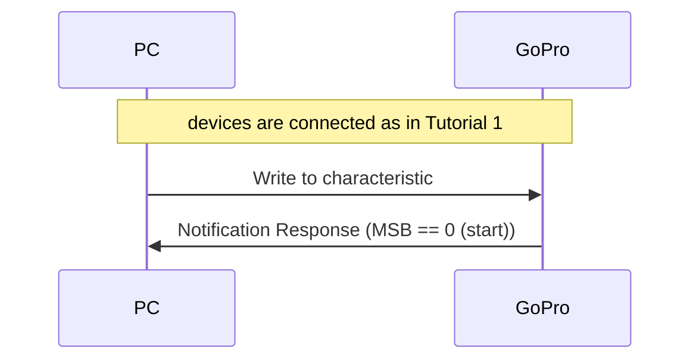
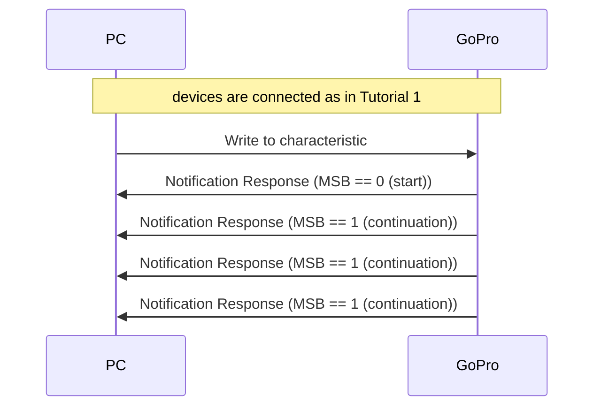
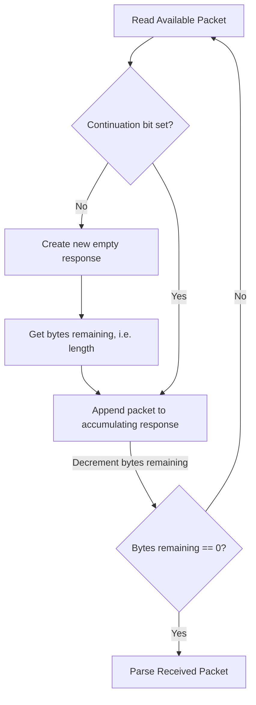
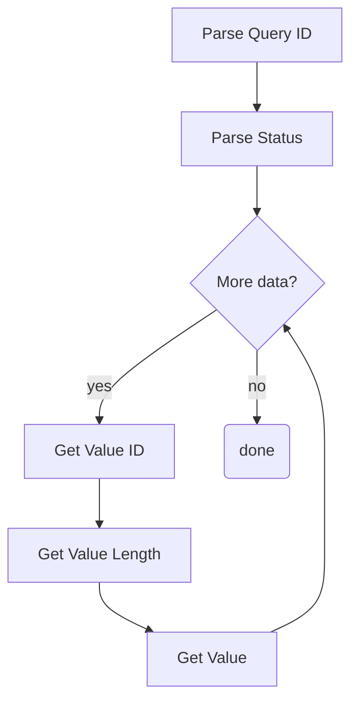

# Python Tutorial 3: Parse BLE TLV Responses

This document will provide a walk-through tutorial to use [bleak](https://pypi.org/project/bleak/) to implement the
[Open GoPro Interface]() to parse BLE
[Type-Length-Value](https://en.wikipedia.org/wiki/Type-length-value) (TLV) Responses.

Besides TLV, some BLE commands instead return protobuf responses. These will be discussed in a future
tutorial.

> Note! It is required that you have first completed the [connect](#requirements) and [sending commands]() tutorials before going through this tutorial.

This tutorial will give an overview of types of responses, then give examples of parsing each type
before finally providing a **Response** class that will be used in future tutorials.

# Requirements

It is assumed that the hardware and software requirements from the [connect tutorial]()
are present and configured correctly.

The scripts that will be used for this tutorial can be found at in the
[Tutorial 3 Folder](https://github.com/gopro/OpenGoPro/tree/main/demos/python/tutorial/tutorial_modules/tutorial_3_parse_ble_tlv_responses).

# Just Show me the Demo(s)!!

Each of the examples described below has a corresponding script to demo it. If you don't want to read this
tutorial and just want to see the demo, for example, run:

```console
$ python ble_command_get_state.py
```

> Note! Python 3.8.x must be used as specified in [the requirements](#requirements)

Note that each script has a command-line help which can be found via:

```console
$ python ./ble_command_get_state.py --help
usage: ble_command_get_state.py [-h] [-i IDENTIFIER]

Connect to a GoPro camera via BLE, then get its statuses and settings.

optional arguments:
  -h, --help            show this help message and exit
  -i IDENTIFIER, --identifier IDENTIFIER
                        Last 4 digits of GoPro serial number, which is the last 4 digits of the default camera SSID. If not used, first discovered GoPro will be connected to
```

# Setup

We must first connect as was discussed in the [connect tutorial](). When enabling notifications,
one of the notification handlers described in the following sections will be used.

# Response Overview

In the preceding tutorials, we have been using a very simple response handling procedure where the notification
handler simply checks that the UUID is the expected UUID and that the status byte of the response is 0 (Success).
This has been fine since we were only sending specific commands where this works and we know that the sequence
always appears as such (connection sequence left out for brevity):



In actuality, responses can be more complicated. As described in the
[Open GoPro Interface](#packet-headers), responses can be
be comprised of multiple packets where each packet is <= 20 bytes such as:



This requires the implementation of accumulating and parsing algorithms which will be described in
[Parsing Multiple Packet TLV Responses].

# Parsing a One Packet TLV Response

This section will describe how to parse one packet (<= 20 byte) responses. A one-packet response
is formatted as such:

| Header (length) | Command / Setting ID | Status  | Response         |
| --------------- | -------------------- | ------- | ---------------- |
| 1 byte          | 1 byte               | 1 bytes | Length - 2 bytes |

## Command / Setting Responses with Response Length 0

These are the only responses that we have seen thus far through the first 2 tutorials. They
return a status but have a 0 length additional response. For example, consider
[Set Shutter](#set-shutter). It returned a response of

```
02:01:00
```

This equates to:

| Header (length) | Command / Setting / Status ID | Status          | Response         |
| --------------- | ----------------------------- | --------------- | ---------------- |
| 1 byte          | 1 byte                        | 1 bytes         | Length - 2 bytes |
| 0x02            | 0x01 == Set Shutter           | 0x00 == Success | (2 -2 = 0 bytes) |

We can see how this response includes the status but no additional response data. This type of
response will be used for most Commands and Setting Responses as seen in the
[previous tutorial]().

## Complex Command Response

There are some commands that do return additional response data. These are called "complex responses."
From the [commands reference](#commands-quick-reference), we can see that these are:

-   Get Open GoPro Version (ID == 0x51)
-   Get Hardware Info (ID == 0x3C)

The `ble_command_get_version.py` script demonstrates a simple parser for the Open GoPro
Get Version command which we will walk through here.

First, we send the command to the Command Request [UUID](#services-and-characteristics):

```python
COMMAND_REQ_UUID = GOPRO_BASE_UUID.format("0072")
event.clear()
await client.write_gatt_char(COMMAND_REQ_UUID, bytearray([0x01, 0x51]))
await event.wait()  # Wait to receive the notification response
```

> Note! The following snippets of code are taken from the `notification handler`

We then receive a response at the expected handle. This is logged as:

```console
INFO:root:Getting the Getting the Open GoPro version...
INFO:root:Received response at handle=52: b'06:51:00:01:01:01:00'
```

This equates to:

| Header (length) | Command / Setting / Status ID | Status          | Response            |
| --------------- | ----------------------------- | --------------- | ------------------- |
| 1 byte          | 1 byte                        | 1 bytes         | Length - 2 bytes    |
| 0x06            | 0x51 == Get Version           | 0x00 == Success | 0x01 0x01 0x01 0x00 |

We can see that this "complex response" contains 4 additional bytes that need to be parsed. Using the information
from the [interface description](#complex-command-responses),
we know to parse this as:

| Byte | Meaning                        |
| ---- | ------------------------------ |
| 0x01 | Length of Major Version Number |
| 0x01 | Major Version Number           |
| 0x01 | Length of Minor Version Number |
| 0x00 | Minor Version Number           |

We implement this in the notification handler as follows. First, we parse the length, command ID, and status
from the first 3 bytes of the response:

```python
len = data[0]
command_id = data[1]
status = data[2]
```

Next we parse the remaining four bytes of the response as individual values formatted as such:

| Length | Value        |
| ------ | ------------ |
| 1 byte | Length bytes |

```python
index = 3
params = []
while index <= len:
    param_len = data[index]
    index += 1
    params.append(data[index : index + param_len])
    index += param_len
```

From the complex response definition, we know these parameters equate to the major and the minor version so let's
print them (and all of the other response information) as such:

```python
major, minor = params
logger.info(f"Received a response to {command_id=} with {status=}: version={major[0]}.{minor[0]}")
```

which shows on the log as:

```console
INFO:root:Received a response to command_id=81 with status=0: version=1.0
```

**Quiz time! 📚 ✏️**









# Parsing Multiple Packet TLV Responses

This section will describe parsing TLV responses that contain more than one packet. It will first describe how
to accumulate such responses and then provide a parsing example. The example script that will be walked through
for this section is `ble_command_get_state.py`. We will be creating a small _Response_ class that will be
re-used for future tutorials.

## Accumulating the Response

The first step is to accumulate the multiple packets into one response. Whereas for all tutorials until now, we
have just used the header bytes of the response as the length, we now must completely parse the header as it is
defined:

<table border="1">
  <tbody>
    <tr>
        <td colspan="8">Byte 1</td>
        <td colspan="8">Byte 2 (optional)</td>
        <td colspan="8">Byte 3 (optional)</td>
    </tr>
    <tr>
        <td>7</td>
        <td>6</td>
        <td>5</td>
        <td>4</td>
        <td>3</td>
        <td>2</td>
        <td>1</td>
        <td>0</td>
        <td>7</td>
        <td>6</td>
        <td>5</td>
        <td>4</td>
        <td>3</td>
        <td>2</td>
        <td>1</td>
        <td>0</td>
        <td>7</td>
        <td>6</td>
        <td>5</td>
        <td>4</td>
        <td>3</td>
        <td>2</td>
        <td>1</td>
        <td>0</td>
    </tr>
    <tr>
        <td>0: Start</td>
        <td colspan="2">00: General</td>
        <td colspan="5">Message Length: 5 bits</td>
        <td colspan="16"></td>
    </tr>
    <tr>
        <td>0: Start</td>
        <td colspan="2">01: Extended (13-bit)</td>
        <td colspan="13">Message Length: 13 bits</td>
        <td colspan="8"></td>
    </tr>
    <tr>
        <td>0: Start</td>
        <td colspan="2">10: Extended (16-bit)</td>
        <td colspan="5"></td>
        <td colspan="16">Message Length: 16 bits</td>
    </tr>
    <tr>
        <td>0: Start</td>
        <td colspan="2">11: Reserved</td>
        <td colspan="21"></td>
    </tr>
    <tr>
        <td>1: Continuation</td>
        <td colspan="24"></td>
    </tr>
  </tbody>
</table>

The basic algorithm here (which is implemented in the _Message.accumulate_ method) is as follows:

---

<div class="md_column">
<div markdown="1">
Continuation bit set?

```python
if buf[0] & CONT_MASK:
    buf.pop(0)
else:
    ...
```

No, continuation bit was not set. So create new response, then get its length.

```python
# This is a new packet so start with an empty byte array
self.bytes = bytearray()
hdr = Header((buf[0] & HDR_MASK) >> 5)
if hdr is Header.GENERAL:
    self.bytes_remaining = buf[0] & GEN_LEN_MASK
    buf = buf[1:]
elif hdr is Header.EXT_13:
    self.bytes_remaining = ((buf[0] & EXT_13_BYTE0_MASK) << 8) + buf[1]
    buf = buf[2:]
elif hdr is Header.EXT_16:
    self.bytes_remaining = (buf[1] << 8) + buf[2]
    buf = buf[3:]
```

Append current packet to response and decrement bytes remaining.

```python
# Append payload to buffer and update remaining / complete
self.bytes.extend(buf)
self.bytes_remaining -= len(buf)
```

In the notification handler, we are then parsing if there are no bytes remaining.

```python
    if response.is_received:
        response.parse()
```

</div>

<div markdown="1" style="60%">
<br><br><br>

</div>
</div>

---

We can see this in action when we send the _Get All Setting Values_ Query.



We send the command as such:

```python
QUERY_REQ_UUID = GOPRO_BASE_UUID.format("0076")
event.clear()
await client.write_gatt_char(QUERY_REQ_UUID, bytearray([0x01, 0x12]))
await event.wait()  # Wait to receive the notification response
```

Then, in the notification handler, we continuously receive and accumulate packets until we have
received the entire response, at which point we notify the writer that the response is ready:

```python
 def notification_handler(handle: int, data: bytes) -> None:
        response.accumulate(data)

        if response.is_received:
            response.parse()

            # Notify writer that procedure is complete
            event.set()
```



We can see the individual packets being accumulated in the log:

```console
INFO:root:Getting the camera's settings...
INFO:root:Received response at handle=62: b'21:25:12:00:02:01:09:03:01:01:05:0
INFO:root:self.bytes_remaining=275
INFO:root:Received response at handle=62: b'80:01:00:18:01:00:1e:04:00:00:00:0
INFO:root:self.bytes_remaining=256
INFO:root:Received response at handle=62: b'81:0a:25:01:00:29:01:09:2a:01:05:2
INFO:root:self.bytes_remaining=237
INFO:root:Received response at handle=62: b'82:2f:01:04:30:01:03:36:01:00:3b:0
INFO:root:self.bytes_remaining=218
INFO:root:Received response at handle=62: b'83:04:00:00:00:00:3e:04:00:00:00:0
INFO:root:self.bytes_remaining=199
INFO:root:Received response at handle=62: b'84:00:42:04:00:00:00:00:43:04:00:0
INFO:root:self.bytes_remaining=180
INFO:root:Received response at handle=62: b'85:4f:01:00:53:01:00:54:01:00:55:0
INFO:root:self.bytes_remaining=161
INFO:root:Received response at handle=62: b'86:01:28:5b:01:02:60:01:00:66:01:0
INFO:root:self.bytes_remaining=142
INFO:root:Received response at handle=62: b'87:00:6a:01:00:6f:01:0a:70:01:ff:7
INFO:root:self.bytes_remaining=123
INFO:root:Received response at handle=62: b'88:75:01:00:76:01:04:79:01:00:7a:0
INFO:root:self.bytes_remaining=104
INFO:root:Received response at handle=62: b'89:01:00:7e:01:00:80:01:0c:81:01:0
INFO:root:self.bytes_remaining=85
INFO:root:Received response at handle=62: b'8a:0c:85:01:09:86:01:00:87:01:01:8
INFO:root:self.bytes_remaining=66
INFO:root:Received response at handle=62: b'8b:92:01:00:93:01:00:94:01:02:95:0
INFO:root:self.bytes_remaining=47
INFO:root:Received response at handle=62: b'8c:01:00:9c:01:00:9d:01:00:9e:01:0
INFO:root:self.bytes_remaining=28
INFO:root:Received response at handle=62: b'8d:00:a2:01:00:a3:01:01:a4:01:00:a
INFO:root:self.bytes_remaining=9
INFO:root:Received response at handle=62: b'8e:a8:04:00:00:00:00:a9:01:01'
INFO:root:self.bytes_remaining=0
INFO:root:Successfully received the response
```

At this point the response has been accumulated. See the next section for how to parse it.

**Quiz time! 📚 ✏️**



## Query Responses

This section is going to describe responses to to BLE status / setting queries. We don't actually
introduce such queries until [the next tutorial]() so for now, only the
parsing of the response is important.



Query Responses contain one or more TLV groups in their Response data. To recap, the generic response format is:

| Header (length) | Query ID | Status  | Response         |
| --------------- | -------- | ------- | ---------------- |
| 1-2 bytes       | 1 byte   | 1 bytes | Length - 2 bytes |

This means that query responses will contain an array of additional TLV groups in the "Response" field as such:

| ID1    | Length1 | Value1        | ID2    | Length2 | Value 2       | ... | IDN    | LengthN | ValueN        |
| ------ | ------- | ------------- | ------ | ------- | ------------- | --- | ------ | ------- | ------------- |
| 1 byte | 1 byte  | Length1 bytes | 1 byte | 1 byte  | Length2 bytes | ... | 1 byte | 1 byte  | LengthN bytes |

Depending on the amount of query results in the response, this response can be one or multiple packets. Therefore,
we need to account for the possibility that it may always be more than 1 packet.

We can see an example of such parsing in the **Response.parse** method:

---

<div class="md_column">
<div markdown="1">

We have already parsed the length when we were accumulating the packet. So the next step is to parse the Query ID
and Status:

```python
self.id = self.bytes[0]
self.status = self.bytes[1]
```

We then continuously parse **Type (ID) - Length - Value** groups until we have consumed the response. We are storing
each value in a dict indexed by ID for later access.

```python
buf = self.bytes[2:]
while len(buf) > 0:
    # Get ID and Length
    param_id = buf[0]
    param_len = buf[1]
    buf = buf[2:]
    # Get the value
    value = buf[:param_len]

    # Store in dict for later access
    self.data[param_id] = value

    # Advance the buffer
    buf = buf[param_len:]
```

</div>
<div markdown="1" style="flex:60%">

<br><br><br>


</div>
</div>

---

In the demo, we then log this entire dict after parsing is complete as such (abbreviated for brevity):

```console
INFO:root:Received settings
: {
    "2": "09",
    "3": "01",
    "5": "00",
    "6": "01",
    "13": "01",
    "19": "00",
    "30": "00:00:00:00",
    "31": "00",
    "32": "00:00:00:0a",
    "41": "09",
    "42": "05",
    "43": "00",
    ...
    "153": "00",
    "154": "01",
    "155": "00",
    "156": "00",
    "157": "00",
    "158": "01",
    "159": "00",
    "160": "00",
    "161": "00",
    "162": "00",
    "163": "01",
    "164": "00",
    "165": "00",
    "166": "00",
    "167": "04",
    "168": "00:00:00:00",
    "169": "01"
}
```

We can see what each of these values mean by looking at the
[Open GoPro Interface](#settings-quick-reference).

For example:

-   ID 2 == 9 equates to Resolution == 1080
-   ID 3 == 1 equates to FPS == 120





# Troubleshooting

See the first tutorial's [troubleshooting section](#troubleshooting).

# Good Job!



You can now parse any TLV response that is received from the GoPro, at least if it is received uninterrupted. There
is additional logic required for a complete solution such as checking the UUID the response is received on and
storing a dict of response per UUID. At the current time, this endeavor is left for the reader. For a complete
example of this, see the Open GoPro Python SDK [package](TODO_ADD_LINK).

To learn more about queries, go to the next tutorial.
