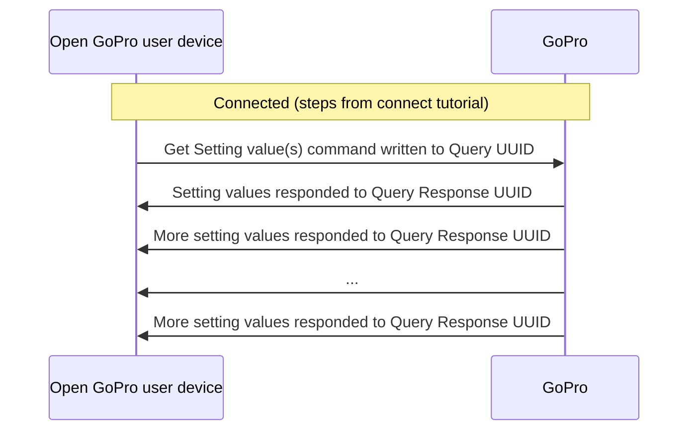
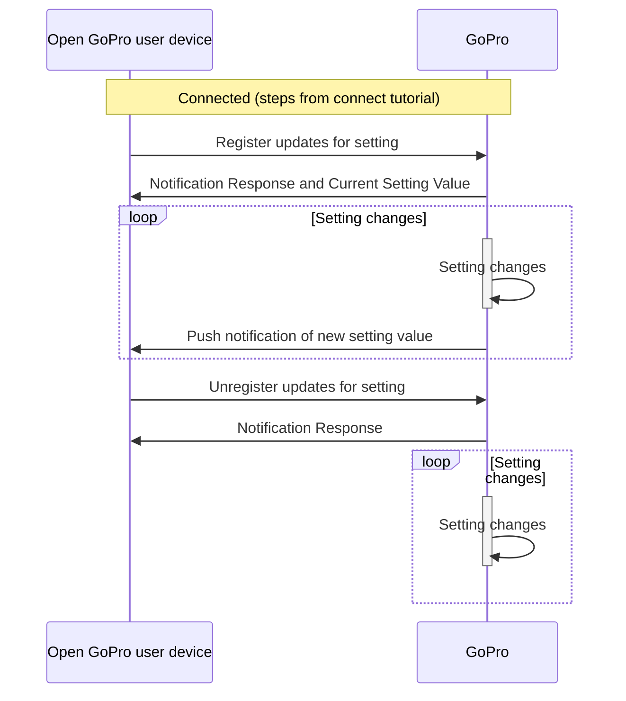

# Python Tutorial 4: BLE Queries

This document will provide a walk-through tutorial to use [bleak](https://pypi.org/project/bleak/) to implement the
[Open GoPro Interface]() to query the camera's setting and status information
via BLE.

"Queries" in this sense are specifically procedures that:

-   are initiated by writing to the Query UUID
-   receive responses via the Query Response UUID.

This will be described in more detail below.

> Note! It is required that you have first completed the [connect](#requirements), [sending commands](), and [parsing responses]() tutorials before going through this tutorial.

This tutorial only considers sending these queries as one-off commands. That is, it does not consider state management /
synchronization when sending multiple commands. This will be discussed in a future lab.

# Requirements

It is assumed that the hardware and software requirements from the [connect tutorial]()
are present and configured correctly.

The scripts that will be used for this tutorial can be found in the
[Tutorial 4 Folder](https://github.com/gopro/OpenGoPro/tree/main/demos/python/tutorial/tutorial_modules/tutorial_4_ble_queries).

# Just Show me the Demo(s)!!

Each of the commands detailed in this tutorial has a corresponding script to demo it. If you don't want to read this
tutorial and just want to see the demo, for example, run:

```console
$ python ble_query_poll_resolution_value.py
```

> Note! Python 3.8.x must be used as specified in [the requirements](#requirements)

Note that each script has a command-line help which can be found via:

```console
$ python ./ble_command_poll_resolution_value.py --help
usage: ble_query_poll_resolution_value.py [-h] [-i IDENTIFIER]

Connect to a GoPro camera then get the current resolution.

optional arguments:
  -h, --help            show this help message and exit
  -i IDENTIFIER, --identifier IDENTIFIER
                        Last 4 digits of GoPro serial number, which is the last 4 digits of the default camera SSID. If not used, first discovered GoPro will be connected to
```

# Setup

We must first connect as was discussed in the [connect tutorial]().

We will also be using the **Response** class that was defined in the
[parsing responses]() tutorial to accumulate and parse
notification responses to the Query Response [characteristic](#services-and-characteristics).
Throughout this tutorial, the query information that we will be reading is the Resolution Setting (ID 0x02).
Therefore, we have slightly changed the notification handler to update a global resolution variable as it
queries the resolution:

```python
def notification_handler(handle: int, data: bytes) -> None:
    response.accumulate(data)

    if response.is_received:
        response.parse()

        if client.services.characteristics[handle].uuid == QUERY_RSP_UUID:
            resolution = Resolution(response.data[RESOLUTION_ID][0])

        # Notify writer that the procedure is complete
        event.set()
```

There are two methods to query status / setting information, each of which will be described in a following section:

-   [Polling Query Information](#polling-query-information)
-   [Registering for query push notifications](#registering-for-query-push-notifications)

# Polling Query Information

It is possible to poll one or more setting / status values using the following
[commands](#query-commands):

| Query ID | Request              | Query        |
| -------- | -------------------- | ------------ |
| 0x12     | Get Setting value(s) | len:12:xx:xx |
| 0x13     | Get Status value(s)  | len:13:xx:xx |

where **xx** are setting / status ID(s) and **len** is the total length of the query (not including the length).
There will be specific examples below.



Here is a generic sequence diagram (the same is true for statuses):



The number of notification responses will vary depending on the amount of settings that have been queried.
Note that setting values will be combined into one notification until it reaches the maximum notification size (20 bytes).
At this point, a new response will be sent. Therefore, it is necessary to accumulate and then parse these
responses as was described in [parsing query responses](#query-responses)

## Individual Query Poll

Here we will walk through an example of polling one setting (Resolution) in `ble_query_poll_resolution_value.py`.
First, we define the UUID's to write to and receive from:

```python
QUERY_REQ_UUID = GOPRO_BASE_UUID.format("0076")
QUERY_RSP_UUID = GOPRO_BASE_UUID.format("0077")
```

Then we send the query command:

```python
event.clear()
await client.write_gatt_char(QUERY_REQ_UUID, bytearray([0x02, 0x12, RESOLUTION_ID]))
await event.wait()  # Wait to receive the notification response
```

When the response is received in the notification handler, we update the global resolution variable:

```python
def notification_handler(handle: int, data: bytes) -> None:
    response.accumulate(data)

    # Notify the writer if we have received the entire response
    if response.is_received:
        response.parse()

        # If this is query response, it must contain a resolution value
        if client.services.characteristics[handle].uuid == QUERY_RSP_UUID:
            resolution = Resolution(response.data[RESOLUTION_ID][0])
```

This all shows in the log as such:

```console
INFO:root:Getting the current resolution
INFO:root:Received response at handle=62: b'05:12:00:02:01:09'
INFO:root:self.bytes_remaining=0
INFO:root:Resolution is currently Resolution.RES_1080
```

For verification purposes, we are then changing the resolution and polling again to verify that the setting
has changed:

```console
INFO:root:Changing the resolution to Resolution.RES_2_7K...
INFO:root:Received response at handle=57: b'02:02:00'
INFO:root:self.bytes_remaining=0
INFO:root:Command sent successfully
INFO:root:Polling the resolution to see if it has changed...
INFO:root:Received response at handle=62: b'05:12:00:02:01:07'
INFO:root:self.bytes_remaining=0
INFO:root:Resolution is currently Resolution.RES_2_7K
```

## Multiple Simultaneous Query Polls

Rather than just polling one setting, it is also possible to poll multiple settings. There is an example of this in
`ble_poll_multiple_setting_values.py`. It is very similar to the previous example except for the following:

The query command now includes 3 settings:

```python
RESOLUTION_ID = 2
FPS_ID = 3
FOV_ID = 121

await client.write_gatt_char(QUERY_REQ_UUID, bytearray([0x04, 0x12, RESOLUTION_ID, FPS_ID, FOV_ID]))
```



We are also parsing the response to get all 3 values:

```python
def notification_handler(handle: int, data: bytes) -> None:
    response.accumulate(data)

    if response.is_received:
        response.parse()

        if client.services.characteristics[handle].uuid == QUERY_RSP_UUID:
            resolution = Resolution(response.data[RESOLUTION_ID][0])
            fps = FPS(response.data[FPS_ID][0])
            video_fov = VideoFOV(response.data[FOV_ID][0])
```



They are then printed to the log which will look like the following:

```console
INFO:root:Received response at handle=62: b'0b:12:00:02:01:07:03:01:01:79:01:00'
INFO:root:self.bytes_remaining=0
INFO:root:Resolution is currently Resolution.RES_2_7K
INFO:root:Video FOV is currently VideoFOV.FOV_WIDE
INFO:root:FPS is currently FPS.FPS_120
```

## Query All

It is also possible to query all settings / statuses by not passing any ID's into the the query command, i.e.:

| Query ID | Request          | Query |
| -------- | ---------------- | ----- |
| 0x12     | Get All Settings | 01:12 |
| 0x13     | Get All Statuses | 01:13 |

An example of this can be seen in the `ble_command_get_state.py` script described in the
[parsing query responses](#query-responses) tutorial

**Quiz time! 📚 ✏️**

{% quiz
    question="How can we poll the encoding status and the resolution setting using one command?"
    option="A:::Concatenate a 'Get Setting Value' command and a 'Get Status' command with the relevant ID's"
    option="B:::Concatenate the 'Get All Setting' and 'Get All Status' commands."
    option="C:::It is not possible"
    correct="C"
    info="It is not possible to concatenate commands. This would result in an unknown sequence of bytes
        from the camera's perspective. So it is not possible to get a setting value and a status value in one command.
        The Get Setting command (with resolution ID) and Get Status command(with encoding ID) must be sent sequentially
        in order to get this information."
%}

# Registering for Query Push Notifications

Rather than polling the query information, it is also possible to use an interrupt scheme to register for
push notifications when the relevant query information changes.

The relevant [commands](#query-commands) are:

| Query ID | Request                           | Query        |
| -------- | --------------------------------- | ------------ |
| 0x52     | Register updates for setting(s)   | len:52:xx:xx |
| 0x53     | Register updates for status(es)   | len:53:xx:xx |
| 0x72     | Unregister updates for setting(s) | len:72:xx:xx |
| 0x73     | Unregister updates for status(es) | len:73:xx:xx |

where **xx** are setting / status ID(s) and **len** is the total length of the query (not including the length).

The Query ID's for push notification responses are as follows:

| Query ID | Response                        |
| -------- | ------------------------------- |
| 0x92     | Setting Value Push Notification |
| 0x93     | Status Value Push Notification  |

Here is a generic sequence diagram of how this looks (the same is true for statuses):



That is, after registering for push notifications for a given query, notification responses will continuously
be sent whenever the query changes until the client unregisters for push notifications for the given query.



We will walk through the `ble_query_register_resolution_value_updates.py` script to demonstrate this:

First, we define the UUID's to write to and receive from:

```python
SETTINGS_REQ_UUID = GOPRO_BASE_UUID.format("0074")
SETTINGS_RSP_UUID = GOPRO_BASE_UUID.format("0075")
QUERY_REQ_UUID = GOPRO_BASE_UUID.format("0076")
QUERY_RSP_UUID = GOPRO_BASE_UUID.format("0077")
```

Then we register for updates when the resolution setting changes:

```python
event.clear()
await client.write_gatt_char(QUERY_REQ_UUID, bytearray([0x02, 0x52, RESOLUTION_ID]))
await event.wait()  # Wait to receive the notification response
```

and parse its response (which includes the current resolution value). This is very similar to the polling example
with the exception that the Query ID is now 0x52 (Register Updates for Settings). This can be seen in the raw
byte data as well as by inspecting `response.id`.

```python
def notification_handler(handle: int, data: bytes) -> None:
    logger.info(f'Received response at {handle=}: {hexlify(data, ":")!r}')

    response.accumulate(data)

    # Notify the writer if we have received the entire response
    if response.is_received:
        response.parse()

        # If this is query response, it must contain a resolution value
        if client.services.characteristics[handle].uuid == QUERY_RSP_UUID:
            global resolution
            resolution = Resolution(response.data[RESOLUTION_ID][0])
```

This will show in the log as such:

```console
INFO:root:Registering for resolution updates
INFO:root:Received response at handle=62: b'05:52:00:02:01:07'
INFO:root:self.bytes_remaining=0
INFO:root:Successfully registered for resolution value updates.
INFO:root:Resolution is currently Resolution.RES_2_7K
```

We are now successfully registered for resolution value updates and will receive push notifications whenever
the resolution changes. We verify this is the demo by then changing the resolution. This will show in the log
as:

```console
INFO:root:Successfully changed the resolution
INFO:root:Received response at handle=62: b'05:92:00:02:01:09'
INFO:root:self.bytes_remaining=0
INFO:root:Resolution is now Resolution.RES_1080
```

In this case, the Query ID is 0x92 (Setting Value Push Notification) as expected.

---



**Quiz time! 📚 ✏️**





# Troubleshooting

See the first tutorial's [troubleshooting section](#troubleshooting).

# Good Job!



You can now query any of the settings / statuses from the camera using one of the above patterns.

If you have been following these tutorials in order, here is an extra 🥇🍾 **Congratulations** 🍰👍 because you have
completed all of the BLE tutorials.

Next, to get started with WiFI (specifically to enable and connect to it),
proceed to the next tutorial.
