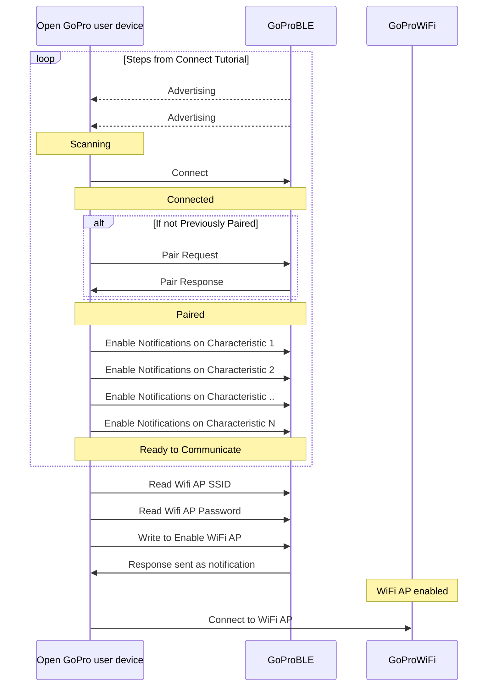

# Python Tutorial 5: Connect WiFi

This document will provide a walk-through tutorial to use [bleak](https://pypi.org/project/bleak/) to implement the
[Open GoPro Interface]() to enable the GoPro's WiFi Access Point (AP) so that it
can be connected to. It will also provide an example of connecting to the WiFi AP.

> Note! It is recommended that you have first completed the [connecting](), [sending commands](), and [parsing responses]() tutorials before proceeding

# Requirements

It is assumed that the hardware and software requirements from the [connect tutorial](#requirements)
are present and configured correctly.

The scripts that will be used for this tutorial can be found in the
[Tutorial 5 Folder](https://github.com/gopro/OpenGoPro/tree/main/demos/python/tutorial/tutorial_modules/tutorial_5_connect_wifi).

# Just Show me the Demo(s)!!

There are two relevant scripts that will be discussed here:

-   wifi_enable.py
-   wifi_enable_and_connect.py

If you don't want to read this tutorial and just want to see the demo, for example, run:

```console
$ python wifi_enable_and_connect.py
```

> Note! Python 3.8.x must be used as specified in [the requirements](#requirements)

Note that each script has a command-line help which can be found via:

```console
python wifi_enable_and_connect.py --help
usage: wifi_enable_and_connect.py [-h] [-i IDENTIFIER]

Connect to a GoPro camera via BLE, get WiFi info, enable WiFi and connect.

optional arguments:
  -h, --help            show this help message and exit
  -i IDENTIFIER, --identifier IDENTIFIER
                        Last 4 digits of GoPro serial number, which is the last 4 digits of the default camera SSID. If not used,
                        first discovered GoPro will be connected to
```

# Setup

We must first connect to BLE as was discussed in the [connect tutorial](). We are also
using the same notification handler as was used in the [sending commands tutorial](#setup)

# Connecting to WiFi AP

Now that we are connected via BLE, paired, and have enabled notifications, we can send the command to enable the WiFi AP.

Here is an outline of the steps to do so:



Essentially we will be finding the WiFi AP information (SSID and password) via BLE, enabling the WiFi AP via BLE, then
connecting to the WiFi AP.

## Find WiFi Information

Note that the process to get this information is different than all procedures described up to this point.
Whereas the previous command, setting, and query procedures all followed the Write Request-Notification Response
pattern, the WiFi Information is retrieved via direct Read Requests to BLE characteristics.

### Get WiFi SSID

The WiFi SSID can be found by reading from the WiFi AP SSID
[characteristic](#services-and-characteristics) of the
WiFi Access Point service.

First, we need to define the attribute to read from:

```python
WIFI_AP_SSID_UUID = GOPRO_BASE_UUID.format("0002")
```

Now, let's send the read request to get the SSID (and decode it into a string).

```python
ssid = await client.read_gatt_char(WIFI_AP_SSID_UUID)
ssid = ssid.decode()
```



In the demo, this information is logged as such:

```console
INFO:root:Reading the WiFi AP SSID
INFO:root:SSID is GP24500456
```

### Get WiFi Password

The WiFi password can be found by reading from the WiFi AP password
[characteristic](#services-and-characteristics) of the
WiFi Access Point service.

First, we need to define the attribute to read from:

```python
WIFI_AP_PASSWORD_UUID = GOPRO_BASE_UUID.format("0003")
```

Now, let's send the read request to get the password (and decode it into a string).

```python
password = await client.read_gatt_char(WIFI_AP_PASSWORD_UUID)
password = password.decode()
```



In the demo, this information is logged as such:

```console
INFO:root:Reading the WiFi AP password
INFO:root:Password is g@6-Tj9-C7K
```

## Enable WiFi AP

Before we can connect to the WiFi AP, we have to make sure it is enabled. This is accomplished by using the
"AP Control" [command](#commands-quick-reference):

| Command            |        Bytes        |
| ------------------ | :-----------------: |
| Ap Control Enable  | 0x03 0x17 0x01 0x01 |
| Ap Control Disable | 0x03 0x17 0x01 0x00 |

This is done in the same manner that we did in the
[sending commands tutorial]().

Now, let's write the bytes to the "Command Request UUID" to enable the WiFi AP!

```python
event.clear()
await client.write_gatt_char(COMMAND_REQ_UUID, bytearray([0x03, 0x17, 0x01, 0x01]))
await event.wait()  # Wait to receive the notification response
```



Note that we have received the "Command Status" notification response from the
Command Response characteristic since we enabled it's notifications in
[Enable Notifications](#enable-notifications). This can be seen in the demo log:

```console
INFO:root:Enabling the WiFi AP
INFO:root:Received response at handle=52: b'02:17:00'
INFO:root:Command sent successfully
INFO:root:WiFi AP is enabled
```

As expected, the response was received on the correct handle and the status was "success".

## Establish Connection to WiFi AP

If you have been following through the `ble_enable_wifi.py` script, you will notice that it ends here such that
we know the WiFi SSID and password and the WiFi AP is enabled and ready to connect to. This is because there
are many different methods of connecting to the WiFi AP depending on your OS and the framework you are
using to develop. You could, for example, simply use your OS's WiFi GUI to connect.

We do provide a programmatic example of this in the `ble_enable_wifi_and_connect.py` script. This script uses the
cross-platform `Wireless` module from the [Open GoPro Python SDK](https://gopro.github.io/OpenGoPro/python_sdk/).
Note that this has been imported as such:

```python
from open_gopro.wifi.adapters import Wireless
```

In order to do so, perform the following after the above steps have been completed:

```python
wifi = Wireless()
wifi.connect(ssid, password)
```

This will log something similar to the following (it will vary slightly based on your OS):

```console
INFO:root:Connecting to GoPro WiFi AP
INFO:open_gopro.wifi_controller:Attempting to establish WiFi connection to GP24500456...
INFO:open_gopro.wifi_controller:Wifi connection established!
INFO:root:Wifi Connected!
```

**Quiz time! 📚 ✏️**

{% quiz
    question="How is the WiFi password response received?"
    option="A:::As a read response from the WiFi AP Password characteristic"
    option="B:::As write responses to the WiFi Request characteristic"
    option="C:::As notifications of the Command Response characteristic"
    correct="A"
    info="This (and WiFi AP SSID) is an exception to the rule. Usually responses
    are received as notifications to a response characteristic. However, in this case, it is
    received as a direct read response (since we are reading from the characteristic and not
    writing to it)."
%}

{% quiz
    question="Which of the following statements about the GoPro WiFi AP is true?"
    option="A:::It only needs to be enabled once and it will then always remain on"
    option="B:::The WiFi password will never change"
    option="C:::The WiFi SSID will never change"
    correct="D"
    info="Trick question! They are all false. While the WiFi AP will remain on for
    some time, it can and will eventually turn off so it is always recommended to first connect
    via BLE and ensure that it is enabled. The password and SSID will almost never change.
    However, they will change if the connections are reset via Connections->Reset Connections."
%}

# Troubleshooting

See the first tutorial's [troubleshooting section](#troubleshooting).

# Good Job!



You are now connected to the GoPro's Wifi AP and can send any of the HTTP commands defined in the
[Open GoPro Interface](). Proceed to the next tutorial.
