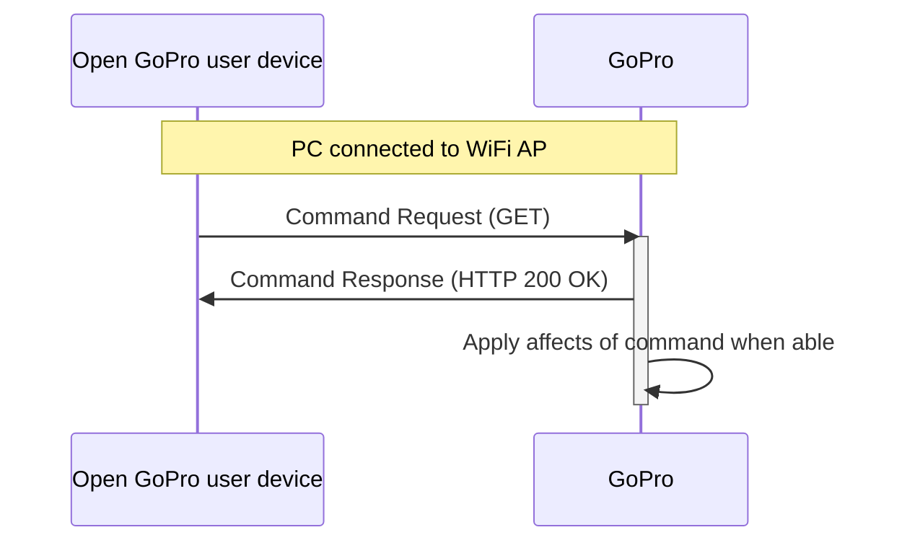

# Python Tutorial 6: Send WiFi Commands

This document will provide a walk-through tutorial to use the Python [requests](https://pypi.org/project/requests/)
package to send Open GoPro [HTTP commands]() to the GoPro.

> Note! It is required that you have first completed the [Connecting to Wifi]() tutorial.

This tutorial only considers sending these commands as one-off commands. That is, it does not consider state management /
synchronization when sending multiple commands. This will be discussed in a future lab.

There are two types of responses that can be received from the HTTP commands: JSON and binary. This section
will deal with commands that return JSON responses. For commands with binary responses (as well as commands with
JSON responses that work with the media list), see the [next tutorial]().

# Requirements

It is assumed that the hardware and software requirements from the [connect tutorial](#requirements)
are present and configured correctly.

The scripts that will be used for this tutorial can be found at in the
[Tutorial 6 Folder](https://github.com/gopro/OpenGoPro/tree/main/demos/python/tutorial/tutorial_modules/tutorial_6_send_wifi_commands).

# Just Show me the Demo(s)!!

Each of the commands detailed below has a corresponding script to demo it. If you don't want to read this
tutorial and just want to see the demo, for example, run:

```console
$ python wifi_command_zoom.py
```

> Note! Python 3.8.x must be used as specified in [the requirements](#requirements)

Note that each script has a command-line help which can be found via:

```console
$ python wifi_command_zoom.py --help
usage: wifi_command_zoom.py [-h] [-z ZOOM]

Set the digital zoom level.

optional arguments:
  -h, --help            show this help message and exit
  -z ZOOM, --zoom ZOOM  Zoom percentage (0-100)
```

# Setup

We must first connect to The GoPro's WiFi Access Point (AP) as was discussed in the
[Connecting to Wifi]() tutorial.

# Sending HTTP Commands with JSON Responses

Now that we are are connected via WiFi, we will use the `requests` module to send the various HTTP commands.

Both Command Requests and Setting Requests follow the same procedure:

1. Send HTTP GET command to appropriate endpoint
1. Receive confirmation from GoPro (via HTTP response) that request was received.
1. GoPro reacts to command







## Digital Zoom

The first command we will be sending is
[Digital Zoom](#commands-quick-reference). The camera
must be in the [Photo Preset Group](#load-preset-group)
for this command to succeed. The commands writes to the following endpoint:

`/gopro/camera/digital_zoom?percent=50`

Let's build the endpoint (in this example from the script, **zoom** is a command line argument that defaults to 50):

```python
url = GOPRO_BASE_URL + f"gopro/camera/digital_zoom?percent={zoom}"
```

Now we send the GET request and check the response for errors. Any errors will raise an exception.

```python
response = requests.get(url)
response.raise_for_status()
```

Lastly, we print the response's JSON data (nicely formatted with indent 4 using the `json` module):

```python
logger.info(f"Response: {json.dumps(response.json(), indent=4)}")
```

This will log as such:

```console
INFO:root:Setting digital zoom to 50%: sending http://10.5.5.9:8080/gopro/camera/digital_zoom?percent=50
INFO:root:Command sent successfully
INFO:root:Response: {}
```



## Get State




The next command we will be sending is
[Get State](#commands-quick-reference). This command will
return all of the current settings and values. It is basically a combination of the
[Get All Settings](#query-all) and
[Get All Statuses](#query-all)
commands that were sent via BLE. Since there is no way to query individual settings / statuses
via WiFi (or register for asynchronous notifications when they change), this is the only option to query
setting / status information via WiFi.

The command writes to the following endpoint:

`/gopro/camera/state`

Let's first build the endpoint:

```python
url = GOPRO_BASE_URL + "/gopro/camera/state"
```

Now we send the GET request and check the response for errors. Any errors will raise an exception.

```python
response = requests.get(url)
response.raise_for_status()
```

Lastly, we print the response's JSON data (nicely formatted with indent 4 using the `json` module):

```python
logger.info(f"Response: {json.dumps(response.json(), indent=4)}")
```

Go to the next tab for examples of viewing and parsing the response.




The response will log as such (abbreviated for brevity):

```console
INFO:root:Getting GoPro's status and settings: sending http://10.5.5.9:8080/gopro/camera/state
INFO:root:Command sent successfully
INFO:root:Response: {
    "status": {
        "1": 1,
        "2": 2,
        "3": 0,
        "4": 255,
        "6": 0,
        "8": 0,
        "9": 0,
        "10": 0,
        "11": 0,
        "13": 0,
        "14": 0,
        "17": 1,

  ...

  "settings": {
      "2": 9,
      "3": 1,
      "5": 0,
      "6": 1,
      "13": 1,
      "19": 0,
      "24": 0,
      "30": 0,
      "31": 0,
      "32": 10,
      "41": 9,
      "42": 5,
```

We can see what each of these values mean by looking at the
[Open GoPro Interface](#settings-quick-reference).

For example (for settings):

-   ID 2 == 9 equates to Resolution == 1080
-   ID 3 == 1 equates to FPS == 120




## Preview Stream




The next command we will be sending is
[Preview Stream](#commands-quick-reference). This command will
enable (or disable) the preview stream . It is then possible to view the preview stream from a media player.

The commands write to the following endpoints:

| Command              | Endpoint                   |
| -------------------- | -------------------------- |
| start preview stream | /gopro/camera/stream/start |
| stop preview stream  | /gopro/camera/stream/stop  |

Let's first build the endpoint:

```python
url = GOPRO_BASE_URL + "/gopro/camera/stream/start"
```

Now we send the GET request and check the response for errors. Any errors will raise an exception.

```python
response = requests.get(url)
response.raise_for_status()
```

Lastly, we print the response's JSON data (nicely formatted with indent 4 using the `json` module):

```python
logger.info(f"Response: {json.dumps(response.json(), indent=4)}")
```

This will log as such:

```console
INFO:root:Starting the preview stream: sending http://10.5.5.9:8080/gopro/camera/stream/start
INFO:root:Command sent successfully
INFO:root:Response: {}
```



Go to the next tab for an example of viewing the stream.




Once enabled, the stream can be viewed at `udp://@:8554`.

Here is an example of viewing this using [VLC](https://www.videolan.org/):



1. Select **Media-->Open Network Stream**
1. Enter the path as such:

{% include figure image_path="/assets/images/tutorials/python/preview_stream.png" alt="Preview Stream" size="70%" caption="Configure Preview Stream" %}

1. Select play
1. The preview stream should now be visible.




## Load Preset Group

The next command we will be sending is
[Load Preset Group](#commands-quick-reference). which is
used to toggle between the 3 groups of presets (video, photo, and timelapse).

Let's build the endpoint first to load the video preset group (the id comes from the command table linked above):

```python
url = GOPRO_BASE_URL + "/gopro/camera/presets/set_group?id=1000"
```

Now we send the GET request and check the response for errors. Any errors will raise an exception.

```python
response = requests.get(url)
response.raise_for_status()
```

Lastly, we print the response's JSON data (nicely formatted with indent 4 using the `json` module):

```python
logger.info(f"Response: {json.dumps(response.json(), indent=4)}")
```

This will log as such:

```console
INFO:root:Loading the video preset group: sending http://10.5.5.9:8080/gopro/camera/presets/set_group?id=1000
INFO:root:Command sent successfully
INFO:root:Response: {}
```



You should hear the camera beep and move to the Video Preset Group. You can tell this by the logo at the top
middle of the screen:

{% include figure image_path="/assets/images/tutorials/python/preset_group.png" alt="Preset Group" size="50%" caption="Preset Group" %}

## Load Preset

The next command we will be sending is
[Load Preset](#commands-quick-reference). which is
used to select a specific preset that is part of a Preset Group.

Let's build the endpoint first to load the Cinematic Preset (the id comes from the command table linked above):

```python
url = GOPRO_BASE_URL + "/gopro/camera/presets/load?id=2"
```

Now we send the GET request and check the response for errors. Any errors will raise an exception.

```python
response = requests.get(url)
response.raise_for_status()
```

Lastly, we print the response's JSON data (nicely formatted with indent 4 using the `json` module):

```python
logger.info(f"Response: {json.dumps(response.json(), indent=4)}")
```

This will log as such:

```console
INFO:root:Loading the cinematic preset: sending http://10.5.5.9:8080/gopro/camera/presets/load?id=2
INFO:root:Command sent successfully
INFO:root:Response: {}
```



You should hear the camera beep and switch to the Cinematic Preset (assuming it wasn't already set). You can verify
this by seeing the preset name in the pill at bottom middle of the screen.

{% include figure image_path="/assets/images/tutorials/python/preset.png" alt="Load Preset" size="50%" caption="Load Preset" %}

## Get Preset Status




The next command we will be sending is
[Get Presets Status](#commands-quick-reference). This
command is used to get the list of all currently available presets as well as the settings that comprise
each preset. This includes both default and user-defined presets.

Let's first build the endpoint:

```python
url = GOPRO_BASE_URL + "/gopro/camera/presets/get"
```

Now we send the GET request and check the response for errors. Any errors will raise an exception.

```python
response = requests.get(url)
response.raise_for_status()
```

Lastly, we print the response's JSON data (nicely formatted with indent 4 using the `json` module):

```python
logger.info(f"Response: {json.dumps(response.json(), indent=4)}")
```

Go to the next tab for examples of viewing and parsing the response.




The response will log as such (abbreviated for brevity):

```console
INFO:root:Getting the current preset status: sending http://10.5.5.9:8080/gopro/camera/presets/get
INFO:root:Command sent successfully
INFO:root:Response: {
    "presetGroupArray": [
        {
            "id": "PRESET_GROUP_ID_VIDEO",
            "presetArray": [
                {
                    "id": 6,
                    "mode": "FLAT_MODE_LOOPING",
                    "titleId": "PRESET_TITLE_LOOPING",
                    "userDefined": true,
                    "icon": "PRESET_ICON_LOOPING",
                    "settingArray": [
                        {
                            "id": 2,
                            "value": 9,
                            "isCaption": true
                        },
                        {
                            "id": 3,
                            "value": 5,
                            "isCaption": true
                        },
                        {
                            "id": 6,
                            "value": 1,
                            "isCaption": true
                        },
                        {
                            "id": 121,
                            "value": 0,
                            "isCaption": true
                        }
                    ],
                    "isModified": false
                },
                {
                    "id": 0,
                    "mode": "FLAT_MODE_VIDEO",
                    "titleId": "PRESET_TITLE_STANDARD",
                    "userDefined": false,
                    "icon": "PRESET_ICON_VIDEO",
                    "settingArray": [
                        {
                            "id": 2,
                            "value": 24,
                            "isCaption": true
                        },
                        {
                            "id": 3,
                            "value": 8,
                            "isCaption": true
                        },
                        {
                            "id": 121,
                            "value": 0,
                            "isCaption": true
                        }
                    ],
                    "isModified": true
                },
```

The JSON **presetGroupArray** tag is a list of presets where each preset is comprised of
an ID, array of settings, and other descriptive information. In the example above, we can
see that there is a user-defined looping preset and a default video preset. For more
information on creating / using custom presets, see the
[GoPro Community Article](https://community.gopro.com/t5/en/How-to-Use-Presets/ta-p/712536).
A future lab may be created to demonstrate parsing this JSON directly into a protobuf-compiled object.



As a reader exercise, try creating a custom preset on the camera and then using this command to view its
information.




## Keep Alive

The next command we will be sending is
[Keep Alive](#commands-quick-reference). which is
used to prevent the camera from powering down. Unless changed by the user, GoPro cameras will automatically
power off after some time (e.g. 5min, 15min, 30min). The Auto Power Down watchdog timer can be reset by
periodically sending this message.

Let's build the endpoint first send the Keep Alive signal:

```python
url = GOPRO_BASE_URL + f"/gopro/camera/keep_alive"
```

Now we send the GET request and check the response for errors. Any errors will raise an exception.

```python
response = requests.get(url)
response.raise_for_status()
```

Lastly, we print the response's JSON data (nicely formatted with indent 4 using the `json` module):

```python
logger.info(f"Response: {json.dumps(response.json(), indent=4)}")
```

This will log as such:

```console
INFO:root:Sending the keep alive signal: sending http://10.5.5.9:8080/gopro/camera/keep_alive
INFO:root:Command sent successfully
INFO:root:Response: {}
```



## Set Setting

The next command will be sending is [Set Setting](#settings-quick-reference).
This end point is used to update all of the settings on the camera. It is analogous to BLE commands like
[Set Video Resolution](#set-the-video-resolution).

It is important to note that many settings are dependent on the video resolution (and other settings). For example,
certain FPS values are not valid with certain resolutions. In general, higher resolutions
only allow lower FPS values. Check the [camera capabilities](#camera-capabilities)
to see which settings are valid for given use cases.

Let's build the endpoint first to set the Video Resolution to 1080 (the setting_id and opt_value comes from the command table linked above):

```python
url = GOPRO_BASE_URL + f"/gopro/camera/setting?setting_id=2&opt_value=9"
```

Now we send the GET request and check the response for errors. Any errors will raise an exception.

```python
response = requests.get(url)
response.raise_for_status()
```

Lastly, we print the response's JSON data (nicely formatted with indent 4 using the `json` module):

```python
logger.info(f"Response: {json.dumps(response.json(), indent=4)}")
```

This will log as such:

```console
INFO:root:Setting the video resolution to 1080: sending http://10.5.5.9:8080/gopro/camera/setting?setting_id=2&opt_value=9
INFO:root:Command sent successfully
INFO:root:Response: {}
```



You should hear the camera beep and see the video resolution change to 1080 in the pill in the bottom-middle of the
screen:

{% include figure image_path="/assets/images/tutorials/python/video_resolution.png" alt="Video Resolution" size="50%" caption="Video Resolution" %}

As a reader exercise, try using the [Get State] command to verify that the resolution has changed.

**Quiz time! 📚 ✏️**







# Troubleshooting

## HTTP Logging

[Wireshark](https://www.wireshark.org/) can be used to view the HTTP commands and responses
between the PC and the GoPro.

1. Start a Wireshark capture on the WiFi adapter that is used to connect to the GoPro
2. Filter for the GoPro IP address (10.5.5.9)

{% include figure image_path="/assets/images/tutorials/python/wireshark.png" alt="Wireshark" size="100%" caption="Wireshark" %}

# Good Job!



You can now send any of the HTTP commands defined in the
[Open GoPro Interface]() that return JSON responses. You
may have noted that we did not discuss one of these (Get Media List) in this tutorial. Proceed to the
next tutorial to see how to get and perform operations using the media list.
